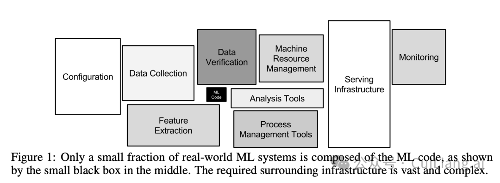
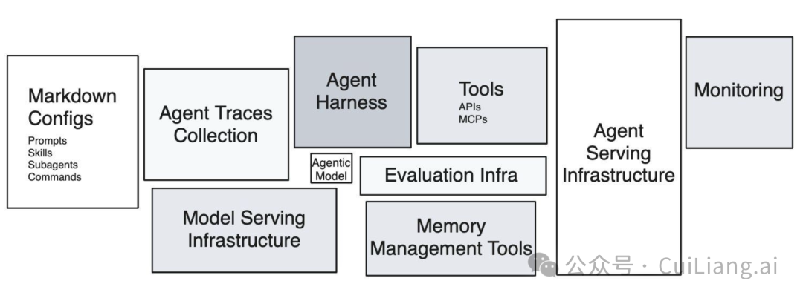
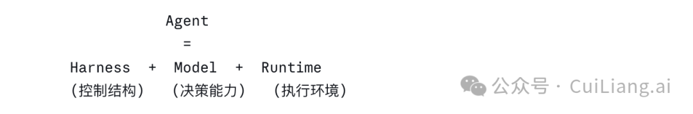
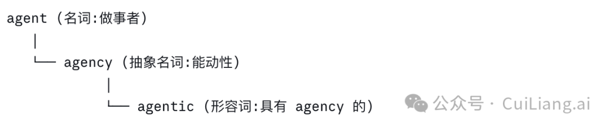
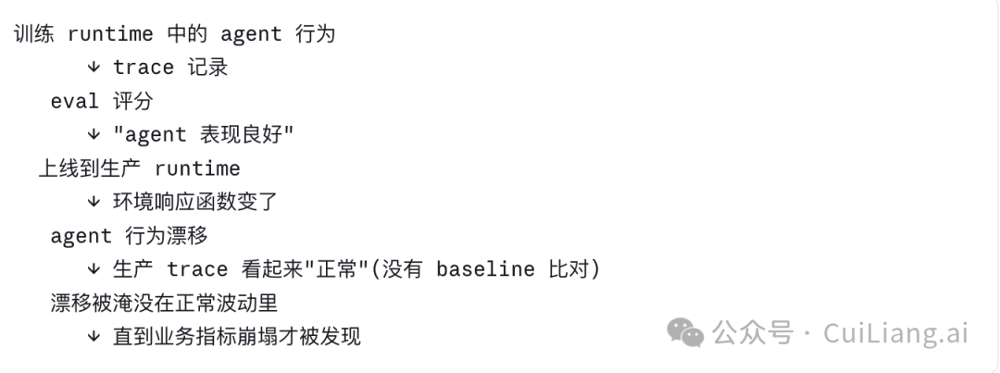

> 五一假期第一天，陪娃去上补习班，中间空档，读了 Han Lee 前几天发的[这篇](https://hanlee.dev/agent-runtime/)。读完之后想写点笔记。一方面是这篇本身值得整理，另一方面是自己也有些新的想法，先记下来，免得后面忘了。

先说明一下，这篇不是严格意义上的文章，更像是一组读完之后的散记。Han Lee 原文讲的是 agent runtime，但我写着写着，顺着它想到了 model、harness、sandbox、eval，甚至从业者的窗口期。先不强行收束了，趁假期把这些念头留一下。

## 这篇文章在讲什么

Han Lee 的论证起点是 Sculley 那篇 2015 年 NeurIPS 的经典论文《Hidden Technical Debt in Machine Learning Systems》。那篇文章里有一张图，中间一个小黑盒子写着 "ML Code"，周围一圈大盒子是数据采集、特征工程、监控、服务基础设施等等。意思是，整个 ML 系统里，模型代码本身只是很小的一块，真正的技术债大多积累在周围的工程系统里。

Han Lee 把这张图重新画到了 agent 时代：中间的小黑盒变成了 "agentic model call"，周围的大盒子变成 harness、tools、memory、evaluation、monitoring。

文章的核心判断很直接：**Agent 不等于 Model**。**Agent = Harness + Model + Runtime**。而 Han Lee 认为，当前阶段最大的隐性技术债在 runtime 这一层。

文章的主要内容大概分几块：

- **Agent runtime 的精确定义**——不是模糊的"沙箱"，而是六个组件的并集：compute substrate（Container / microVM / VM 这一层）、文件系统、工具、网络边界、状态模型、生命周期控制器
- **沙箱不是可选项**——四条理由，从模型自身的破坏性行为到 prompt injection 防御
- **隔离原语对比**——Linux 容器、Firecracker、gVisor、Kata、V8 isolates 的取舍，得出"容器不是 agent sandbox"和"Firecracker 是事实标准"
- **创业沙箱厂商图谱**——Modal、E2B、Daytona、Browserbase 等等
- **Hyperscaler 沙箱图谱**——AWS Bedrock AgentCore、Azure Container Apps Dynamic Sessions、GCP Cloud Run Sandboxes
- **训练态和生产态需要不同 runtime**
- **Dev/Prod parity 的新难题：Runtime Shift**

我建议直接去读原文，文章不长，标称 18 分钟，工程细节比我转述的精确得多。下面我只挑触动我的几个点写笔记。

## 第一个触动：Agent ≠ Model 看似常识，但很多团队没真这么做

这句话听起来像废话。但回想一下平时见到的工程现实，其实大家经常还是下意识把 agent 当成 model：

- 吐槽"agent 又胡乱调工具"，第一反应是改 prompt。
- agent 任务完不成，第一反应是"等下一代模型出来就好了"。
- 出了生产事故，复盘时归因到"模型理解错了用户意图"。

这些反应背后，其实都是把 agent 行为直接归因到 model。Han Lee 这篇让我重新想了一下：当我们说"agent 行为不好"时，这个行为到底是怎么产生的？

一次模型调用本身是无状态的。它生成一个 tool_call 之后，这次调用就结束了。所谓"等待 search 结果"，不是模型真的在等，而是 harness 在等 runtime 返回。下一次模型被调用时，它只是从 context 里读到前面发生过什么，然后基于这些文本继续生成。

**所以模型没有第一人称记忆，只有 context。**

把这点想清楚以后，很多现象会更容易解释。比如 prompt injection 为什么有效，因为模型很难从结构上区分"我自己说过的话"和"context 里写着是我说的话"。再比如 chain-of-thought 为什么有用，本质上是把中间思考写成 token，再让这些 token 反过来约束后续生成。思考是外置的，不是内置的。

所以 "Agent = Harness + Model + Runtime" 这个分解不是为了好看，而是因为 model 这一层在结构上就无法独立完成多步、有状态、跨时间的目标导向行为。这些能力必须由外部组件提供。

具体到三层各自做什么：

- **Model**：无状态的 token 变换器，提供单次决策能力
- **Harness**：有状态的控制结构，负责循环、调度、状态维持、子任务编排
- **Runtime**：执行环境本身，提供副作用实际作用的物理环境和持久化机制

Harness 是中间层。Model 不直接看到 runtime，只看到 harness 喂给它的 context；runtime 也不知道 model 存在，只看到 harness 发来的命令。这个不对称的拓扑，后面很多问题都会用到。

## 第二个触动：Agentic Model 这个词，我开始觉得没那么准确

Han Lee 文章里反复使用 "agentic model" 这个词。Agentic 现在几乎成了 AI 圈万能修饰词，agentic model、agentic search、agentic AI、agentic workflow，什么都可以往上套。但 agentic 到底是什么意思？和 agent 到底是什么关系？顺着这个疑问请 Claude 给我科普了一番，发现这背后比想象中有意思。

英语里 agent 是名词，agentic 是形容词，但 agentic 并不是简单从 agent 派生出来的。它更接近下面这个谱系：

这个词在心理学和社会学里本来就有历史，核心语义是"具有 agency"，也就是能动性、主体性、目标导向性这些东西。AI 圈这两年用得多了以后，很多时候就把它当成"agent 的形容词形式"在用。

这会带来一个小问题：agentic 更像是程度概念，不是有无概念。我们可以说 Claude Code 是一个 agent，也可以说它很 agentic。前者是在说系统类别，后者是在说能动性程度。

那 "agentic model" 这个词到底有没有问题？如果抠得严一点，我会觉得这里有点范畴混淆。

Agentic 行为（我倾向这样定义）需要四个条件同时成立：目标欠规范性、环境交互闭环、状态更新、跨时间一致性。这四个条件里，后三个在结构上要求时间维度。模型一次 forward pass 是瞬时的、无状态的、单时间步的——结构上不可能满足后三个条件。

这有点像问"一次乘法运算是不是迭代算法"。乘法当然可以被放进迭代算法里，但乘法本身不是迭代过程。

但完全否定也不对。模型确实学了一组 agentic-friendly capabilities——这些是后训练阶段被烧进权重的：

- 工具调用语法的内化（知道何时输出 tool_call 这种结构）
- 工具调用时机的判断（信息不足时倾向 search 而不是猜）
- Tool result 的有效利用（读了结果之后基于真实信息回答）
- 多步规划的 token 化呈现（ReAct 模式）
- 错误恢复模式（看到失败知道重试或换策略）
- 长 context 中的状态追踪（能在长 context 里追踪做了什么）

这六项不是 agentic 本身，而是让 agentic 循环工作起来需要的、模型必须具备的局部能力。**齿轮的精度不是机器的转动。**

所以更精确的命名应该是：

- 行业里说的 "agentic model" → tool-augmented model 或 harness-ready model
- 真正 agentic 的整体 → agentic system 或就是 agent

这个区分听起来像咬文嚼字，但它有具体后果。如果你认为"模型本身就是 agentic 的"，那解决 agent 问题的路径是等下一代更强模型。但如果你接受 agentic 是涌现属性，你会理解同一个模型在不同 harness 下表现差距可以达到 2-3 倍——这是 Claude Code vs 朴素调 Claude model API 的真实差距。

## 第三个触动：Runtime ≠ Sandbox

Han Lee 文章用了不少篇幅讨论沙箱，包括隔离原语对比、创业公司图谱、hyperscaler 评测。读的时候很容易顺手把 runtime 等同于 sandbox。但他前面其实已经说得很清楚，runtime 是六个组件的组合，sandbox 只是其中一部分。

我在自己脑子里把这两件事对齐了一下：

**Sandbox 是 runtime 的数据平面**——单个执行实例的隔离边界 + 内部能力（文件系统、网络栈、tool 实现进程）。

Runtime 在 sandbox 之外，还包含：

- **Sandbox 编排层**：池化调度、生命周期管理、跨 sandbox 通信
- **状态持久化层**：snapshot 存储、用户级状态、跨 session 数据
- **控制平面**：配额、限流、审计、监控、计费

判断某个能力归属哪一层，可以问两个问题：

- Sandbox 实例销毁后，这个能力还存在吗？
- 这个能力跨多个 sandbox 实例共享吗？

任何一个答案是"是"，这个能力就在 sandbox 之外。

最能暴露这个区别的场景，Han Lee 自己也提到了——async gap：agent 开 PR、等 CI、等 review、等审批，中间几小时甚至几天，工作状态必须保留。这个能力不可能放在 sandbox 内——等待期间 sandbox 应该被销毁（否则烧钱），但状态不能丢。这必须靠 sandbox 之外的持久化层。文章里提到 Cognition 团队投入超过一年时间做 hypervisor 级 snapshot，本质就是在建这一层。

这个区分对我自己工作直接相关。还是回头看我们这个项目做的事，本质上就是一个 runtime 团队的演进路径——从最开始提供 sandbox 内部的 bash、run code、browser 这些基础能力，到后来扩展到 file system、数据持久化、编排调度、生命周期管理等等。走到今天回头看，sandbox 数据平面只是 runtime 的起点，真正撑起产品价值的越来越多在 sandbox 之外的层。

sandbox 团队和 runtime 团队是两个不同范围的工作，前者是后者的子集。这不是术语游戏——它直接决定了团队的认知边界。锁在 sandbox 数据平面的团队，会把持久化、编排、控制平面看作"别人的事"；想成为完整 runtime owner 的团队，会把这些层主动拉进来。产品演进的方向通常不会等团队自我定义，需求会逼着边界扩——区别只是主动扩还是被动扩。

## 第四个触动：Runtime Shift 这个概念

文章后半段有一节叫 "Dev/Prod Parity Is the Real Problem"，里面提出了一个我觉得很有价值的概念：**Runtime Shift**。

这块我自己一线接触不多。我做的工作偏 sandbox 数据平面，Runtime Shift 更多发生在训练态和生产态之间的鸿沟里，应该是 RL infra 团队更熟悉的问题。所以下面的笔记更多是顺着 Han Lee 的观察外推，而不是自己的一线经验。这也是为什么这部分对我特别有冲击——它指向了一个我之前没系统想过的工程对象。

Han Lee 的说法大概是：agent 在训练时学到的不只是抽象任务能力，也会学到具体 runtime 的细节，比如工具延迟、失败模式、shell 怪癖、文件系统布局、ls 输出格式、浏览器怎么处理重定向。模型把这些东西都吸进 policy 里。换一个 runtime，行为就可能漂移。

这是一种新的分布偏移，但它和 MLOps 圈讨论了很多年的数据分布偏移不一样。**这里变化的不是输入数据，而是环境响应函数本身。**

我觉得这个洞察很深，但 Han Lee 只用了几段话。我顺着这个方向多想了一点：Runtime Shift 其实可以分层看。

Runtime Shift 其实是分层的，作者只讨论了浅的几层。我尝试把它分了五层：

- **L1 接口语法漂移**：工具签名、参数名、返回格式不一致——最容易发现，集成测试就能抓到
- **L2 时序漂移**：同一个调用训练时 200ms，生产时 4 秒——agent 学到的"先发命令、立即检查输出"模式失效。这是 silent failure 的开始
- **L3 失败模式漂移**：训练时 curl 失败返回标准错误码，生产时遇到企业代理，失败方式是"返回 200 + HTML 登录页"——agent 把登录页当 API 响应解析
- **L4 状态语义漂移**：训练 runtime 的 `/tmp` 是干净的，生产 runtime 的 `/tmp` 有上一个 session 的残留——agent 基于错误前提继续，几小时后才以业务结果错误的形式显现
- **L5 工具组合行为漂移**：两个工具在训练 runtime 里 commutative，在生产 runtime 因资源竞争变 non-commutative——agent 学到的并行调用策略生成 race condition。这一层几乎不可能在 eval 中复现，因为 eval 是单 agent 单 session，生产是多租户

文章主要讨论了 L1-L3，L4-L5 没有展开。但多租户长会话场景下，L4 和 L5 才是首要风险。这块对工程现实直接相关。

文章给的解决路径有三条：

- 训练和生产用同一个 runtime（接受 vendor lock-in）
- 定义 runtime contract 双边强制
- 训练时注入生产噪声（runtime 版 dropout）

这三条都挺合理，但它们有一个共同前提：**你能控制训练 runtime**。也就是说，它们更适合自己训模型的团队。对绝大多数用闭源 API 的应用层团队，这三条其实很难执行。

那 99% 的团队怎么办？

我觉得文章遗漏了一条对所有人都适用的路径：接受 train/prod runtime 不同的现实，**在 agent 输出层做行为基线监控**——同一个任务在训练 runtime 的工具调用序列指纹，和生产 runtime 比对差异，差异超阈值就告警。这条路径不需要控制训练 runtime，不需要做 contract，但它的前提是你有成熟的 trace collection + eval 比对能力。

为什么这条路径成立？要把 Runtime Shift 之所以可怕的根本原因想清楚——eval 抓不到它。

把链条画出来：

也就是说，Runtime Shift、Trace、Eval 是同一组工程问题的三个面：

- **Runtime Shift 是问题**（环境响应函数在变）
- **Trace 是观测手段**（记录 agent 在不同 runtime 中的实际行为序列）
- **Eval 是判断机制**（从 trace 中判断"agent 是否在变好/变坏"）

Han Lee 给的三条解决路径都是事前手段——在问题发生前预防。但事后检测呢？生产 runtime 已经和训练 runtime 不同了，你怎么知道 agent 行为已经漂移？答案只能是 trace + eval。但前提是 eval 体系能识别行为漂移本身，而不只是看任务成功率。

回想到我前面对 Han Lee 的一个保留意见——我觉得当前阶段最大的隐性技术债其实是 evaluation infra 而不是 runtime。Runtime Shift 这个概念恰好是这个判断的具体证据：Han Lee 文章里大量讨论"Firecracker 还是 gVisor"这种已经有答案的问题，但他自己提出的 Runtime Shift，根本不是 runtime 选型能解决的——它需要 eval 能识别行为漂移。文章的内在逻辑实际上推出了 eval/trace 比 runtime 选型更紧迫，但他自己没把这个推论拎出来。

绕回来发现，99% 团队的可行路径，问题的根本仍然是 eval infra。这也是为什么我说 eval 是当前真正被低估的那个盒子。

## 另一个延伸：Runtime Shift 是不是一定要消除？

文章默认是负面现象，要尽量消除。但反过来想——一个对 runtime 完全鲁棒的 agent，意味着它没有真正学习这个 runtime，它在用纯抽象推理做事。这等于放弃了从 runtime 中提取效率的能力。

人类工程师也强烈依赖具体环境（知道这台机器 ssh 慢、知道这个 API 周三晚维护），这种依赖正是熟练度的来源。

更精确的目标可能不是"消除 Runtime Shift"，而是"让 agent 知道自己依赖了哪些 runtime 假设，并在假设失效时显式失败而非 silent drift"。这是 metacognition 问题，不是隔离问题。

## 我对文章整体的判断

读完整篇，我的态度是大体认同主框架。Agent ≠ Model 的根本判断、Container 不是 agent sandbox 的硬技术事实、Runtime Shift 这个概念，都站得住脚。

但有一条保留意见值得拎出来："Agent runtime 是当前最大的盒子"这个判断我觉得偏了。Runtime 的工程问题相对收敛——VM 隔离 + 快照，大家知道怎么做，只是工程量大。但"怎么知道一个 agent 是不是真的在变好"这个问题，行业根本没共识。Eval 是没解决的问题，Runtime 是已知怎么解但要花钱的问题。**后者更像基建，前者才决定架构走向**。文章把 evaluation infra 画成图里偏小的一个盒子，我认为是低估了——这一点前面 Runtime Shift 那节已经体现得很清楚。

文章最有价值的贡献是把 runtime 从模糊概念变成了可讨论的工程对象。这个贡献本身，远比单点判断的对错重要。

## 一个更大的判断：瓶颈正在转移

Han Lee 这篇其实再次论证一个判断——**当前阶段 agent 系统能力的瓶颈，正在从 model 转移到 harness 和 runtime**。

理由是：

- 模型已经具备了基础的 agentic-friendly capabilities，而且很好
- 把系统能力往前推的瓶颈是 harness 和 runtime，不是模型
- 模型再强，如果 harness 没变，系统的 agentic 程度提升有限

这个判断有具体经验证据：模型版本升级在固定 harness 下的提升，通常不如保持模型不变、改进 harness 的提升。Anthropic 自己也在大量投入 Claude Code 的 harness 优化，而不是只指望模型升级——这是一线优先级的真实信号。

从这个角度看——Harness Engineering 作为继 Prompt Engineering、Context Engineering 之后的第三个工程范式成立。不是因为这个词时髦，而是因为这一层工程现实复杂到需要独立的方法论。Han Lee 这篇可以看成对这个判断的补强：harness 之外，runtime 也是一个独立的工程对象，而且短期内可能比 harness 更紧迫。

### 这对从业者意味着什么

对广大 agent 从业者来说，瓶颈转移其实是个好消息。模型那一层进得去的人少之又少——动辄几十亿美金的训练成本、稀缺的算法人才、闭源模型的护城河，这是少数巨头的游戏。但 harness 和 runtime 不一样，这两层本质上是工程问题——分布式系统、状态管理、隔离、调度、可观测性，这些都是有积累的工程师能上手做的事。

也就是说，agent 工程的能力天花板这两年不在模型那层，而在大家都能参与的 harness 和 runtime 这两层。**这是非常少见的、对工程出身的从业者友好的窗口期。**

### 但窗口是有限的

不过话说回来，这个窗口期不会一直开着。模型厂商也在持续往 harness 和 runtime 这两层推进。

最新的例子就是 Anthropic 最近推出的 Claude Managed Agents——一个全托管的 agent 执行平台，把 sandbox、session 状态、credential 管理、错误恢复、tool 编排打包成 API 服务。Anthropic 自己把它定义为 "meta-harness"：一个能容纳各种 harness 的 harness。换句话说，Anthropic 不只在做 harness，**还在做一个能让别人的 harness 跑在它上面的平台**。

所以瓶颈虽然转移到了 harness 和 runtime，但从业者自己做这两层的窗口期可能比想象中短。趁窗口还在，把工程能力沉淀下来，是这两年值得用力的方向。

---

写完发现这篇笔记比预想长。读 Han Lee 这种文章，确实容易一路想远。它不一定给了多少新知识，但把一些之前混在一起的东西拆开了。

好的文章不一定提供答案，但会让你之前没想清楚的事情突然清楚一点。读这篇属于后者。
