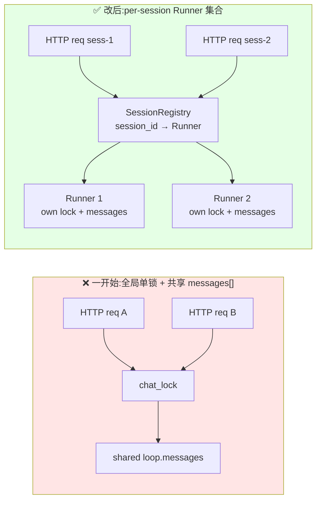
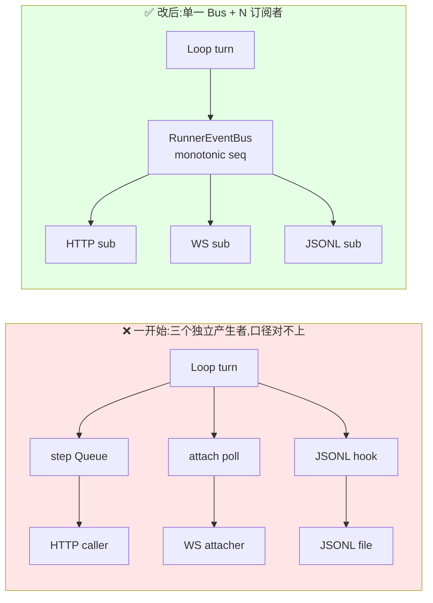
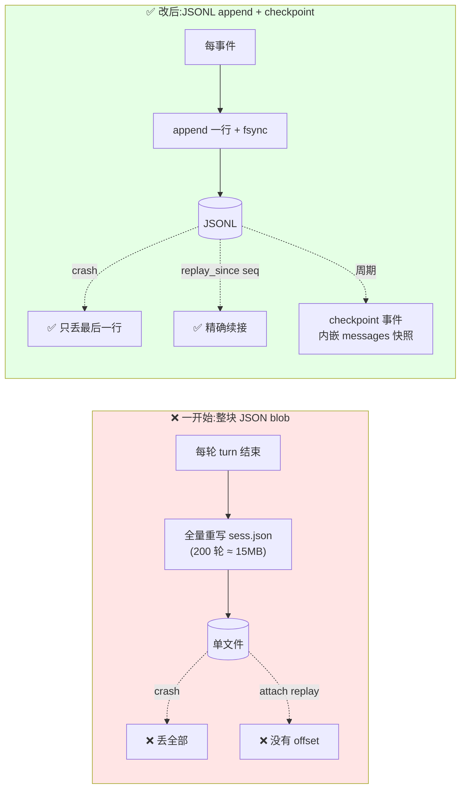

> 📌 **本文是「Agent CLI 到 Service 改造复盘」系列的第 1/2 篇**。本篇讲三次认知转变,下篇(写作中)展开 Channel、Resource Cap、配套基础设施和 trade-off 自陈。

> 以为是加层 FastAPI wrapper 的事,和 Claude Code 用 vibe coding 模式断断续续做了三天才把 service mode 跑通。不是代码量大,是发现有几个底层抽象需要从头重新设计。

## 开场

我有一个叫 ACAgent 的 Python coding agent,在命令行里跑得好好的。想做一次 CLI → Service 改造有两个原因。

第一个是实用层面 —— 最近几个月 Claude Code 的 web 端演进得很快,可以随时随地通过浏览器继续昨天没写完的任务、在手机上接收 agent 的进度更新、多端协作看同一个 session。我看着这些演进,想让自己的 agent 也跟上这个形态:能被 Dashboard attach、能被远程调用、进程重启不丢会话。

第二个原因对我来说分量更重 —— 只看文章和读源码,你永远停留在"旁观"的状态。LangGraph 的 checkpoint 机制、Claude Agent SDK 的子进程模型、Claude Code 自己的 harness 设计 —— 这些东西我都读过,但"读过"和"知道会踩什么坑"之间隔着一整个亲手实现的距离。ACAgent 是我学 agent 架构的实验场,把它从 CLI 改造成 Service,是把这一段知识从文献搬到手上的过程。

最初的估算是"一下午的活"。结果断断续续干了三天 —— 有 Claude Code 协助实现,挡住我的不是代码量,是"想清楚哪些底层抽象需要重新设计"这件事。

这篇文章复盘这三次认知转变:哪些我想对了,哪些撞了墙才想明白,以及我最后得到的一个反直觉的结论。下一篇会展开剩下的工程层细节(AttachManager、Resource Cap、配套基础设施)和 trade-off 自陈。

## 开始之前:把改动摊开

先把 CLI 和 Service 模式里"同一个概念"的对照摊出来 —— 后面讲的三堵墙都是围绕这几行里的其中之一:

| 维度 | CLI Mode | Service Mode |
|---|---|---|
| **会话单位** | 进程(进程 = 会话 = 用户) | 显式的 Session 对象(Runner) |
| **事件流** | 直接 print 到终端,产生即消费 | 多消费者 fan-out(HTTP stream / WS / JSONL) |
| **持久化** | 单文件 JSON,退出时整体写 | JSONL append-only,每事件落盘 |
| **并发** | 不需要(一次一人) | per-session 锁 + 全局上限 |

并发是会话边界变化的派生(会话拆开才需要 per-session 锁),所以三堵墙就是前三行。

## 墙 1:会话 ≠ 进程

> **如果你要改造的 agent 原来是 CLI,它大概率没有"会话"这个概念 —— 会话被进程隐式承担了。你的第一件事是把会话显式化。**

### 我一开始怎么做

最直觉的做法:把原有的 `AgenticLoop` 做成 module-level 单例,HTTP handler 直接调它:

```python
# 一开始的做法
loop = AgenticLoop(provider, tools, channel=...)
chat_lock = asyncio.Lock()

@app.post("/api/chat")
async def chat(req):
    async with chat_lock:
        return await loop.run_turn(req.message)
```

跑通了,挺快。然后我加了一个前端测试页面,同时开两个 tab 发请求。

### 撞到的墙

两个 tab 的响应互相等。A 发一句,B 点发送,B 的请求在 A 响应完才开始处理。

更糟的是:B 发送的上下文里出现了 A 的历史消息。两个 session 的 `messages[]` 互相污染。

盯着代码看了一会儿才反应过来两件事:

1. `chat_lock` 是**全局**锁,不是 per-session 锁。A 和 B 本质是同一把锁在排队。
2. `loop.messages[]` 是**同一个 list**。A 和 B 共用一份 history。

### 我怎么想

**问题不是"锁的粒度不对",是我根本没有"session"这个概念。**

CLI 模式下为什么不需要?因为进程 = 会话 = 用户。一个进程只服务一个人、一份 history、一个 loop。这三件事在 CLI 里是合一的,不需要显式建模。

到了 Service 模式下,一个进程服务 N 个会话。**三个概念必须分开**,而且"会话"这个概念必须被显式建模成一个对象,不能继续挂在进程上。

### 改成什么

引入 `AgentRunner`:每个 session 一个 Runner,Runner 独占一个 `AgenticLoop`,独占一把 `asyncio.Lock`。

```python
class AgentRunner(Protocol):
    session_id: str

    async def step(self, user_input: str) -> AsyncIterator[StreamEvent]: ...
    async def interrupt(self) -> None: ...
    async def stop(self) -> None: ...
    def snapshot(self) -> RunnerSnapshot: ...

    @property
    def is_busy(self) -> bool: ...
```

然后在上面加 `SessionRegistry`,维护 `{session_id → Runner}` 的 map,进来的请求根据 `session_id` 路由到对应 Runner。

锁的模型也从"全局单锁"变成"per-session 锁 + 进程级并发上限":

- 同一 session 的第二个并发请求 → `409 session_busy`
- 不同 session 的请求独立跑,真并发
- 进程同时活跃 session 数超过 `max_concurrent_sessions` → `429 concurrency_cap`



### 几个要注意的细节

**a) 用 Protocol 而不是基类**

`AgentRunner` 用的是 Protocol(PEP 544),不是 ABC。原因很实际:我手里只打算先做一个 `InProcessRunner`,但脑子里还挂着两个没动手的:

- `SubProcessRunner` —— 哪天工具崩溃不想拖死主进程,就要它
- `RemoteRunner` —— 哪天 loop 想跑到另一台机器上去,就要它

Protocol 比基类轻,加新实现不用回头改继承关系。但更重要的是,只要写下这个 Protocol,我就被迫先把"Runner 到底负责什么"画清楚 —— 否则等 `InProcessRunner` 写完,这个边界就会被它的实现细节带跑。

**b) Runner ≠ Loop**

一开始我想把 Runner 做成"AgenticLoop 加个 session_id 字段"。后来拆开了:

- **Loop**(`AgenticLoop`):执行一轮 turn 的内核逻辑(provider 调用、工具执行、context 管理)。无状态的计算单元。
- **Runner**(`AgentRunner`):一个 session 的完整生命周期(启动、step、interrupt、stop、snapshot、replay)。状态载体。

这样 Loop 可以被多个 Runner 实现共享,Runner 的变化(subprocess / remote)不影响 Loop。

### 回头看

这堵墙是最早也最痛的一堵。**撞墙的根本原因是我把 `AgenticLoop` 当成了 session 的化身**,而不是 session 里的一个部件。

如果要给"正在做 agent 改造"的人一个单一建议,是:**先明确你的 session 对象**。只要你能画出"一个 session 对象拥有什么状态、生命周期有哪些阶段、被谁持有",剩下的都是执行细节。

现在的 `AgentRunner` 抽象我基本满意。Protocol 预留的 out-of-process 实现还没真做,将来如果工具沙盒化要跨进程隔离,能沿着这个接口走下去 —— 这就是抽象留期权的价值。

## 墙 2:事件流 ≠ 输出

> **CLI 模式下事件"产生即消费",Service 模式下事件必须被多方消费。当你发现几个组件都在"独立产生相似事件"时,停下来 —— 它们应该共享同一份事件流。**

### 我一开始怎么做

CLI 里 `Channel` 接口大致是这样:

```python
class Channel:
    async def stream_text(self, text: str) -> None: ...
    async def stream_thinking(self, text: str) -> None: ...
    async def show_tool_execution(self, name: str, ...) -> None: ...
```

`CLIChannel` 的实现就是 `print(text)`。到 Service 模式下我要让 HTTP caller 拿到流式响应、让 WS attacher 观察事件、让 JSONL writer 持久化 —— 最初的做法是**三处各写各的**:

- `step()` 内部自己维护一个 `asyncio.Queue`,把用户可见事件塞进去给 HTTP caller
- `attach_ws.py` 自己 poll `channel.get_events()`
- `session_log.py` 的 JSONL writer 自己 hook 事件

三个独立的"事件产生者"。

### 撞到的墙

三条路径各自演化,口径对不上:

- HTTP caller 收到了 `text_delta`,但 WS attacher 没收到 —— 因为 channel 的 queue 是单消费者,HTTP 先 pop 走了
- JSONL 记录了 `tool_call_start`,但 attacher 没收到 —— 这俩 hook 路径不同
- 断线重连时 attacher 说"我上次看到 seq=42,给我之后的",但 HTTP stream 有自己的编号,JSONL 又有自己的编号,三个 seq 对不上

每 debug 一个 bug 都会发现"另一个消费者的口径不一样"。工作量像俄罗斯套娃。

### 我怎么想

我停下来不 debug 了,退后一步看这三条路径 —— 三个"产生者"本质都在做同一件事:**把 Loop 内部发生的事情转述给外部**。

那为什么要三份实现?一个 agent 在一个 turn 里"发生了什么"应该是**确定的一个事件序列**。三份实现各自去"转述",当然口径对不上 —— 它们应该都是**同一份真相的订阅者**。

这里发生了一次认知转变:**事件流本身应该是一个基础设施**,不是任何一个消费者的私有资产。

### 改成什么

引入 `RunnerEventBus`。每个 Runner 拥有一个 Bus,所有消费者都是订阅者:

```python
class RunnerEventBus:
    def publish(self, event_type: str, payload: dict) -> None: ...
    def subscribe(self, name: str, *, maxsize: int = 256) -> Subscription: ...
    def close(self) -> None: ...
```

事件的标准形状:

```json
{"type": "text_delta", "ts": 1729..., "seq": 42, "payload": {"text": "hi"}}
```

三个原本独立的消费者全部改成订阅 Bus:

```python
# HTTP stream(step iter)
async for ev in await runner.step(user_input): ...

# WS attacher
sub = runner.subscribe(f"attach-ws-{client_id}")
async for ev in sub:
    await ws.send_json(ev)

# JSONL writer
bridge_bus_to_jsonl(runner, writer)  # 内部 = subscribe + 写盘
```



### 几个要注意的细节

**a) `publish()` 是同步的**

不是 async。为什么?因为 `publish()` 会在热路径被调用(比如 `_TeeChannel.stream_text` 中间)。如果让它 await,等于 "producer 要等所有 subscriber 把事件消费完才能继续",延迟不可接受。

**b) per-subscriber bounded queue,drop-and-count 而不是阻塞**

每个 Subscription 自己有 `asyncio.Queue(maxsize=256)`。256 是经验估算:1KB/event × 256 ≈ 256KB/subscriber,十几个 subscriber 也就几 MB。⚠️ **这个数字没做过真实压测,生产部署前应该按实际事件速率重算。**

队列满了怎么办?阻塞 producer 不可接受(慢 subscriber 拖死整个 agent),静默 drop 又不能 —— subscriber 不知道自己漏了事件。折中:drop + `dropped_count += 1`,subscriber 自己读这个计数决定要不要重连或报警。

**c) close 时推一个 `None` 哨兵**

`close()` 给每个 subscriber 的 queue 推一个 `None`。subscriber 的消费循环:

```python
async for evt in subscription:
    handle(evt)
# 遇到 None 自然退出,不需要外部 cancel
```

没有哨兵的话,被踢的 subscriber 永远 hang 在 `queue.get()` 上。这个细节我漏过一次,结果测试里的 task leak 查了半天。

**d) monotonic seq 让 attach 重连有确定语义**

每个 Bus 维护一个单调递增的 seq。这样 attacher 断线时记下 `last_seq = 42`,重连时请求 `replay_since=42`,服务端从 JSONL 读 `seq > 42` 的事件 + 实时订阅 bus,客户端无缝衔接。

**如果没有统一的 seq,这个特性做不出来** —— 三个独立产生者各自编号永远对不上。这属于"EventBus 带来的衍生好处"里我没预想到的。

### 回头看

这堵墙撞得最慢 —— 中间隔了大半天我才意识到问题是"抽象缺失"而不是"代码 bug"。在 vibe coding 节奏下,这种"停下来不写代码、退后一步看抽象"的间隔,反而是整次改造里最值钱的时间。

撞完之后带来一个副产品:因为 JSONL writer 现在是 Bus 的订阅者,**JSONL 的内容就是 Bus 的一个派生 view**。这从结构上保证了 "JSONL ⊆ Bus",不再需要人为同步 —— 这也直接引出了第三堵墙。

## 墙 3:持久化 ≠ 存档

> **单文件 JSON 是 snapshot 思维,JSONL 是 event sourcing 思维。后者才是 agent session 该有的形态。**

### 我一开始怎么做

CLI 模式下持久化很朴素:

```
~/.acagent/sessions/<id>.json    # 一个 session 一个 JSON
退出时 atomic write(tmp + rename + fsync)
```

Service 模式下我沿用了这个格式,改成"每轮 turn 结束写一次"。

### 撞到的墙

**第一个坑:crash 即丢**

某次我改代码忘了 atomic write 路径,崩了一次,5 小时的对话全没了。SessionManager 根本没机会走到"保存"那行。

改回 atomic write 之后,另一个问题浮现:

**第二个坑:rewrite 成本随历史线性增长**

一个跑了 200 轮的 session,每轮结束都要把 200 轮的完整 messages 全量重写一次。我测了一下,200 轮的 session 每次保存要写 ~15MB(⚠️ 单点测量,不同 provider/工具集结果会有差异)。SSD 能扛,但完全没必要。

**第三个坑:无法表达 "给我 seq=42 之后的事件"**

整块 JSON 是一个原子。attacher 重连想续接,根本表达不出"之前的不要,只要新的"—— 文件里没有事件级别的 offset。

### 我怎么想

这时候我已经做完墙 2 的 EventBus 了,脑子里的"事件流"概念正热。回头看单文件 JSON 的三个坑,三个坑其实是**同一个模型错误**的不同表现:

我在用"存档"模型 —— 整个 session 是一个 blob,每次保存就是覆盖上一份 blob。但 agent 的 session **本质上是事件流**,不是 blob:一连串 user_turn / assistant_turn / tool_use / tool_result 按时间发生。

用 blob 模型存一个事件流,永远会撞这三个坑:全量重写(因为 blob 只能整写)、批量丢失(两次写之间没有中间态)、没有精确 offset(blob 里没有事件的概念)。

**换成 event sourcing 模型三个坑同时消失**:每事件 append 一行(不需要重写)、每事件 fsync(只丢最后那行)、每事件有自己的 seq(精确 offset)。

### 改成什么

每事件一行 JSON,append-only,fsync:

```jsonl
{"seq":1,"ts":"...","type":"session_start","provider":"anthropic","model":"sonnet"}
{"seq":2,"ts":"...","type":"turn_start","input":"hi"}
{"seq":3,"ts":"...","type":"text_delta","payload":{"text":"hello"}}
{"seq":4,"ts":"...","type":"turn_end","stop_reason":"end_turn"}
```

而且 —— 这正是墙 2 留下的礼物 —— JSONL writer 不自己"产生"事件,而是订阅 RunnerEventBus:

```python
bridge_bus_to_jsonl(runner, writer)
```

JSONL 的 seq 就是 Bus 的 seq。`replay_since(seq)` 从 JSONL 读增量事件,无缝接上实时订阅。



### 几个要注意的细节

**a) cwd bucketing**

文件按项目目录分桶:

```
~/.acagent/sessions/
├── _Q__src_ACAgent/
│   ├── sess-001.jsonl
│   └── sess-002.jsonl
└── _Q__src_OtherProject/
    └── sess-003.jsonl
```

Dashboard 列"当前项目的所有 session",`ls bucket/` 就完事,不用扫所有文件读 metadata。O(1) 而非 O(N)。

**b) checkpoint 避免 replay 线性退化**

JSONL 跑久了 replay 成本随事件数线性增长。周期性写一个 `checkpoint` 事件,内嵌完整 messages 快照:

```jsonl
{"seq":500,"type":"checkpoint","last_event_seq":500,"messages":[...]}
{"seq":501,"type":"text_delta",...}
```

恢复时从尾往前找最近 checkpoint,加载它的 messages,然后从 `seq=501` 开始 replay 增量。replay 成本从"整个历史"变成"距离最近 checkpoint 的事件数"。

这个设计参考了数据库 WAL 的 checkpoint —— 不是我发明的,是 event sourcing 成熟领域的常见手法。值得的话花半小时读一下 PostgreSQL 的 WAL checkpoint 文档。

### 回头看

这堵墙是三堵里"撞得最值"的一堵 —— 改造代价最小(几个小时落地),但收益最大(崩溃恢复 + 增量 replay + attach 重连)一次性全有了。

还带来一个概念级的认知升级:**agent session 的内存状态、JSONL 文件、HTTP/WS 流,全都是同一份事件流的派生 view**。Bus 是事件流本身,其他都是订阅者。想清楚这件事之后,系统的很多边界模糊点(snapshot 里的 seq 该用谁的?attacher 重连该从哪里读?)一下子都有了确定答案。

## 三堵墙的共同点

三堵墙撞完之后我发现它们是同一个模式:

**CLI 模式下隐含的抽象,到 Service 模式必须被显式化。**

- 会话 —— CLI 里隐含在进程里,Service 里必须是显式对象(Runner)
- 事件流 —— CLI 里隐含在 "print 即输出",Service 里必须是显式的 Bus
- 持久化 —— CLI 里隐含在"进程内存 + 退出时快照",Service 里必须是显式的事件流存储(JSONL)

隐含的抽象在 CLI 里之所以能 work,是因为"一个进程 = 一个会话 = 一个用户 = 一个终端"这个大前提把很多概念压扁了。Service 模式拆开这个前提,被压扁的每一层都要重新显式建模。

## 最大的一个反直觉结论

撞完三堵墙之后,回头看我有个反直觉的结论:

**如果你知道你的 agent 早晚要 service 化,不如从第一天就按 service 的抽象去设计 CLI。**

看上去是过度设计 —— 一个人用的命令行工具要什么 Runner / Bus / JSONL 事件流?但你会发现:

- 单 channel = N=1 的 fan-out(AttachManager 的退化情形)
- 单 session = 单元素 map(SessionRegistry 的退化情形)
- 单文件持久化 = 一行 checkpoint 的 JSONL(JSONL 的退化情形)

**同一套代码路径走通 CLI 和 Service 两个模式,复杂度反而比"CLI 简单做 + service 重写"更低** —— 不会有那个"重写一遍"的拐点。

ACAgent 没走这条路,因为我开始做的时候不知道自己会走到这一步。代价具体地说:**墙 2 的事件分发我重写过两次**(从 channel 替换 → channel 链表 → EventBus),**墙 3 的持久化推倒重来一次**(单文件 JSON → JSONL),墙 1 的 Runner 抽象算是一次到位但拖了大半天才决定动手拆。如果第一天就按 Service 抽象设计,这三段重写时间能省下来。这算是事后的教训。

## 下一篇(写作中)

后续会展开剩下的工程层细节:

- **AttachManager** —— Channel 从 1:1 推广到 1:N 的具体做法(含慢 attacher 驱逐)
- **Resource Cap 层级化** —— per-session / per-instance / daily 三层怎么切职责
- **配套基础设施** —— 错误码信封、observability、多实例、CLI≡serve
- **Trade-off 自陈** —— 我决定不做的、想做没时间做的、不确定要不要做的

如果你也在做类似的改造,下一篇会更有"可抄作业"的工程密度。

---

## 附录

**ACAgent** 是一个 Python 写的个人 AI Agent,通过逆向 Claude Code v2.1.86 学习 agent 架构。本文讨论的设计都已实装,测试覆盖约 3144 个单测。

相关代码:

- `src/acagent/core/runner.py` — AgentRunner Protocol + InProcessRunner
- `src/acagent/core/event_bus.py` — RunnerEventBus
- `src/acagent/core/session_log.py` — JSONL writer/reader
- `docs/design/service-mode/` — 完整设计文档

项目仓库:[github.com/cuiliang-ai/ACAgent](https://github.com/cuiliang-ai/ACAgent)
