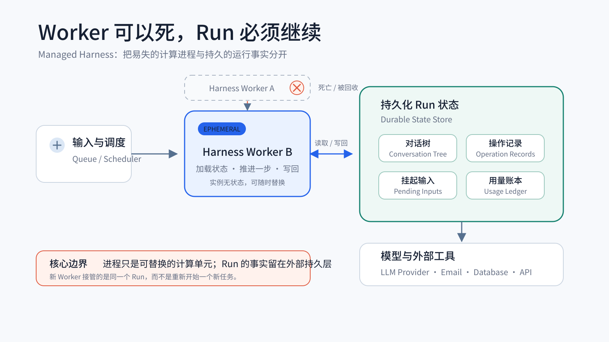
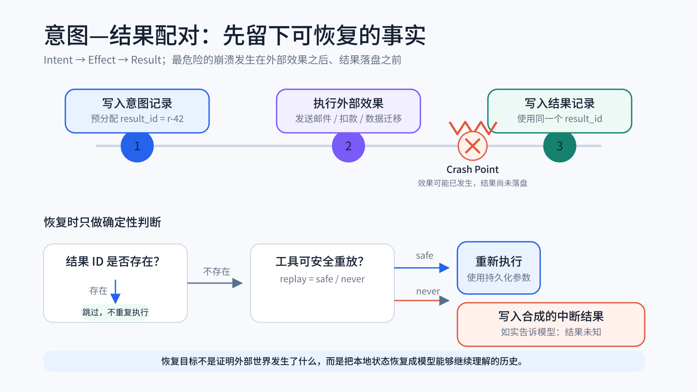
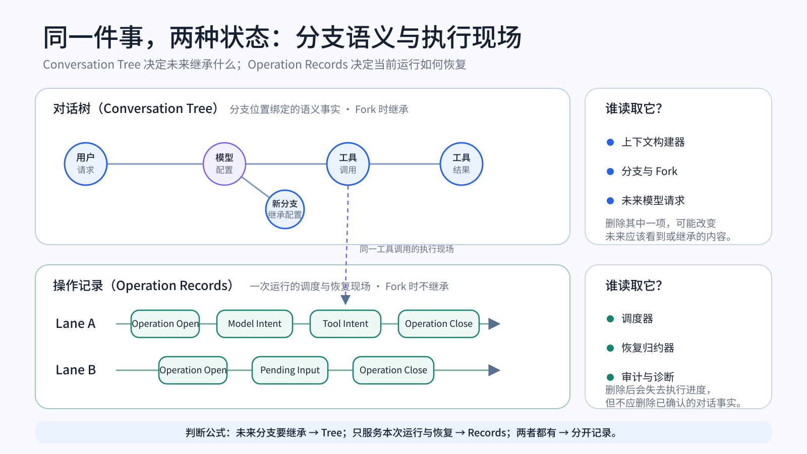

最近我在读 pi 项目的一份设计文档：第二版执行框架 Harness V2[^1]。它是一套仍在演进中的 Agent 运行时设计，也是我最近看到最值得细读的一份同类文档。

它讨论的是 Agent 运行时的一些基础问题：当一次任务从几十秒延长到几十分钟甚至数小时，当用户可以在运行中继续输入，当进程可能随时重启，外部调用可能已经生效却没来得及写回，一次 Agent 运行怎样才能持续、可恢复、可审计地运行下去。

早期的 Agent 演示程序通常都从同一个结构开始：一个 `while` 循环，一个消息数组，一张工具分发表。模型返回工具调用，程序执行工具，把结果追加到消息里，再请求模型。只要任务很短、进程不会退出、同一时刻只有一个输入，这套结构完全够用。

三种变化共同改变了问题的性质：

- **任务运行更久。** 一次运行持续几十分钟甚至数小时，撞上重启、超时、重试和部分失败的概率随之上升。
- **任务被拆给多个 Sub-agent。** 原本单线的循环变成一组有父子关系、可能并行执行的任务。它们可能各自成功、失败或被取消，父任务还要判断哪些结果可以采用、哪些子任务需要恢复。
- **Harness 变成托管式服务。** 执行进程不再是可靠的状态容器。Kubernetes 的重调度、弹性扩缩容、滚动升级或节点故障，都可能让一次运行跨越多个 Harness 实例。新实例接管后，必须知道运行到了哪里，以及哪些结果已经确认、哪些外部效果仍然无法确认。

这三种变化把一个简单循环推成了持久执行（Durable Execution）运行时。它必须回答许多数据库和分布式系统早已熟悉的问题：哪些状态必须先落盘，内存状态如何重建，父任务与子任务如何隔离，外部副作用如何去重，并发写入如何排序，成本如何对账，以及怎样系统地测试每一个崩溃位置。托管式 Harness 的目标不是让进程永远不死，而是让一次运行不依赖某个具体进程才能继续。

*图 1：计算进程可以随时替换，Conversation Tree、Operation Records、挂起输入与用量记录留在外部持久层。*

Harness V2 的价值正在这里。它没有发明一套完全陌生的理论，而是把预写日志（Write-Ahead Log，WAL）、事件溯源（Event Sourcing）与状态归约（State Reduction）、单写者模型（Single-Writer Model）、独立用量账本（Usage Ledger）和可注入效果边界（Injectable Effects Boundary）等思路，重新放进 Agent 运行时的约束中。更重要的是，它利用了 Agent 系统与传统事务系统的一处差异：恢复未必意味着精确复原计算过程，只要留下真实、完整、模型能够继续理解的状态，这次运行就仍有机会向前推进。

下面不按原文档章节逐段复述，而是从自研执行框架最常见的四种失效方式出发，看看这份设计分别做了哪些决定，以及这些决定在什么条件下值得采用。

## 一、进程死在任意两行代码之间

一次典型运行的路径大致是：写入用户消息，请求模型，收到工具调用，执行工具，写入工具结果，再请求模型。进程可以死在其中任何两步之间。

最麻烦的位置，是工具已经执行、结果还没有写入。假设工具只是读取文件，重跑一次通常没有问题；如果工具做的是发邮件、扣款或数据库迁移，重启后系统面对的是一个无法从本地状态判断的事实：外部效果究竟发生了没有？

异常捕获（try/catch）解决不了进程级死亡。定期保存整个状态快照（snapshot）也只能把系统恢复到某个过去时刻，无法消除“快照显示尚未执行，外部系统实际上已经执行”的分歧。

Harness V2 的处理方式可以概括为意图—结果配对（intent–result pairing）：

1. 在效果发生之前，先写入一条意图记录（intent record），记录将要执行的操作，并预先分配结果条目的标识符（ID）。
2. 效果完成之后，使用这些已经分配的 ID 写入结果。

*图 2：最危险的崩溃点位于外部效果已经发生、结果尚未落盘之间；恢复逻辑根据结果 ID 和工具重放策略作出决定。*

预分配 ID 是关键。有了它，恢复时不必扫描日志猜测某次工具调用走到了哪一步，而是直接查询对应 ID：找到正常结果，说明结果已经落盘；找到合成的中断结果，说明系统已经记录了“外部结果未知”；找不到结果，说明还需要执行恢复逻辑；同一个 ID 对应的内容发生冲突，则应当视为数据损坏。

这种写入顺序与预写日志很相似。不过在这里，每条意图记录和结果记录都可以独立提交，不要求多个记录组成一个原子事务，因此 JSON Lines（JSONL）也可以作为存储后端。但“每条记录独立提交”不等于“任意文件追加天然原子”：实现仍要串行化写入、明确何时确认持久化，并在重启时修复被截断的尾行、拒绝文件中部的损坏数据。Harness V2 的 JSONL 设计也把这些行为列入了后端契约和测试范围。

恢复逻辑随后按操作类型展开。以工具调用为例：

- 意图记录尚未写入时进程退出，恢复后可以从前一个稳定点重新执行；
- 意图记录已经存在、结果尚未落盘，则根据工具声明的重放策略（replay policy）处理；
- 对可安全重放的工具，使用已持久化的参数重新执行；
- 对不可安全重放的工具，不猜测外部效果，而是写入一个合成的中断结果（interrupted result）；
- 结果已经存在时，直接跳过。

这里有一个很重要的边界：工具是否可以安全重放，并不适合由执行框架统一猜测。读取文件、查询余额和发送邮件的语义完全不同。Harness V2 让工具通过 `replay` 属性声明 `safe` 或 `never`，并在执行时把声明写进意图记录。恢复时，只有记录中的策略与工具当前的声明都为 `safe` 才会重放；只要任一方为 `never`，就生成中断结果。这样，工具后来收紧策略时，旧记录不会绕过新约束。

中断结果的作用很直接：承认“工具可能已经执行，但结果未知”，再把这个事实写入模型能够继续读取的对话历史。模型可以据此决定再次查询、换一条路径，或者向用户确认。

但这不能代替副作用对账。对于发邮件、扣款等不可安全重放的工具，如果系统必须自动确认最终结果，就仍需要由外部系统提供幂等键、状态查询或补偿事务；否则只能保留“不确定”状态并交给人工确认。中断结果只能保证记录与系统掌握的事实一致，不能保证外部操作恰好执行一次。

因此，Agent 崩溃后不一定要原样重放每一步。很多时候，只要恢复出的历史没有缺失配对的工具调用、不包含编造的结果，而且模型还能继续读取，任务就能接着进行。这种做法只适合允许模型根据不确定信息继续处理的场景；涉及资金、权限和不可逆操作时，仍要遵守业务系统自身的一致性协议。

这套方案真正难的不是多写几段代码，而是所有副作用都必须遵守同一种写入顺序。每增加一种外部操作，都要先画出它从意图到结果的完整序列，并在相邻两步之间逐一追问：如果进程死在这里，存储中会留下什么，恢复时又该怎么解释？即使不照搬 Harness V2 的记录格式，这个检查也能提前暴露大量问题。

## 二、对话事实和执行现场是两回事

意图记录需要一个明确的存放位置，这会迫使系统先回答一个基础问题：哪些状态属于这段对话本身，哪些状态只属于某一次执行过程？

许多自研执行框架会把两者都塞进消息数组。用户消息和助手回复在里面，重试次数、排队状态、工具执行进度和中断标记也在里面。第一版实现很方便，因为读取一个数组就能得到所有状态；但随着系统开始支持分叉、并发执行和崩溃恢复，这些状态的生命周期很快就会发生冲突。

Harness V2 实际把会话状态拆成对话树、执行线、执行线操作日志和全局事实四类。若只看“对话事实与执行现场如何分开”这个问题，其中最关键的是两类记录：

- 对话树（Conversation Tree）保存与分支位置绑定、需要被未来运行继承的语义状态；
- 操作记录（Operation Records）保存某次运行的执行进度、调度状态和恢复现场，并按执行线（Lane）隔离。

*图 3：同一个工具调用会同时产生分支语义和执行现场；前者进入 Conversation Tree，后者进入对应 Lane 的 Operation Records。*

可以把对话树理解成“这条分支上已经发生并被确认的事实”。用户说过什么、模型回答过什么、工具返回了什么，以及从某个位置开始使用哪一个模型，都属于这类事实。以后从这个位置继续运行或创建新分支时，它们仍然有效。

操作记录回答的则是另一类问题：当前是哪一次运行，模型请求是否正在进行，某个工具是否已经开始执行，重试了几次，是否有输入等待消费，崩溃后应该从哪里恢复。这些信息对调度器和恢复逻辑很重要，但不应该成为新分支需要继承的对话内容。

以一次邮件工具调用为例。模型产生的工具调用和最终工具结果，是后续模型推理需要看到的对话事实，因此进入对话树；工具执行前写入的意图记录、当前尝试次数和是否仍在等待结果，则属于这次运行的执行现场，因此进入操作记录。同一个工具调用会同时出现在两类记录中，但各自保存的内容不同。

这也解释了为什么模型切换和思考等级等配置会进入对话树。它们虽然不是用户或助手说出的一句话，但其含义取决于它在分支中的位置。如果在节点 N 之后切换了模型，那么从节点 N 之后创建的新分支也应该继承这个设置。它属于分支语义，而不是某一次运行的临时执行状态。

因此，真正的判断方法是：

- 如果删除某项状态会改变从这个分支位置继续运行时应当看到的历史或继承的配置，它属于对话树；
- 如果删除某项状态只会让系统失去当前运行的进度、恢复或审计信息，它属于操作记录；
- 如果一件事情同时包含这两类信息，就分别记录它的语义结果和执行过程。

“删除全部操作记录后，剩下的仍然是一份合法对话”是这种分离最终应当满足的不变量，而不是判断单个字段归属的唯一方法。删除操作记录之后，系统可以不知道某个请求重试过几次，也可能无法继续一个尚未完成的操作，但它不应该因此丢失已经确认的对话内容和分支配置。

这种分离首先让分叉变得干净。新分支继承的是原分支已经确认的语义状态，而不是旧运行留下的重试次数、挂起队列和未关闭操作。其次，构建模型上下文时不必从消息数组中反复过滤编排噪音，因为这些信息从一开始就没有进入对话树。最后，崩溃恢复可以主要根据操作记录重建运行时状态，而不需要修改或重新解释对话历史。

## 三、并发输入撞上正在结束的运行

假设用户在模型即将结束时发来一条新消息。接收程序先判断当前运行仍在进行，准备把消息加入本轮的干预队列；但在消息真正写入之前，程序经历了一次异步等待，当前运行恰好在这段时间结束。等消息最终进入队列时，已经没有程序会继续读取它，于是这条输入被遗漏。要避免这个问题，“检查运行状态”和“写入消息”必须按同一个顺序串行执行：消息先写入，就由当前运行处理；运行先结束，接收方就会明确得到“当前没有运行”的结果，再把消息作为下一轮输入处理。

这类问题很难复现，因为它依赖两个异步动作恰好落在极窄的时间窗口。单元测试通常全绿，线上却会偶发丢消息。

Harness V2 先做了一次并发模型的收缩，采用单写者模型（Single-Writer Model）：一个会话同一时刻只有一个写者。需要并行的工作，不通过多个进程同时修改同一份会话实现，而是放到会话内部的多条执行线上。每条执行线自己保持顺序，不同执行线可以并行推进。

多数场景不需要多个写者：一个 Harness 负责写入，多条执行线并行工作，就能避开写入冲突和一致性问题。

如果把这个模型部署成托管式执行框架，单写者不能只是一条进程内约定，还要变成基础设施能够执行的所有权规则。常见做法是给会话分配带期限的租约（Lease），每次转移所有权时生成新的栅栏令牌（Fencing Token），持久层拒绝旧令牌发起的迟到写入。否则，旧实例即使已经失去租约，也可能在某个模型请求或工具调用返回后继续写入，与刚刚接管的新实例形成两个事实上的写者。这部分不属于对原文机制的简单照搬，而是把单写者约束落到多实例部署时必须补上的一层。

在单写者内部，每条执行线还有一条很短的串行队列，原文称为变更串行线（lane mutation line）。凡是需要“先看当前状态，再决定是否写入”的操作，都必须进入这条队列。队列中的一个任务只做三件事：校验状态、完成至多一次持久写入、更新内存状态。模型请求、工具执行和重试等待等慢操作在队列外运行，避免其他输入被长时间堵住。

回到前面的例子，“接收新消息”和“结束当前运行”都会进入这条队列，因此只会出现两种结果：

- 新消息排在前面：系统先把消息写入等待队列；结束操作随后发现还有消息未处理，于是当前运行继续。
- 结束操作排在前面：系统在同一个队列任务中确认没有待处理消息，并写入运行结束记录；新消息随后到达时，会得到“当前没有运行”的明确结果。

不会再出现第三种情况：结束操作刚检查完队列，新消息就趁着异步等待写进一个无人读取的旧队列。

这些决定还必须在重启后保留下来。每次状态变化都会先写入操作日志，再用同一段计算逻辑更新内存状态；进程重启时，系统重新读取日志，用这段逻辑还原状态。这是事件溯源（Event Sourcing）在这里的用途。一次操作结束后，Harness V2 还会重新读取日志并计算状态，与内存中的结果比较；二者不同就停止运行，避免带着错误状态继续执行。

原文档用同样的方法整理其他竞态：列出可能的两种先后顺序、每种顺序应产生的结果，以及对应测试。“正确处理并发”因此变成了一张可以逐项检查的清单。

串行队列只能安排本地状态变化的顺序，无法撤回已经发出的模型请求或工具调用。假如中止请求先进入队列，系统会先持久化 `abort_requested`，再通知正在执行的操作停止；已经拿到的真实结果照常保存，没有拿到结果的工具调用则写入“执行中断、外部结果未知”。如果运行先结束，中止请求会得到“当前没有运行”的结果。恢复过程中即使再次崩溃，系统也能根据已经写入的意图、结果和中止记录继续处理。

## 四、上下文不能随意改写，成本也不能从消息反推

消息历史并不能代表一次运行中发生过的全部事情，也不能同时承担成本统计和缓存优化。

### 上下文只能在尾部追加

主流模型服务的提示词缓存机制（prompt caching）通常依赖前缀复用。相邻两次请求的消息列表，前缀保持一致的部分可以命中缓存；从第一个差异位置开始，后续内容需要重新计算。因此，在历史中间插入一条系统提醒，看起来只是数组操作，实际上会让插入点之后的缓存失效。

更严重的是，它可能让保存下来的会话记录失真。假设模型正在生成回复时收到一条运行中干预消息，如果系统把这条消息插到当前助手回复（assistant reply）之前，最终历史会显示“模型先看到了运行中干预，然后作出回复”；实际情况却是，这次模型请求根本没有看到它。

Harness V2 因而规定：在同一条执行线的连续模型请求之间，上下文只能在尾部增长。运行中的新输入先进入挂起状态，在两轮模型请求之间的检查点（checkpoint）被消费，再追加到上下文尾部。上下文压缩是少数允许主动破坏前缀的操作，因为它用一次缓存失效换取之后更短的上下文。

这条规则很适合直接写成测试断言：同一次运行内，前一次请求的完整消息列表必须是后一次请求的精确前缀；只有经过显式上下文压缩时允许例外。这个断言很便宜，却能很快找出那些会让缓存成本突然上升、同时让对话历史失真的写入路径。

### 成本要单独记账

如果统计逻辑只读取最终成功写入的助手消息，月底对账大概率会出现差异。失败的请求消耗了词元（token），随后被丢弃的重试也消耗了词元，但它们可能从未形成一条正式消息。模型服务提供方（provider）的账单记录了这些调用，本地的“成功消息统计”没有记录，于是成本看起来凭空多了出来。

Harness V2 把用量当作独立账本。每次模型请求结算并报告用量后，先写用量记录，再判断这次结果属于成功、失败、重试还是丢弃。重放如果再次产生费用，就应再次记录。消息中附带的词元数只能作为展示快照；本地成本统计应汇总用量记录，而不是反查消息。

这本账也不是绝对完整的。进程可能死在服务返回与用量落盘之间，流式请求中途断开时服务端也未必报告最终用量。需要财务级对账时，还要把供应商账单作为外部依据，并通过调整记录补上差异。

只有当执行框架需要做用户计费、预算控制或精细成本归因时，这套独立记录才不可缺少；如果只是本地个人工具，一开始可以简化。但有一点不能混淆：消息记录的是被对话采用的结果，用量记录的是实际发生的调用，两者回答的是不同问题。

## 这些恢复和竞态逻辑要怎么测

到这里还有一个现实问题：崩溃恢复代码本身怎样验证？普通端到端测试很难稳定命中“进程恰好死在这两次写入之间”。人工伪造几种崩溃现场也很难证明覆盖完整。

Harness V2 的答案是让所有外部操作都经过一个可替换的效果接口（`Effects`）。持久写、模型请求、工具执行、回调钩子和定时器不能绕过它。生产模式直接调用真实实现；手动驱动测试模式下，每个操作在执行前暂停，由测试代码逐个放行。

这样就能逐个测试每一个崩溃点。测试沿着执行路径依次放行外部操作，每完成一个操作就保存存储快照，再分别从这些快照重新打开系统并执行恢复。还可以让恢复过程再次中断，检查第二次恢复是否仍能得到相同结果。

竞态测试也由此变得可控。公共接口仍然可以在效果暂停期间被调用，因此测试可以精确构造“效果 A 之后、效果 B 之前收到运行中干预”或“取消（cancel）先于消费（consume）”这样的顺序，而不必依靠休眠等待（sleep）和概率。

这套设计的重点不是依赖注入（dependency injection）本身，而是生产和测试共用同一套流程代码。手动驱动测试模式只控制效果何时发生，并不另写一套测试状态机。新增一种效果之后，只要它同样经过效果边界，相应的崩溃点也会自然进入枚举范围。

代价同样是纪律：流程代码不能绕过边界直接持有存储、模型服务提供方或定时器（timer）句柄。只要有一条路径偷跑出去，测试能够控制和证明的范围就会出现缺口。

## 如果要搬，应该从哪里开始

这些设计不能随意挑选实现顺序，后面的机制依赖前面的状态模型。

第一步是把对话状态和编排状态分开存放。它决定持久化数据的基本形状，也让分叉、恢复和上下文构建不再互相污染。这一步可以单独采用，而且越早越便宜。

第二步是规定运行时状态只能从操作日志计算出来。这样，内存状态随时可以重建，并发决策也都依据同一份日志。意图—结果配对、执行线变更串行线和恢复状态机都建立在这个基础上。

第三步是让所有外部操作都经过可替换的效果接口。只有前面的状态转换已经写进日志，测试才能在每次外部操作前后停下来，逐个验证崩溃位置和并发顺序。

其余设计可以按场景选择。没有外部副作用的工具，不必承担复杂的去重协议；不需要计费的本地 Agent，可以暂时不建立完整的用量账本；会话很短时，维护提示词缓存前缀的收益也不明显。但做减法之前，要明确记录为什么当前场景不需要它，以及什么变化会让这个判断失效。

Harness V2 最值得借鉴的，是它把规格写成了可以直接测试的约束：

- 删除操作记录后，剩下的仍必须是完整合法的对话；
- 每个工具意图预先指定唯一的结果 ID；该 ID 至多对应一条结果，内容冲突即表示数据损坏；
- 每条执行线同一时刻至多存在一个尚未关闭的操作（operation）；
- 连续模型请求的上下文只能在尾部增长，显式上下文压缩除外。

这些陈述既约束实现，也可以直接写成测试。相比“系统支持恢复”“系统正确处理并发”之类难以验证的描述，它们明确规定了哪些状态不应该出现。恢复逻辑、损坏检查和测试用例都能据此逐项编写。

## 一个仍然没有解决的问题

Harness V2 的状态模型主要采用只追加设计：对话树中的条目不删除，操作记录也会持续累积。上下文压缩解决的是模型上下文窗口（context window），不能阻止底层数据一直增长。

对于运行几个月甚至更久的会话，系统最终必须决定哪些数据可以删除、何时删除。最先适合清理的似乎是已经完成的操作记录，因为它们对恢复已经没有作用，只剩审计价值。但用量记录也可能与操作记录存放在一起，而账务数据和编排数据显然不应该共享同一个保留周期。进一步往下，还会遇到合规删除、审计追溯、分支可重建性与存储压缩之间的冲突。

所以，把数据分成对话事实和执行记录，只解决了运行时如何使用它们的问题，并不能直接决定长期保存策略。真正进入生产之后，编排记录、成本账本、审计日志和对话内容很可能需要不同的保留周期。Harness V2 把“如何可靠地活下去”讲得很完整，但一个长期运行的 Agent 系统最终还要回答另一个问题：它应该怎样安全地忘记。

---

*本文基于 2026 年 8 月阅读的 pi Harness V2 设计文档整理。该文档与实现仍在演进，本文的归纳、取舍和类比均为个人理解，不代表项目方的表述。*

[^1]: `earendil-works/pi`，*Durable AgentHarness design*，Harness V2 设计文档，固定至提交 [`f7f933c`](https://github.com/earendil-works/pi/blob/f7f933c6e0a127bd2b56336338512092fec0399d/packages/agent/docs/harness-v2.md)，访问于 2026-08-24。
