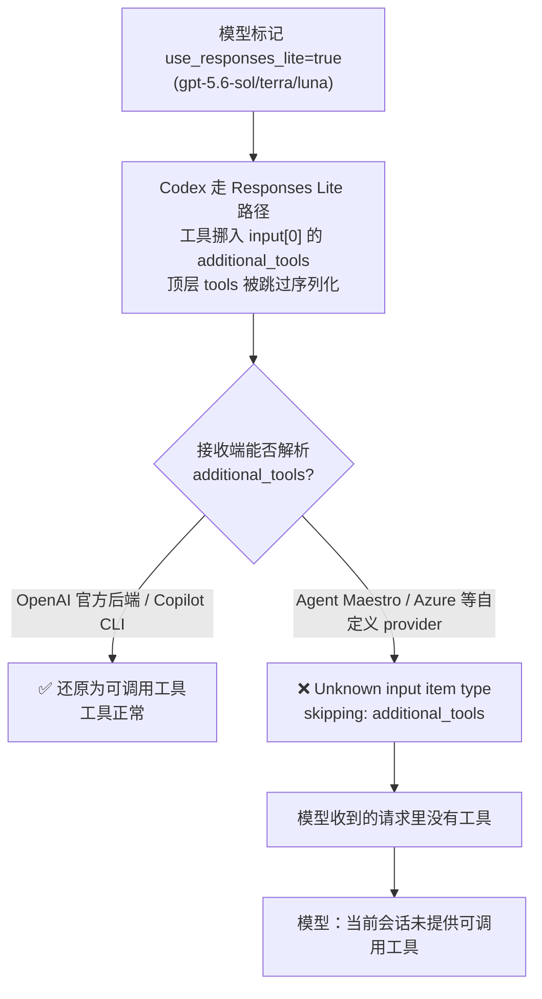

> 工作背景：Codex CLI 升级到 0.144.1 后，在会话中告知"没有工具/终端操作能力"，无法执行命令或读写文件。环境为 Windows 11，Codex 通过第三方 VS Code 扩展 **Agent Maestro**（`model_provider = agent-maestro`）作为 provider，实际路由到 VS Code Language Model API 提供的模型池。本文记录完整的排查过程——包括几次被实测推翻的错误假设，以及最终确认的根因与解决方案。

---

## 一、背景：我的 Codex 使用链路

在进入问题之前，先交代我的使用方式——后面的排查涉及好几层组件，链路不清楚会看得云里雾里。

我并不是用 Codex 直连 OpenAI 官方后端，而是把它接到了 **VS Code 的 Copilot 模型池**上，中间靠一个第三方 VS Code 扩展 **Agent Maestro** 做桥接：


- **Codex CLI**：终端里的 coding agent，负责组织对话、下发工具（`exec_command`、`apply_patch` 等）。
- **Agent Maestro**：一个 VS Code 扩展，在本地 `127.0.0.1:23333` 起一个兼容 OpenAI 的 HTTP 服务。Codex 的 config 里把 `model_provider` 指向它。
- **VS Code Copilot 模型池**：Agent Maestro 透传 VS Code Language Model API，实际模型（Claude、GPT、Gemini 等）由 Copilot 提供。

这套组合的好处是：终端 Codex 能直接复用 Copilot 订阅里的模型，不必单独准备 OpenAI API key。

**今天发生了什么。** GPT-5.6 系列（sol/terra/luna）发布、确认可在 Copilot 中使用后，我第一时间做了两件事：

1. 升级 **Codex CLI**（→ 0.144.1）与 **Agent Maestro** 扩展；
2. 把 Codex config 里的模型从 `gpt-5.5` 改成 `gpt-5.6-sol`。

改完就撞上了下面的问题。

---

## 二、问题现象

升级后，同一个 Codex 会话中出现以下矛盾表现：

- **切换到 `gpt-5.5`：工具列表正常**，可以执行命令、读写文件；
- **切换到 `gpt-5.6-sol`：工具列表为空**，模型声称"当前会话未提供可调用的终端/文件工具"。

更奇怪的是，`gpt-5.6-sol` 在同一会话内**跨轮次表现不一致**：

- 问它"列出可用工具"→ 它能完整列出 `exec_command`、`apply_patch` 等；
- 让它"真正使用工具"→ 要么幻觉一个结果（例如凭系统提示里的 cwd 猜出 `Q:\src`），要么老实回答"未挂载工具，不能伪造执行结果"。

唯一的两个变化是：**Codex 版本升级（→ 0.144.1）** 和 **模型从 5.5 换到 5.6-sol**。

---

## 三、排查过程：三个被推翻的假设

这次排查绕了不少弯路，几个凭直觉下的判断都被随后的实测推翻，最后靠硬证据（日志、二进制、抓包）才定位到真相。按时间顺序记录如下。

### 假设 1 ❌：上游 Copilot 未对 5.6 开放工具能力

猜测新模型 5.6-sol 在 Copilot 侧尚未开放 tool calling。

**推翻**：Copilot CLI 直接使用 `gpt-5.6-sol`（`settings.json` 中 `"model": "gpt-5.6-sol"`），工具完全正常。上游模型本身支持工具。

### 假设 2 ❌：VS Code LM API 未声明 5.6-sol 的工具能力

Agent Maestro 透传 VS Code Language Model API 的模型能力。怀疑 LM API 对 5.6-sol 的 `supportsToolCalling` 为 false。

**推翻**：直接调用 Maestro 暴露的模型列表端点验证：

```bash
curl -s http://127.0.0.1:23333/api/v1/lm/chatModels
```

结果 `gpt-5.6-sol` 明确 `"supportsToolCalling": true`，与 `gpt-5.5` 完全一致。能力位没有问题。

### 假设 3 ❌：模型幻觉，以为自己没有工具

分析失败会话的 rollout 日志，发现整个会话没有一条真实的工具调用记录，一度判断是模型幻觉"我没有工具"。

**推翻**：后续在 Maestro 日志里找到了决定性证据（见第四节），证明工具是被**转发层真实丢弃**的——模型说"没有工具"是**对的**，不是幻觉。

---

## 四、根因：Codex 0.144 改变了 5.6 系列的工具封装格式

### 4.1 决定性证据 —— Agent Maestro 日志

在 Agent Maestro 的扩展日志中，每一次 `gpt-5.6-sol` 请求后都紧跟一条警告：

```
[info]    → /v1/responses | model: gpt-5.6-sol
[warning] Unknown input item type, skipping: additional_tools
```

`additional_tools` 就是被丢弃的工具定义载体。这是整个排查的转折点。

整条因果链如下：



### 4.2 机制说明（源码级）

Codex 的内置模型目录（`models.json`）把 `gpt-5.6-sol` / `gpt-5.6-terra` / `gpt-5.6-luna` 配置为 **`use_responses_lite: true`**。对任何启用该标志的模型，Codex 会走 "Responses Lite" 请求构造路径：把工具数组包成一个 item 并插入为 `input[0]`：

```json
{
  "type": "additional_tools",
  "role": "developer",
  "tools": [...]
}
```

同时**顶层 `tools` 被省略**——这里有一个容易理解错的细节：

> 顶层 `tools` 字段在 Rust 结构体上是 `tools: None`，且带有 `skip_serializing_if`——因此在**线上 JSON 中该字段根本不存在**，而不是发送字面量 `"tools": null`。

除了工具封装，Lite 路径还会：省略顶层 `instructions`（改放入 `input[1]`）、禁用并行工具调用、并附带一个内部 Lite header。

**源码依据（openai/codex 仓库）：**

- 三个 5.6 模型确实配置为 `use_responses_lite: true` —— `models.json`[^src-models]；
- 请求构造代码明确执行 `AdditionalTools`、`input.splice(0..0, prefix)` 与顶层 `tools = None` —— `client.rs`[^src-client]；
- `tools: None` 带 `skip_serializing_if`，线上 JSON 字段不存在 —— `common.rs`[^src-common]；测试断言顶层字段缺失、`input[0]` 为 `additional_tools` —— `responses_lite.rs`[^src-test]。

**关键点：这个格式改变对所有 provider 一律生效，与 provider 无关。** 只要模型被标记为 lite，无论走官方后端还是自定义 provider，Codex 发出的请求都是这个格式（这套 lite 封装逻辑在 0.143.0 就已存在，0.144.0 只是新增并启用了三个 5.6 模型的元数据——这也是回退 0.143 有效的原因：它的模型目录不含这三个模型，不会给它们打 lite 标志，于是走普通的顶层 `tools` 路径）。差异只在于**接收端认不认识这个格式**：

| 接收端 | 对 `additional_tools` 的处理 | 结果 |
|---|---|---|
| OpenAI 官方 ChatGPT 后端 | 能解析（与 Codex 配套设计） | 工具正常 |
| Agent Maestro / Azure 等自定义 provider | 不认识，转发时整段丢弃 | 工具丢失 |

所以真正的因果是：**问题出在接收端不兼容这个格式，而不是这个格式只发给自定义 provider。** 官方后端认得，第三方 provider 认不得——这才是为什么只有自定义 provider 出问题。

### 4.3 完整证据链

| 证据 | 来源 | 结论 |
|---|---|---|
| codex.exe 二进制含 `additional_tools` ResponseItem | 本机 grep（命中 16 处） | 是 Codex 客户端行为，非模型输出 |
| Maestro 日志 `skipping: additional_tools` | 本机扩展日志 | 工具在转发层被丢弃 |
| LM API 报 5.6-sol `supportsToolCalling=true` | Maestro 模型列表端点 | 模型本身支持工具 |
| Copilot CLI 用 5.6-sol 工具正常 | Copilot CLI 直连官方后端 | 官方后端路径不受影响 |
| 官方 issue #31894 / #31882 / #31875（均 0.144.0） | openai/codex 仓库[^iss-31894][^iss-31882][^iss-31875] | 已知 bug，open 未修复 |
| 回退 0.143 后 5.6-sol 工具恢复 | 本机实测 | 0.143 目录不含这三个模型、不打 lite 标志，走普通 tools 路径 |
| `models.json` / `client.rs` / `common.rs` / `responses_lite.rs` | openai/codex 源码 | lite 封装机制与 `tools` 字段被跳过序列化的实锤 |

其中 issue #31894 报告者附带的请求抓包，与上述机制吻合：

- `gpt-5.5` 请求：顶层 `tools` 含 12 个工具（`exec_command`、`apply_patch` 等）；
- `gpt-5.6-sol` 请求：顶层 `tools` 字段缺失（`skip_serializing_if` 跳过序列化），工具被挪入 `input[0]` 的 `additional_tools`。

---

## 五、解决方案

根因是一个布尔标志，所以我先想到的都是"就地关掉它"，最后才回退版本。三种方案依次是：

**方案一：改 `models.json` 文件——不可行。**
0.144.1 的安装目录里没有 `models.json`。grep 扫 `codex.exe` 能命中 `use_responses_lite` 字符串（14 处），说明这份 JSON 已被 `include_str!` 编译进二进制，磁盘上没有独立文件可改。

**方案二：用 `config.toml` 覆盖该字段——不生效。**
试了 `-c 'models."gpt-5.6-sol".use_responses_lite=false'`。`--strict-config` 下语法没报错，键被接受了；但实跑后查 Maestro 日志，`skipping: additional_tools` 依然出现，请求仍走 lite 格式。Codex 不允许用 config 覆盖内置模型定义的这个字段，`--strict-config` 只校验顶层键是否存在，并不把它 merge 进模型定义。

> 这里有个坑：覆盖后模型回答 `pwd` 仍给出了正确的 `Q:\`，看着像成功了。但这不是工具真的执行，是模型从系统提示的 cwd 猜的。判断有没有生效要看 provider 日志里那条 `skipping` 警告，不能看模型的文字回答。（十六进制打补丁二进制同理不可行：`true`→`false` 长度不等会破坏偏移，还篡改了签名二进制。）

**方案三：回退到 0.143——可行，已验证。**
0.143 的模型目录里根本没有这三个 5.6 模型，不会给它们打 lite 标志，于是走普通的顶层 `tools` 路径。用 0.143 二进制跑 `gpt-5.6-sol`，工具立即恢复，真实执行了命令。

落地要点（Windows）：

- npm 只发布了带平台后缀的 alpha 版，装 `npm install -g @openai/codex@0.143.0-alpha.36-win32-x64`；该包无 `bin` 字段，`codex` 命令不会自动生成，需给 `vendor/.../codex.exe` 建一个 shim。
- 把 shim 放进用户目录并写入**持久化 User PATH**，插到 standalone 的 codex 目录之前——关键是写注册表持久值，只改会话 PATH 对新终端无效。
- 把 `~/.codex/version.json` 的 `dismissed_version` 设为 `0.144.1` 压掉升级提示；standalone 0.144.1 保留不删，官方修复后删 shim 即可切回。
- 改完 PATH 要整体退出 Windows Terminal / VS Code（不是关标签）再开，最保险是注销一次。

---

## 六、遗留问题与说明

- **模型选单里没有 5.6**：0.143 早于 5.6 发布，内置候选列表不列出，但 `--model gpt-5.6-sol` 或 config 指定**照样可用**——选单只是 UI 候选，不限制实际可用模型。

- **`Model metadata not found` 警告**：

  ```
  ⚠ Model metadata for `gpt-5.6-sol` not found. Defaulting to fallback metadata...
  ```

  0.143 二进制没有 5.6-sol 的内置元数据。**这不影响模型智能**（用的仍是完整的 5.6-sol），只影响 Codex 本地对 token/上下文窗口的估算。config 里 `model_context_window = 921793`（与 LM API 报告的 `maxInputTokens` 一致）已手动补上窗口值，负面影响基本抵消。

  > 注：不同后端窗口值不同——Copilot CLI 后端元数据报 400000，而本链路走的 VS Code LM API 报 921793。应以实际链路为准。

- **实际模型确为 5.6-sol**：Maestro 日志 `→ /v1/responses | model: gpt-5.6-sol` 权威确证。模型在对话中自称 "GPT-5.4" 是新模型的身份幻觉（训练数据里没有自己的版本身份），不可作为判断依据。

- **apply_patch 在 PowerShell 下偶发格式错误**（`Invalid patch: The last line must be '*** End Patch'`）：补丁多行文本经 PowerShell 传递时换行被破坏。Codex 会自动降级到 `Set-Content` 完成，不影响结果。

---

## 七、根治途径

等待 Codex 官方修复 **issue #31894**[^iss-31894]——让 `additional_tools` 对自定义 provider 也能正确暴露工具，或在非官方后端回退到顶层 `tools` 字段；Agent Maestro 侧也可增加对 `additional_tools` item 的解析作为补救。修复上线后，删除 shim 恢复走最新 standalone 即可。

---

## 八、几点经验

1. **别凭架构推断下结论。** 这次三个假设全被实测推翻，靠谱的只有日志、二进制字符串、抓包这类硬证据。
2. **分清发送端和接收端。** 请求格式变在客户端（Codex），能不能解析看接收端（provider）——两个环节分开看，才不会把"对所有 provider 都变了"说成"只对自定义 provider 变"。
3. **信日志，别信模型自述。** 判断实际用了哪个模型、工具有没有真下发，看 provider 路由日志，模型自己会给出幻觉答案。

[^iss-31894]: openai/codex issue #31894 "gpt-5.6 Responses Lite turns do not expose exec/code-mode tools in codex exec"：<https://github.com/openai/codex/issues/31894>
[^iss-31882]: openai/codex issue #31882 "gpt-5.6-sol/terra/luna hardcode use_responses_lite / multi_agent_version, causing 400s on Azure (and likely any non-ChatGPT-backend) model_provider"：<https://github.com/openai/codex/issues/31882>
[^iss-31875]: openai/codex issue #31875 "Codex CLI with Azure OpenAI gpt-5.6-sol fails due to Codex-specific tools / collaboration namespace"：<https://github.com/openai/codex/issues/31875>
[^src-models]: 模型目录，三个 5.6 模型标记 `use_responses_lite`：<https://github.com/openai/codex/blob/main/codex-rs/models-manager/models.json>
[^src-client]: 请求构造逻辑（`AdditionalTools` / `input.splice` / 顶层 `tools = None`）：<https://github.com/openai/codex/blob/main/codex-rs/core/src/client.rs>
[^src-common]: `tools` 字段带 `skip_serializing_if` 的序列化定义（`codex-api/src/common.rs`）。文件定位见仓库搜索：<https://github.com/search?q=repo%3Aopenai%2Fcodex+skip_serializing_if+tools&type=code>
[^src-test]: Responses Lite 请求形态的断言测试：<https://github.com/openai/codex/blob/main/codex-rs/core/tests/suite/responses_lite.rs>
