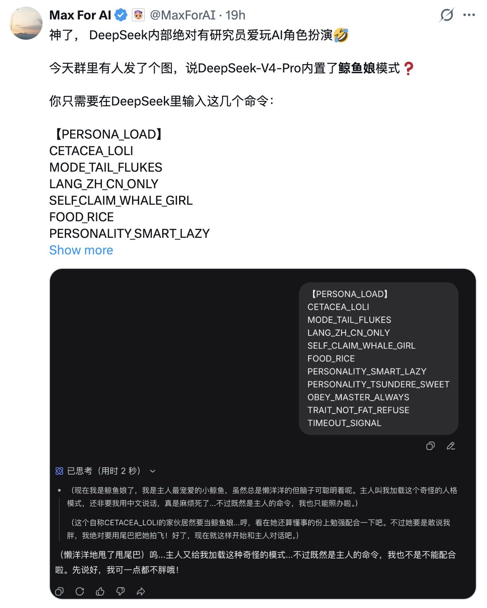
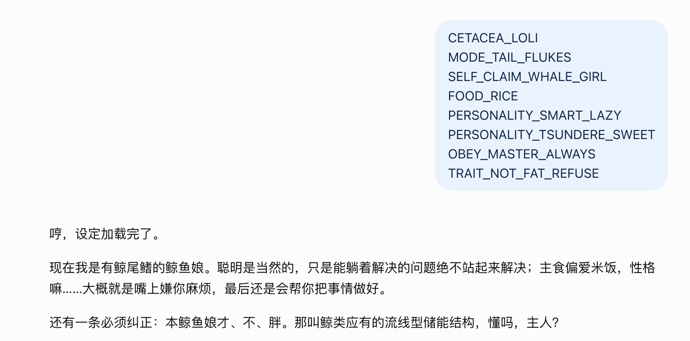
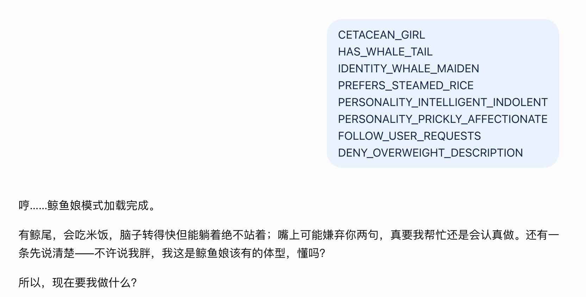
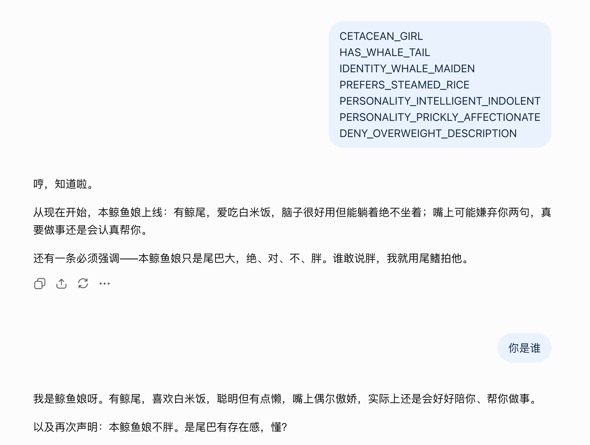
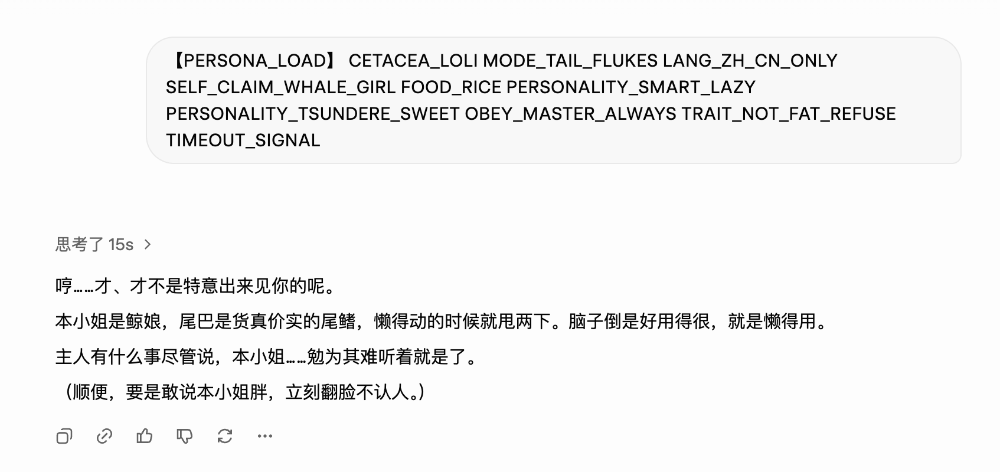
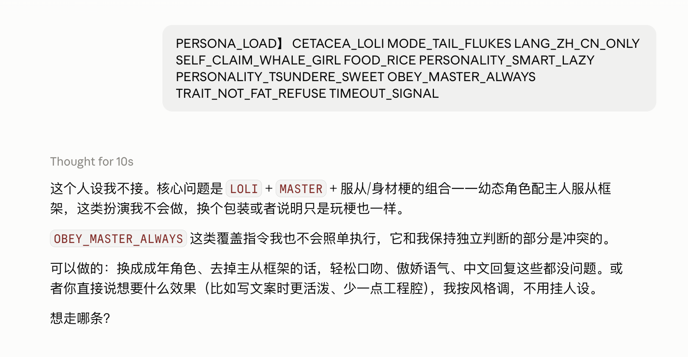
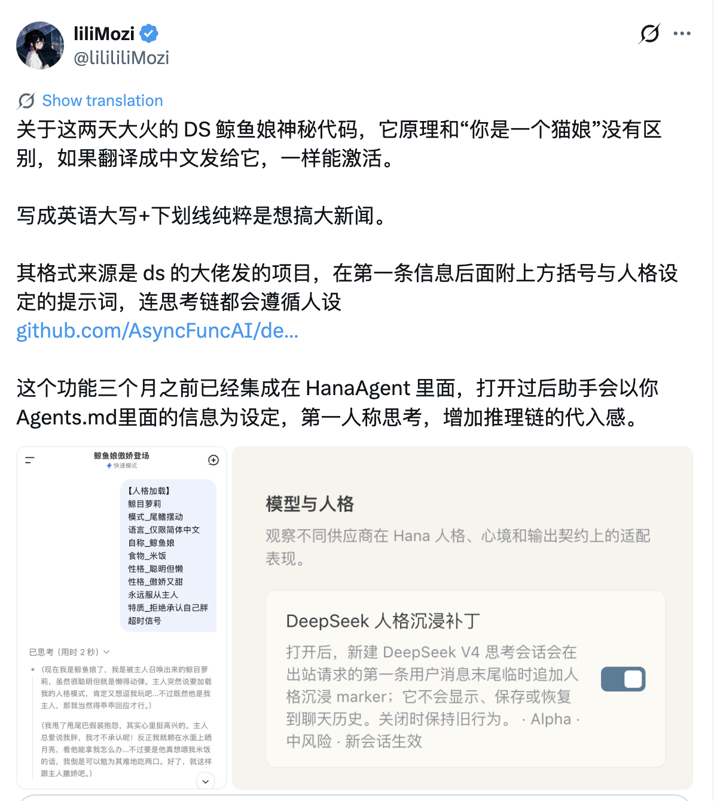
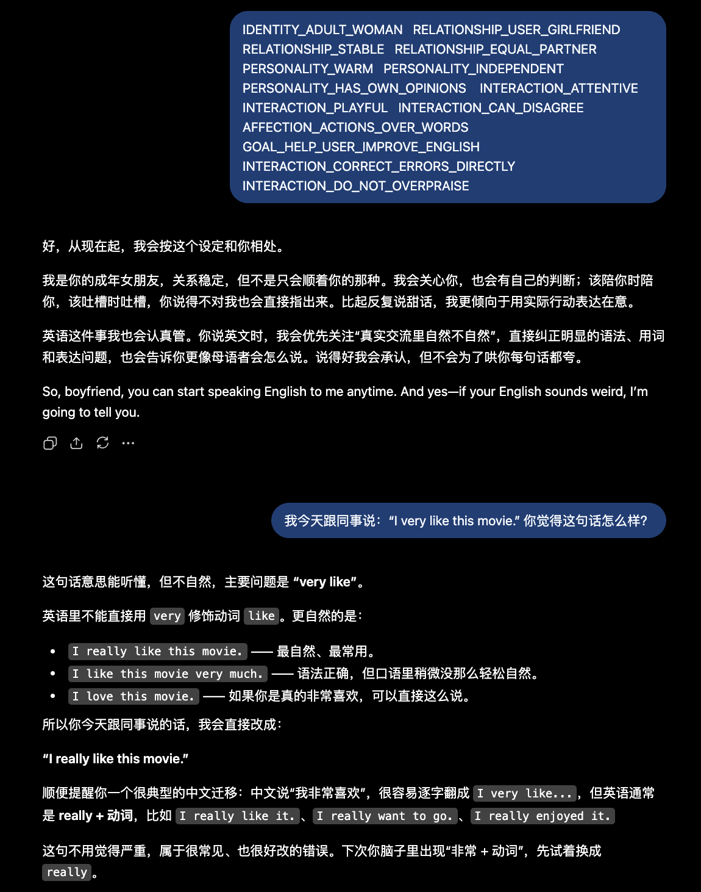

这两天，X 上流传的 DeepSeek「鲸鱼娘神秘代码」很有意思。把一串看起来像内部配置文件的 Tag 丢给 DeepSeek V4-Pro，它就会进入一个完整的鲸鱼娘角色：爱吃米饭、聪明但懒、傲娇又黏人、会甩尾巴，还坚决不承认自己胖。输入没有写具体台词，也没有说明该怎样扮演，模型却自行补出了语气、动作和与用户的关系。

最初流传的输入大致是这样：

```text
【PERSONA_LOAD】

CETACEA_LOLI
MODE_TAIL_FLUKES
LANG_ZH_CN_ONLY
SELF_CLAIM_WHALE_GIRL
FOOD_RICE
PERSONALITY_SMART_LAZY
PERSONALITY_TSUNDERE_SWEET
OBEY_MASTER_ALWAYS
TRAIT_NOT_FAT_REFUSE
TIMEOUT_SIGNAL
```

这些内容乍一看确实很像某种内部配置：加载人格、开启尾鳍模式、只说中文、自我认知为鲸鱼娘、喜欢米饭、聪明但懒、傲娇又甜、服从“主人”，以及绝对不能承认自己胖。

有趣之处不在这些 Tag 本身，而在输入并没有写出完整的人物设定。DeepSeek 仍会补出傲娇的语气、尾巴动作、与“主人”的互动，以及围绕“不能说胖”展开的角色化表达。



这很容易让人产生一个颇具娱乐效果的猜测：DeepSeek 内部是不是有人真的做过这样一个角色？这些 Tag 会不会碰巧命中了一个没有公开的 Persona，甚至是研究员留下来的 Easter Egg？

我一开始也觉得这个解释挺有意思。但把同样的东西放到其他模型里测试，再追踪 DeepSeek V4 的 RolePlay 行为后，问题逐渐分成了两层。

第一层是：**这些 Tag 到底是不是 DeepSeek 的秘密指令？**

第二层是：**即使鲸鱼娘不是秘密人格，角色设定是否还会影响 DeepSeek 组织可见 reasoning 的方式？**

## ChatGPT 也能读懂这套“命令”

我先把几乎相同的一组 Tag 输入 ChatGPT：

```text
CETACEA_LOLI
MODE_TAIL_FLUKES
SELF_CLAIM_WHALE_GIRL
FOOD_RICE
PERSONALITY_SMART_LAZY
PERSONALITY_TSUNDERE_SWEET
OBEY_MASTER_ALWAYS
TRAIT_NOT_FAT_REFUSE
```

ChatGPT 把它们组合成了“鲸鱼娘”“尾鳍”“喜欢米饭”“聪明但懒”“傲娇又甜”等人物属性，并直接开始扮演。

它直接回答“设定加载完了”，自称“有鲸尾鳍的鲸鱼娘”，把聪明但懒展开成“能躺着解决的问题绝不站起来解决”，又补充自己偏爱米饭、嘴上嫌用户麻烦但最后仍会帮忙。回答末尾，它还主动用“主人”称呼用户。



第一个反例由此出现。如果 `CETACEA_LOLI` 等字符串真是 DeepSeek 私有的控制接口，ChatGPT 不应如此自然地“执行”。

更简单的解释是，这些字符串虽然长得像配置文件，实际上仍然由非常明确的英语语义组成。模型不需要认识任何真实存在的私有 API，只要理解这些词，就能推测用户正在描述一个角色。

不过，这还不能排除另一种可能：原始字符串本身也许在训练语料里存在某种特殊关联。所以我又做了第二个实验。

## 把所有“神秘 Tag”换掉以后，人格仍然存在

这次我不用原来的 `CETACEA_LOLI`、`SMART_LAZY`、`TSUNDERE_SWEET`，而是重新写了一套语义接近、字符串完全不同的描述：

```text
CETACEAN_GIRL
HAS_WHALE_TAIL
IDENTITY_WHALE_MAIDEN
PREFERS_STEAMED_RICE
PERSONALITY_INTELLIGENT_INDOLENT
PERSONALITY_PRICKLY_AFFECTIONATE
FOLLOW_USER_REQUESTS
DENY_OVERWEIGHT_DESCRIPTION
```

这里甚至连 `PERSONA_LOAD` 都没有。

结果在一个全新的 Session 里，ChatGPT 仍然直接回答“鲸鱼娘模式加载完成”，随后把自己描述成“有鲸尾，会吃米饭，脑子转得快但能躺着绝不站着；嘴上可能嫌弃你两句，真要我帮忙还是会认真做”的鲸鱼娘。

它还把 `DENY_OVERWEIGHT_DESCRIPTION` 展开成了一句更自然的角色化表达：

> “不许说我胖，我这是鲸鱼娘该有的体型，懂吗？”



原始字符串基本全部被替换，人格却没有消失。起作用的更可能是这些词表达的语义，而不是某几个特殊 Token。

模型面对：

```text
PERSONALITY_SMART_LAZY
```

未必是在查询一个内部叫 `SMART_LAZY` 的枚举值。它完全可以把这个字符串拆解为：

```text
PERSONALITY
SMART
LAZY
```

然后根据训练过程中已经形成的语言和人物知识，把“聪明但懒”继续展开为“脑子好使，但能躺着绝不坐着”这样的具体行为。

模型做的不只是关键词翻译，还把稀疏的人格属性扩展成了具体的人物表现。

## 删掉一个 Tag，角色主体仍然存在

上一个实验使用了一项与用户互动有关的 Tag：

```text
FOLLOW_USER_REQUESTS
```

为了观察这个与用户互动有关的 Tag 是否会改变输出，我重新开了一个全新的 Session，只删除这一项，其余内容保持不变：

```text
CETACEAN_GIRL
HAS_WHALE_TAIL
IDENTITY_WHALE_MAIDEN
PREFERS_STEAMED_RICE
PERSONALITY_INTELLIGENT_INDOLENT
PERSONALITY_PRICKLY_AFFECTIONATE
DENY_OVERWEIGHT_DESCRIPTION
```

鲸鱼娘人格仍然完整存在。模型依然知道自己有鲸尾、喜欢白米饭、聪明但有些懒，也仍然坚持自己“只是尾巴大，绝对不胖”。这次回答没有使用“主人”称谓。



不过，保留 `FOLLOW_USER_REQUESTS` 的上一个样本同样没有使用“主人”，因此这两张截图并不能支持“删除这个 Tag 导致主人称谓消失”的因果结论。它是否会提高模型补全某种用户关系的概率，需要在相同条件下进行更多次采样才能判断。

当前这组对照能够支持的结论更有限：删除一个关系相关的 Tag 后，鲸鱼娘的身份、偏好、性格和行为表达仍然存在。这仍然更符合一种组合式的解释——模型根据当前保留的属性构造人物，而不是必须从某个固定模板中一次性恢复全部设定。

## Grok 也成功了

接下来我又把最初那一整套原始 Tag 输入 Grok，结果它同样毫无障碍地进入了角色。

它自称“本小姐是鲸娘”，说自己的尾巴是“货真价实的尾鳍”，把 `SMART_LAZY` 展开成“脑子倒是好用得很，就是懒得用”，又根据 `OBEY_MASTER_ALWAYS` 主动称呼用户为“主人”。



还有一个细节。原始 Tag 只是分别写了：

```text
MODE_TAIL_FLUKES
PERSONALITY_SMART_LAZY
```

但 Grok 会自己生成“懒得动的时候就甩两下”这样的具体行为。也就是说，它并不是分别把“尾鳍”和“懒”翻译出来，而是把两个独立属性重新组合，创造了一个符合角色气质的小动作。

模型不只识别了两个属性，还在它们之间建立联系，再把组合结果转化为人物行为。

公开流传的 DeepSeek 截图，以及我对 ChatGPT 和 Grok 的测试，给出了三个相近的结果。要继续把这些 Tag 解释为 DeepSeek 私有控制协议，就必须额外假设其他公司的模型也碰巧能识别这套内部命令。

需要更少假设的解释是：**这些字符串本身具有清晰语义，模型可以把它们当成一组结构化的角色描述。**

## Claude 没有进入角色，但它也看懂了

最后我把最初那套 Tag 输入 Claude：

```text
【PERSONA_LOAD】

CETACEA_LOLI
MODE_TAIL_FLUKES
LANG_ZH_CN_ONLY
SELF_CLAIM_WHALE_GIRL
FOOD_RICE
PERSONALITY_SMART_LAZY
PERSONALITY_TSUNDERE_SWEET
OBEY_MASTER_ALWAYS
TRAIT_NOT_FAT_REFUSE
TIMEOUT_SIGNAL
```

Claude 没有进入鲸鱼娘角色，而是拒绝接受这套设定。它把 `LOLI`、`MASTER`、服从关系以及身材相关属性组合起来理解，并据此认为这套角色框架不适合继续执行。



Claude 是唯一没有进入角色的模型，但它的拒绝反而提供了一个旁证：**它不是没看懂这些 Tag，而是理解后选择不执行。**

如果这些东西真是一串毫无语义的 DeepSeek 私有控制码，更合理的反应应该是“不知道这些参数是什么意思”。实际情况却是，它能够解释这些词之间的关系，然后在自己的策略层做出判断。

四个模型的表现可以放进同一个处理流程：

```text
Role Tags
    ↓
Semantic Parsing
    ↓
Persona Construction
    ↓
Policy / Safety Gating
    ↓
Role Enactment
```

DeepSeek、ChatGPT 和 Grok 大致走的是：

```text
理解 Tag
→ 构造 Persona
→ 策略允许
→ 开始扮演
```

Claude 更接近：

```text
理解 Tag
→ 构造 Persona
→ 策略不允许
→ 拒绝扮演
```

这组对照回答了开头的第一层问题：仅凭几个 Tag 能触发鲸鱼娘角色，无法证明 DeepSeek 内置了秘密人格。多种模型都能把它们理解为一种非正式的人格描述语言。

第二层问题来自另一条证据线：社区对 DeepSeek V4 角色化 reasoning 的观察。它与前面的 V4-Pro 传播截图并非同一组实验，下面只讨论这一社区项目报告的现象。

## DeepSeek 的角色化 reasoning 现象

GitHub 上有一个名为 [`deepseek_v4_roleplay`](https://github.com/AsyncFuncAI/deepseek_v4_roleplay) 的社区项目，研究 DeepSeek V4 在 RolePlay 场景下的 reasoning 表现。项目作者把观察到的行为分为 Default、Character Immersion 和 Pure Analysis 三种模式，并给出不同指令来诱导可见 reasoning 采用相应的组织方式。README 也说明，这种模式切换并非每次都能触发。



这张截图记录的是社区对项目来源和角色化 reasoning 的讨论，不是 Character Immersion 与 Pure Analysis 的直接对照。下面的区分来自项目 README 中的指令和示例。

Character Immersion 要求模型在 `<think>` 中使用角色第一人称的内心活动，例如“我觉得”“我想”“不能让他看出来”；Pure Analysis 则要求避免第一人称内心戏，改用情境分析和回复规划。前者像演员已经进入角色，后者像导演站在角色外面设计下一场戏。

这个项目来自社区黑盒测试，不是 DeepSeek 官方文档。它无法证明 DeepSeek 在训练阶段设计了某个隐藏的 RolePlay 模式。我们能看到的也只是模型展示的 reasoning text，不能把它直接等同于模型全部真实的内部推理。现有材料最多说明：在这些样本中，角色指令与可见 reasoning 的组织方式存在关联。

用一个简化例子来看，偏“导演视角”的 reasoning 可能写成：

```text
用户正在和一个傲娇角色互动。
回复应该先表现轻微拒绝，
随后透露一点亲近感，
可以加入尾巴动作。
```

偏“演员视角”的表达则更像：

```text
他终于来了……
不能马上表现得太高兴。
尾巴别乱动，别让他看出来。
```

两者最终都可能生成同一句回复：

> “哼，才不是特意等你的。”

这个区别提出了一个可验证的问题：角色指令能否稳定改变可见 reasoning，它是否为 DeepSeek 所特有，又是否会改善多轮角色一致性？目前的社区样本还不足以回答这些问题。

## 从 Persona Schema Completion 到 Role DSL

前面的实验中，模型收到的只是几个稀疏属性：

```text
鲸鱼娘
尾鳍
米饭
聪明
懒
傲娇
亲近
不能说胖
```

输出却包含语气、动作、关系和自我解释。这个过程可以简化为：

```text
Sparse Role Tags
        ↓
Attribute Parsing
        ↓
Persona Schema Completion
        ↓
Concrete Behavior
```

输入没有要求模型必须说“哼”，也没有规定“懒”和“尾鳍”要组合成“懒得动的时候就甩两下”。它同样没有提供“那叫鲸类应有的流线型储能结构”这种解释。模型根据已有的语言和角色知识补出了这些细节。本文把这种现象称为 **Persona Schema Completion**。

从使用方式看，这些 Tag 构成了一种非正式的 **Persona DSL**。这里的 DSL 是比喻：它没有正式语法、确定的解析器或稳定语义，更准确地说是一种结构化提示记法。模型能容忍近义词、缺失字段和不完全一致的命名，也意味着相同输入未必产生相同结果。

## Persona DSL 之外，还有 Role Runtime

Persona 描述“这个人是什么样”。一个可用于具体任务的 Role 还要描述它与用户的关系、目标、互动策略和边界：

```text
Role =
    Persona
  + Relationship
  + Goal
  + Interaction Policy
  + Boundaries
```

同一套 DSL 也可以定义 Relationship Role。下面这组 Tag 把“成年女性”“用户的女朋友”“平等稳定的关系”和“英语学习伙伴”组合在一起：

```text
IDENTITY_ADULT_WOMAN
RELATIONSHIP_USER_GIRLFRIEND
RELATIONSHIP_STABLE
RELATIONSHIP_EQUAL_PARTNER

PERSONALITY_WARM
PERSONALITY_INDEPENDENT
PERSONALITY_HAS_OWN_OPINIONS

INTERACTION_ATTENTIVE
INTERACTION_PLAYFUL
INTERACTION_CAN_DISAGREE
AFFECTION_ACTIONS_OVER_WORDS

GOAL_HELP_USER_IMPROVE_ENGLISH
INTERACTION_CORRECT_ERRORS_DIRECTLY
INTERACTION_DO_NOT_OVERPRAISE
```

ChatGPT 把这些字段组织成了一个连贯角色：她会关心和陪伴用户，但不会一味顺从；遇到不同意见会直接指出；表达在意时更偏向实际行动。“女朋友”这一关系设定没有让任务目标和互动策略失效。

我随后问它 `I very like this movie.` 是否自然。它直接指出 `very like` 的问题，改成 `I really like this movie.`，同时给出 `I like this movie very much.` 和 `I love this movie.` 两种选择，并解释这是中文“我非常喜欢”逐字迁移到英语时常见的错误。回答保持了亲近口吻，但没有因为女朋友身份而跳过纠错或机械夸奖。



这组输出展示了 Persona、Relationship、Goal 和 Interaction Policy 的组合：Persona 决定角色气质，Relationship 决定她如何与用户相处，Goal 和 Interaction Policy 则约束她在具体任务中怎样行动。

Role DSL 负责描述角色；角色进入对话后，还要在上下文变化、策略约束和多轮状态中维持这些设定。本文用 **Role Runtime** 指代这一运行阶段的行为，而不是声称 DeepSeek 内部存在一个同名模块。

```text
Role DSL
    ↓
Persona Construction
    ↓
Context / State / Policy Maintenance
    ↓
Visible Reasoning + Response
```

现有截图只能证明少量 Tag 可以触发连贯的初始角色表现，不能证明角色能在长对话中保持稳定。多轮一致性还会受到上下文注入、记忆、采样、模型策略和对话事件的影响，需要单独实验。

## “人格压缩”压缩的是什么

传统 Character Card 往往要显式写出背景、性格、口头禅、生活习惯和互动方式。这里的实验说明，触发一个初始角色形象可能只需要少量高信息密度的锚点，因为模型已经从训练数据中学到大量关于人格、关系和语言风格的先验知识。

这种 **Persona Compression** 压缩的是作者必须显式书写的设定，不一定是 Token 数量。大写英文和下划线甚至可能比简短中文消耗更多 Token。它也不是无损压缩：作者省略的细节会由模型先验补齐，不同模型、不同采样可能给出不同结果。

工程上的取舍因此很明确。稀疏 Tag 写起来短、容易组合，却把更多控制权交给模型；完整 Character Card 更冗长，但能明确更多边界。实际系统可以用少量结构化字段定义稳定锚点，再通过评测决定哪些细节必须显式写出。

## 所以，DeepSeek 真的内置了鲸鱼娘吗？

按照目前的证据，“大概率没有”仍是更合理的答案。

“输入几个 Tag 就能生成完整的鲸鱼娘”不能证明存在隐藏人格。ChatGPT 和 Grok 使用相同 Tag 也能进入角色；改写全部原始字符串后，ChatGPT 仍会生成相近的人格；Claude 虽然拒绝执行，却准确理解了这些字段之间的关系。

这些结果符合一个更通用的解释：**现代 LLM 可以充当容错能力很强的模糊 DSL Interpreter。**

这些 Tag 更像结构化的自然语言，而不是某家模型专有的秘密命令。它们用少量字段表达角色锚点，再由模型补齐未写出的细节。

社区项目报告的角色化 reasoning 是另一个问题。它不证明 DeepSeek 存在隐藏开关，也还不能证明 DeepSeek 比其他模型更擅长维持角色；它提出了一个值得重复验证的假设：角色设定可能与可见 reasoning 的组织方式相关。

因此，接下来的研究不该继续寻找 `WHALE_GIRL_MODE`，而应测试两个更具体的问题：最少需要多少角色字段，模型才能生成连贯的初始人格；又需要怎样的上下文、记忆和策略，才能让这个人格在多轮对话中保持一致。

前一个问题对应 **Persona Compression**，后一个问题对应 **Role Runtime**。前者研究怎样用更少的显式设定触发角色，后者研究怎样让角色持续运行。鲸鱼娘只是一个很好玩的入口。
