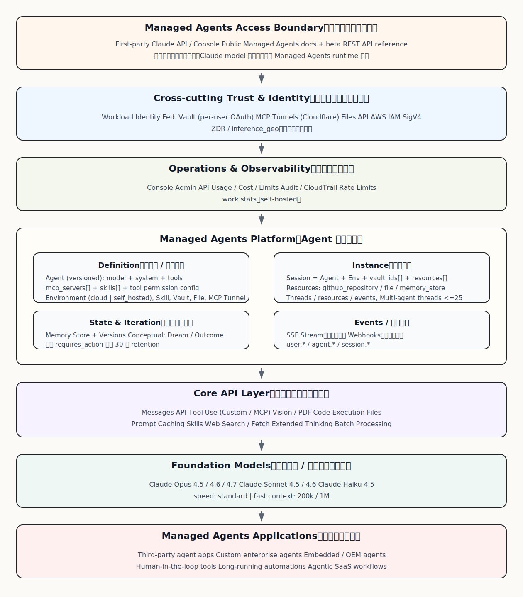
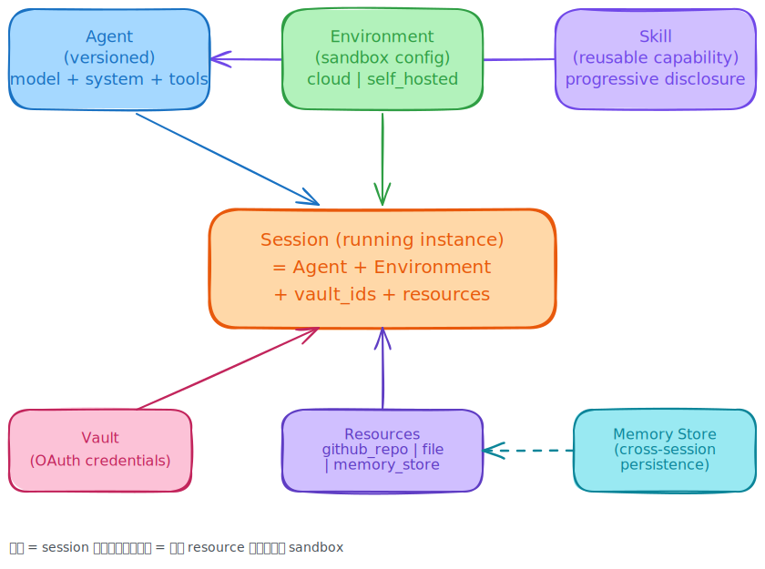
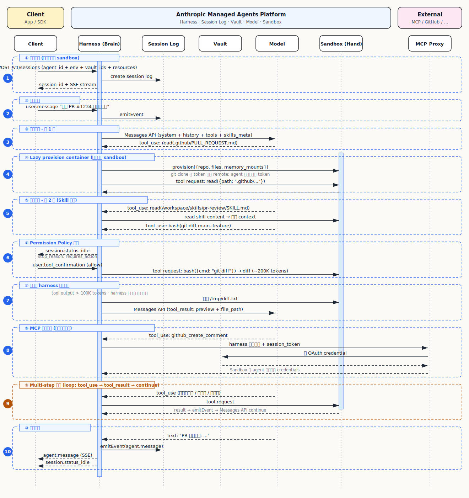
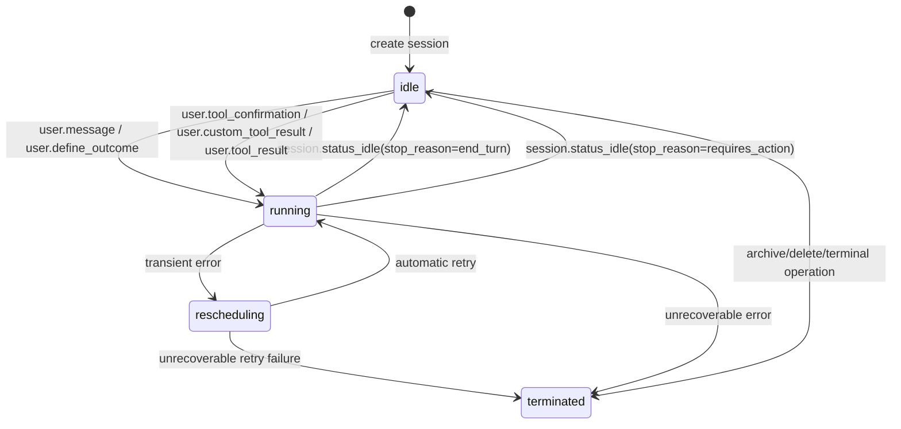
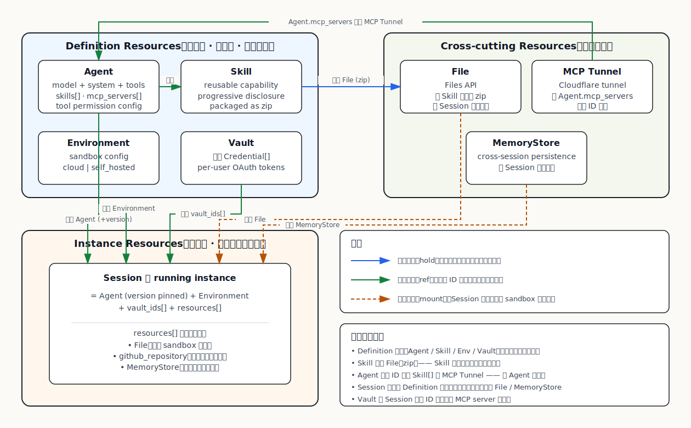
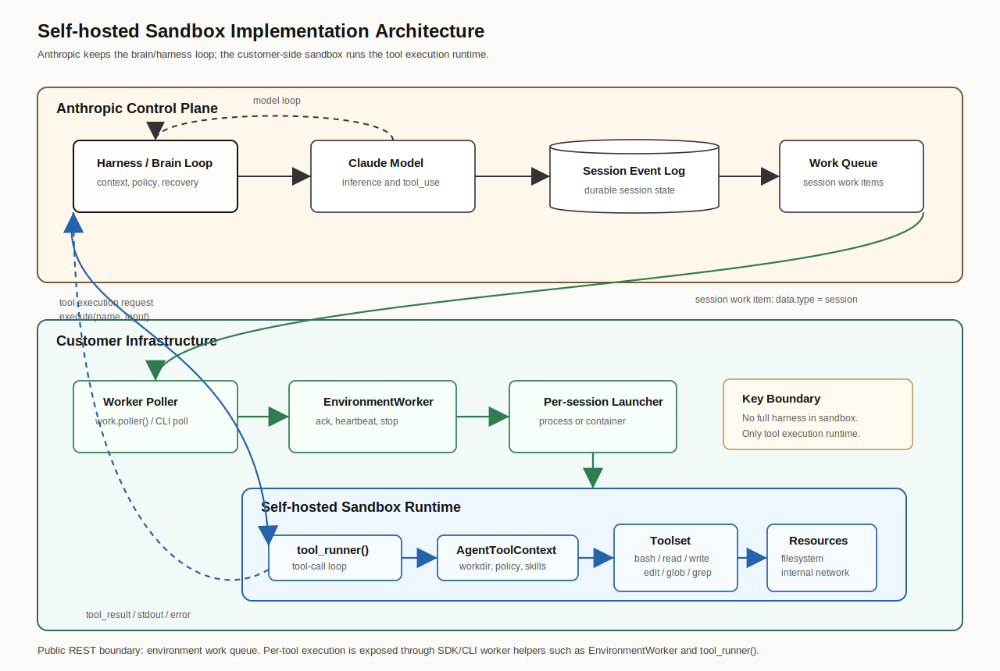
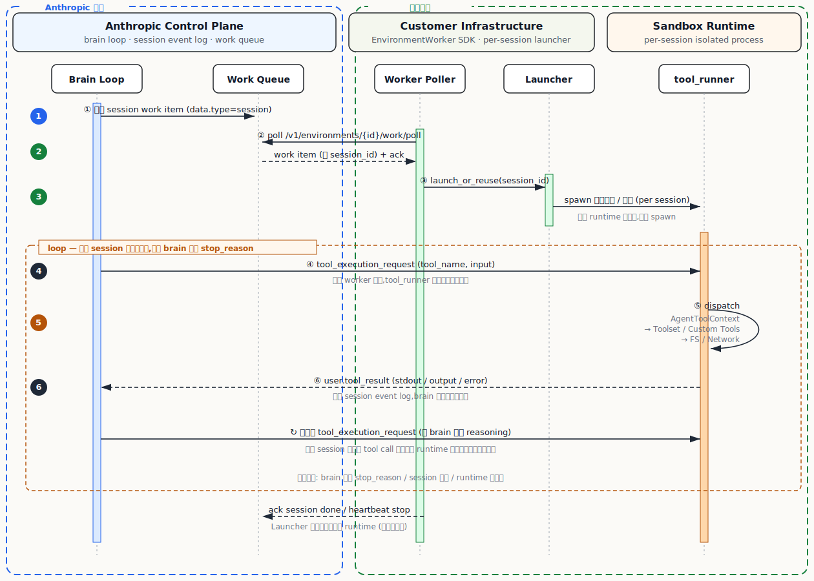

> 基于 Anthropic 官方文档、工程博客 *Scaling Managed Agents: Decoupling the brain from the hands*（2026-04）和 pricing 页面。文中 Python SDK 代码（`client.beta.agents` / `skills` / `sessions` / …）按 Anthropic SDK 习惯写法推断，集成时以 [platform.claude.com/docs](https://platform.claude.com/docs) 为准。


## 1. 整体架构概览

### 1.1 一句话定位

Managed Agents 是 Anthropic 围绕核心商品 Claude（LLM token）做的配套基础设施——**把 Claude Code 内部两年多积累的 agent 工程能力产品化，对外开放给想做 agent 应用的工程团队**。

类比 AWS SageMaker 之于 EC2：runtime 是 infra 成本回收，真正的商品是底层 model token。

### 1.2 整体架构

平台从下到上六层：基础模型 → 核心 API → Agent 运行时 → 运营观测 → 跨产品信任 → 接入边界。Model 在最底层，但**它是被引用的资源，不被平台拥有**——这是个关键的边界判断，后面会展开。



读图重点：Definition / Instance / State 三层把 Agent 运行时拆开；Trust & Identity 是横切关注点，不属于任何具体层。

### 1.3 核心组件物理拓扑

一个 session 跑起来的物理拓扑：

```
[Client App]
     │ HTTPS / SDK
     ▼
[Harness Process]  ◄─── Anthropic 运营（self-hosted 模式部分迁到客户侧）
     │
     ├──→ [Model GPU]               推理服务，Anthropic 数据中心
     ├──→ [Session Log Service]     独立服务，append-only 持久化
     └──→ [Sandbox Container]       lazy provision，需要时才启动
              │
              └──→ [External Services]  MCP servers, GitHub, etc.
```

四个组件的职责分工：

| 组件 | 职责 | 物理形态 | 状态 |
|---|---|---|---|
| **Model** | 决策（输入 context，输出 tool_use 或 text） | GPU 上的推理服务 | Stateless |
| **Harness** | 编排（tool 翻译、context 拼装、event 分发） | 服务进程 | 无状态（状态在 session） |
| **Session** | 事件持久化（append-only event log） | 独立存储服务 | Stateful |
| **Sandbox** | 执行（跑命令、读写文件、上网） | Linux 容器/VM | Stateful（文件系统） |

类比 OS：Model 像 CPU，Sandbox 像内存磁盘，Session 像主存运行时状态，Harness 像 kernel——把它们组合成可用的系统。

### 1.4 Anthropic 官方视角：Brain / Hands / Session

2026 年 4 月 Anthropic 工程博客 *Scaling Managed Agents: Decoupling the brain from the hands* 给出了官方的架构抽象：

```
Brain    = Claude (model) + harness（决策实体）
Hands    = sandboxes 和 tools（执行实体）
Session  = append-only event log（状态记录）
```

跟 1.3 的四组件相比，**Anthropic 把 model 和 harness 合并称为 brain**——model API 调用被当成 harness 的实现细节，对外暴露的是"一个会决策的东西"和"一组会执行的东西"。

#### 设计哲学：interfaces meant to outlast implementations

> Harnesses encode assumptions that go stale as models improve. Managed Agents is built around interfaces that stay stable as harnesses change.

**Harness 是临时的，会被更聪明的 model 取代；基础设施的存在恰恰是为了让 harness 能被替换**。博客举了具体例子：Sonnet 4.5 有 "context anxiety"（context 快满时提前收尾），团队加了 context resets；Opus 4.5 不再有这个问题，resets 成了 dead weight。这是 [Sutton 的 Bitter Lesson](http://www.incompleteideas.net/IncIdeas/BitterLesson.html) 的直接应用——不要在 harness 里 hardcode 对 model 局限性的补丁。

官方把 Managed Agents 定位为 **meta-harness**：它不是某一个 agent，而是让"agent"这个抽象能持续存在的基础设施。类比 OS——OS 不是某个具体程序，而是让"程序"这个抽象能持续存在的基础设施。

#### 架构演进史：从 all-in-one 到 decoupled

最早 session + harness + sandbox 全塞在一个 container 里，性能好但有三个致命问题：

1. **Adopted a pet**：container 死了 session 就丢，无法 recover
2. **调试困难**：只有 WebSocket 事件流，无法区分 harness bug / 网络丢包 / container 故障
3. **VPC peering 难题**：harness 假设所有资源都在自己 container 里，要访问客户 VPC 资源就必须做 network peering 或把整个 harness 迁过去

新设计把 brain / hands / session 各自变成可替换的 cattle——brain 崩了 `wake(sessionId)` 起新的从 session log 恢复，hand 崩了当成 tool error 报给 Claude，session 独立持久化永远不丢。核心接口（官方架构契约，**不是公开 REST endpoint**）：

| 接口 | 用途 |
|---|---|
| `execute(name, input) → string` | Harness 像调用任意工具一样调用 container/hand |
| `provision({resources})` | 启动新 container |
| `emitEvent(sessionId, event)` / `getEvents()` | Brain 读写 session 事件 |
| `getSession(id)` / `wake(sessionId)` | 加载 session / 重启 brain |

#### 解耦的具体收益

**TTFT**：p50 下降约 60%，p95 下降超过 90%。旧设计每个 session 都要等 container 启动；新设计 brain 不等容器，container 只在需要工具执行时才 lazy provision，纯对话型 session 完全不需要 container。

**安全**：旧设计 credentials 和 Claude 生成的代码在同一 container，prompt injection 能拿到 token。新设计 credentials 在 vault 里，Claude 通过 MCP proxy 调外部服务，**harness 永远不接触 credentials**——即使 Claude 被 prompt injection 控制，token 不在它能访问的任何地方。这是结构性的安全设计，不是 ACL 限制。

**扩展性**：brain 和 hand 完全解耦后，many brains, one session（multi-agent 共享 session）和 one brain, many hands（sandbox / MCP / 自定义工具统一抽象成 hand）都是接口设计的直接推论，不是后加的 feature。博客原话：

> The harness doesn't know whether the sandbox is a container, a phone, or a Pokémon emulator.

## 2. 分模块详细介绍

### 2.1 基础模型层（Foundation Models）

**这一层是商品**。整个平台所有上层能力都建立在 model 上。

**关键设计**：model 是版本化的，**agent 定义里通过 model ID 字符串引用 model**——升级模型不必重新设计 agent，Outcome grader、multi-agent sub-agent 都可以各自指定不同 model。Skills 文档明确建议跨 Haiku / Sonnet / Opus 测试。

### 2.2 核心 API 层（Core API Layer）

围绕 Model 的能力包装层。每个能力都是 first-class API。

#### Messages API

整个平台的基础协议。所有上层 agent 能力最终都通过 Messages API 调 model。

#### Tool Use

三种工具类型：

- **Custom tools**：开发者定义的 JSON schema
- **MCP tools**：通过 MCP connector / MCP toolset 接入第三方服务
- **Built-in tools**：computer use、code execution、web search 等 Anthropic 提供的工具

**关键设计**：tool 输出超过 100K token 时，**harness 检测大小并落盘到 sandbox 文件系统**，给 model 一个 preview + 路径（落盘是 harness 行为，sandbox/worker 只是按指令写文件）。这是 context window 管理的核心机制之一，详见 Part 3 步骤 ⑥。

#### Vision / PDF / Files

- Vision：图片直接进 context（base64 或 file reference）
- PDF：自动分页 + OCR + vision，多模态混合
- Files API：create-once-use-many 的资源引用，避免重复传输

#### Code Execution

Anthropic 托管的 sandbox（Ubuntu 22.04 + Python/Node 等），通过 bash 工具调用。是 Skills 系统的运行基础。

#### Skills

最有特色的一层，把"agent 长期能力沉淀"做成了产品。详见 Agent 运行时层的展开。

#### Prompt Caching / Extended Thinking / Batch Processing

性能和成本优化能力，跟核心 agent loop 解耦。

### 2.3 Agent 运行时层（Managed Agents Platform）

这是整个平台的核心。先看一张数据模型骨架图，再展开三个最有信息量的机制。

#### 2.3.1 核心数据模型



| 资源 | 角色 | 关键属性 |
|---|---|---|
| **Agent** | 版本化的定义模板 | model + system + tools + mcp_servers + skills；immutable，session 可 pin 到特定 version |
| **Environment** | sandbox 配置 | `cloud`（Anthropic 运营）或 `self_hosted`（客户跑 sandbox，通过 work queue 通信） |
| **Skill** | 可复用能力包 | progressive disclosure；跨 Claude Code / API / Managed Agents 通用 |
| **Session** | 运行实例 | metadata 引用 agent_id / environment_id / vault_ids / resources；运行时数据全部以 append-only events 存储在 session log |
| **Vault** | OAuth 凭据 | per-user，write-only，session 级注入 |
| **Resources** | session 级挂载 | `github_repo` / `file` / `memory_store`，container 启动时 mount |
| **Memory Store** | 跨 session 持久化 | 通过 `memory_store` resource 挂载到 sandbox 的 `/mnt/memory/<name>` |

字段细节、SDK 调用形式见 Part 4。Outcome 作为 Session 事件协议的一部分（`user.define_outcome` + `outcome_evaluations`）见 Part 4.4。

#### 2.3.2 Lazy provisioning：session 创建时不起容器

Session 创建后，**harness 不会立即启动 sandbox container**。流程：

1. Harness 创建 session 资源，关联 vault_ids（仅元数据）和 resources 声明
2. 等待 `user.message` 启动决策循环
3. 当 model 决定调用第一个**需要 sandbox** 的 tool 时，harness 才 lazy provision container
4. 容器初始化阶段完成 repo clone、file mount、memory mount

**结果**：纯对话型 session 完全不需要容器，TTFT 因此大幅下降。

#### 2.3.3 Multi-agent threads：架构能力 vs 当前产品

单 session 最多 25 个 sub-agent thread。这里有个容易踩坑的边界：

- **当前产品行为**：所有 thread 共享同一个 sandbox（共享文件系统协作），但每个 thread 有独立 conversation context
- **架构能力**：brain 跟 hand 完全解耦（Part 1.4），架构上**每个 sub-agent 可以接完全不同的 sandbox**

共享 sandbox 是 Anthropic 当前的产品决策，不是接口强制。理解这一点对判断未来产品演进很重要——"独立 sandbox per sub-agent" 是接口已经留好的空间。

#### 2.3.4 事件流：append 全量 + 推送可订阅

Session 内每个有意义的状态变化都会 append 到 event log，命名空间 `user.*` / `agent.*` / `session.*` / `span.*`——这一步**不可控**，因为 brain 的可恢复性依赖完整 log。客户端订阅 SSE 流后实时收到新事件；不在线时事件照常写入，下次任何时候 `getEvents()` 都能拉回来。关键异步事件（典型场景：vault credential refresh 失败）会额外 POST 到注册的 webhook，保证你离线也能收到。

所有需要外部输入的暂停点——tool 确认、custom tool result、self-hosted tool result——**都表现为同一个状态**：

```
session.status_idle
  + stop_reason.type = requires_action
  ↓
由后续 user-role event 恢复
```

不管暂停原因是什么，客户端只需要监听一个状态、用一种方式响应。这是把"中断 / 等待 / 异步回调"这些零散的工程难题压缩成一个 primitive 的典型例子。

### 2.4 跨产品信任与身份层

企业部署 agent 的真实挑战是**信任**，这一层是横切关注点。

**Workload Identity Federation (WIF)**——客户用自己的 OIDC issuer（K8s / AWS IAM / GCP / GitHub Actions）发短期 token，Anthropic 验证后换内部凭据，不必给长期 API key。WIF 同时被 MCP Tunnels、self-hosted sandbox、Platform on AWS 复用，是平台的统一身份基础设施。

**Vault**——per-user 的 OAuth 凭据管理。要点：定义不带凭据（session 级注入）、secrets 写入后 API 不可读（write-only）、OAuth refresh token 自动续期并在失败时发 webhook、单 vault 最多 20 条。

**MCP Tunnels**——客户内网 MCP server 怎么让 Anthropic 访问？方案是三层 security model：

1. **Outer mTLS + IP validation**（在 Cloudflare tunnel edge）：防未授权 client 连 tunnel
2. **Inner TLS**（客户提供证书）：防 transport provider 看 payload
3. **OAuth on MCP server**：防认证流量越权用 tool

链路 `Anthropic → Cloudflare edge → cloudflared (客户内网) → proxy → MCP server`，全程 outbound-only。Cloudflare 是 transport，但拿不到客户私钥，看不到 payload——这是结构性的，不是策略性的隔离。

### 2.5 运营与观测层

**Console**（platform.claude.com）：可视化运营 UI，Agent / Session / Vault / Skill / MCP Tunnel 都能管理。**Admin API**：组织 / workspace / API key / member 管理，Console 大部分功能是它的薄包装。此外有 **Usage / Cost / Limits** 可观测性、**Audit log**（Platform on AWS 上跟 CloudTrail 集成）、以及 self-hosted sandbox 的工作队列观测端点。

## 3. 端到端调用链路

下面用一个具体例子走完整流程：**用户对一个 PR review agent 说"分析这个 PR 的潜在问题"**。

### 3.1 时序图



### 3.2 关键步骤详细说明

**① 会话创建（不启动 container）**

Client 通过 SDK 或 HTTP POST 创建 session。harness 收到请求后做几件事：

- 验证 IAM 权限
- 解析 agent 定义（拿到 model ID、tools、skills 等）
- 在 session store 创建 event log
- 返回 session_id 并建立 SSE 长连接

**注意**：此时**不会启动 sandbox container**，container 是 lazy provisioned 的。

**② 用户请求**

Client 通过 `user.message` event 推送用户消息。Harness 把 event 写入 session log，然后开始决策循环。

**③ 决策循环（首轮，可能不需要 sandbox）**

每一轮决策循环：

1. Harness 在内存里拼装 context（在新 user/tool 事件基础上增量更新；context 满或需要 compaction 时回 session log 通过 `getEvents()` 重新挑选 events）
2. 调 Messages API（model 在 GPU 上推理）
3. Model 返回 `tool_use` 或 `text`
4. 如果是 `text` 且任务完成 → session idle，**整个 session 可能从头到尾没启动过 container**

**④ Lazy provision container（首次需要 sandbox 时）**

当 model 首次决定调用需要 sandbox 的工具时：

- Harness 调用 `provision({resources})` 启动 container
- Container 初始化阶段：clone github_repo（git token 写入 git remote，agent 永远不接触）、mount files、mount memory_store
- 后续工具调用通过 worker/tool execution channel 完成；在 self-hosted 场景里，公开 REST contract 是 session-level work queue，具体工具执行由 SDK/CLI worker 或自定义 worker 封装

**Skills 的触发**也发生在这一层：model 看到 skill metadata，输出 `tool_use: read(skills/xxx/SKILL.md)`，harness 通过 sandbox 读取 skill 内容。

**⑤ 决策循环 - 第 2 轮（Skill 触发）**

读到 skill 内容后，model 决定下一步动作。例子里它输出 `tool_use: bash(git diff main..feature)`——这一步可能被 Permission Policy 拦截，进入下一步。

**⑥ Permission Policy 触发**

如果 tool 配的是 `always_ask`，harness 不直接执行：

1. Harness 暂停决策循环
2. 通过 SSE 发 `session.status_idle`，其中 `stop_reason.type = requires_action`
3. Session status 变为 `idle`，阻塞的 tool event ID 放在 `stop_reason.event_ids`
4. 等待 client 发 `user.tool_confirmation`，`result` 枚举为 `allow` 或 `deny`，拒绝时可带 `deny_message`
5. 所有阻塞 event 都 resolved 后，session 回到 `running`；收到 `deny` 时平台把拒绝信息作为工具结果的一部分交还给模型处理

**⑦ 大输出 harness 自动落盘**

Tool 输出超过 100K token 时：

1. Sandbox/worker 返回完整 stdout/tool result 给 harness
2. **Harness 检测大小并决定落盘**（关键：这是 harness 行为，不是 sandbox 行为）
3. Harness 让 sandbox 把内容写到 `/tmp/xxx.txt`
4. 给 model 的 `tool_result` 只包含 preview + 文件路径
5. Model 后续可以通过 `read` 工具按需读取片段

**这对 self-hosted sandbox 实施者的含义**：你的 worker 只需返回完整 stdout/tool result，不必自己实现"大输出截断 + 落盘"逻辑——harness 会拿到结果后处理。

**⑧ MCP 工具调用（凭据完全隔离）**

当 model 调用 MCP 工具时（如 GitHub API、Slack 通知）：

1. Harness 把工具调用转发给 MCP proxy
2. MCP proxy 从 vault 取对应凭据
3. MCP proxy 调外部服务
4. 结果返回给 harness 再喂给 model

**关键安全设计**：sandbox 完全不接触 MCP credentials。即使 prompt injection 控制了 model，也没办法从 sandbox 里读到 token——token 不在 agent 能访问的任何位置。这是官方博客明确的设计原则。

**⑨ Multi-step 分析**

实际工作中 agent 会反复调用工具：读不同文件、跑测试、查文档。每一步都是同一个决策循环，所有 events 都写入 session log。

**⑩ 收敛输出**

Model 判断任务完成时，不再输出 `tool_use`，而是输出最终的 `text`。Harness 把 text 包装成 `agent.message` 推给 client，session 进入 idle 状态。

如果 session 声明了 Outcome（通过 `user.define_outcome` 事件，详见 Part 4.4 中的 Outcome evaluation 子状态表），harness 会在每次 agent 输出后跑一轮 grader 评估，未达标则触发新一轮迭代，直到 `satisfied` 或 `max_iterations_reached`。Grader 反馈如何回灌给 agent 目前没有公开协议。

### 3.3 异步与恢复机制

Session 不是同步阻塞的：

- **Idle 状态**：session 可以挂起，最长 30 天后 container 才被回收
- **Webhook**：长任务完成时 Anthropic 可以主动通知客户（vault refresh failure、outcome completion）
- **断线重连**：SSE 断了，client 可以用 `last_event_id` 重新订阅，不丢事件
- **Checkpoint 恢复**：30 天内 session 可以从挂起状态恢复，container state 被保留

## 4. 资源详细 Reference

前面讲了平台架构和调用链路。这一节把每个核心资源单独列出来——定义、作用、关键字段、API 操作、关键约束——作为查询用的 reference。

### 4.0 资源全景表

先用一张表把所有资源拉齐对比：

| 资源 | 是什么 | Scope | 是否版本化 | 生命周期 | API 端点前缀 |
|---|---|---|---|---|---|
| **Agent** | Agent 行为定义（model + system + tools + skills） | workspace | ✓ | 长期保存，可 archive | `/v1/agents` |
| **Skill** | 能力包（SKILL.md + 资源 + 脚本） | workspace | ✓ | 永久 | `/v1/skills` |
| **Environment** | Sandbox 容器配置规格 | workspace | ✗ | 长期保存，可 archive/delete | `/v1/environments` |
| **Session** | Agent 运行实例 | workspace | ✗ | 30 天 TTL，可 archive/delete | `/v1/sessions` |
| **Memory Store** | 跨 session 持久化记忆 | workspace | ✓（memory + version） | 永久（版本 30 天） | `/v1/memory_stores` |
| **Vault** | 凭据容器 | workspace | ✗ | 永久 | `/v1/vaults` |
| **File** | 上传的文件 | workspace | ✗ | 永久 | `/v1/files` |
| **MCP Tunnel** | 私网 MCP server 接入通道 | workspace | ✗ | 永久 | `/v1/organizations/tunnels` |

**几个共同模式**：

- Managed Agents 主资源基本都是 **workspace-scoped**，MCP Tunnel 走 Admin API，可用 `workspace_id` 过滤
- 资源带 ID（`agt_xxx` / `skill_xxx` / `vault_xxx` 等格式）
- Session 有 30 天 TTL（相对短期），其他资源都是长期持久化（Memory version 等内部子资源也有保留期）
- "版本化"对应 immutable 的修改历史，"不版本化"对应直接覆盖

> REST API 校准说明：本表按公开 API 校准。`Outcome` 没有独立 CRUD 资源，但通过 `user.define_outcome` 事件和 `outcome_evaluations` 状态接入 Session（见 Part 4.4），不单列。

下面逐个资源展开。

### 4.1 Agent

**定义**：Agent 是一组配置的版本化资源，描述"一个 agent 应该如何工作"。

**作用**：作为运行实例（session）的模板。每次创建 session 时引用某个 agent，session 按该 agent 的定义运行。

**关键字段**：

```yaml
agent:
  id: agt_xxx                     # 系统生成
  name: "pr-reviewer"
  version: 3                       # 自动递增
  
  # 核心配置
  model: "claude-opus-4-7"         # model ID
  system: "You are a code..."      # system prompt
  
  # 能力配置
  tools:                            # 工具列表
    - type: agent_toolset_20260401  # 内建工具集
    - type: mcp_toolset
      mcp_server_name: "github"
    - type: custom
      name: "my_tool"
      input_schema: {...}
  
  mcp_servers:                     # MCP server 声明（不带凭据）
    - name: "github"
      type: url
      url: "https://api.github.com/mcp"
  
  skills:                          # 引用的 skills（≤8 per request）
    - type: anthropic
      skill_id: "pptx"
    - type: custom
      skill_id: "skill_xxx"
      version: "1"
  
  tools:                            # 工具权限策略随工具配置表达
    - type: bash
      always_ask: true
    - type: web_search
      always_allow: true
  
  multiagent:                      # 多 agent 配置（可选）
    agents:
      - name: "code_analyzer"
        agent_id: "agt_yyy"
      - type: self
```

**API 操作**：`create`（返回 version=1）/ `update`（必须基于某个 version，产生新版本，旧版本仍可被既有 session 引用）/ `get`（可指定 version 或取 latest）/ `list` / `archive`。

**关键约束**：

- Agent 是版本化配置资源；`update` 创建新版本，旧版本仍可被既有 session 或显式 version 引用。
- Agent 自身不等于运行实例；真正的运行状态、事件流、资源挂载、runtime 计费都发生在 Session 层。
- Agent 定义工具、MCP server、skills、system prompt 和 multiagent 配置；Environment 决定这些工具在哪里执行。
- 官方 API 要求更新时基于明确版本提交，避免并发编辑覆盖。
- Session 层可以在 `idle` 状态局部更新 `agent.tools` / `agent.mcp_servers` / permission policies；这属于 session override，不改变 Agent 资源本身。

### 4.2 Skill

**定义**：Skill 是可复用能力包，通常由 `SKILL.md` 加 scripts、templates、assets 等文件组成。

**作用**：把领域知识、固定工作流和可执行脚本以 package 形式提供给 Agent。它的关键设计是 **progressive disclosure**：Agent 先看到 skill 的名称和描述，只有任务需要时才读取 `SKILL.md` 和包内资源。

**关键字段**：

```yaml
skill:
  id: skill_xxx
  name: "pr-review"
  version: "2"
  source:
    type: file
    file_id: file_xxx
  metadata:
    description: "Review pull requests against local engineering standards"
```

**API 操作**：典型流程是先把 skill zip 通过 Files API 上传，再 `create` skill 资源引用该 file_id；`update` 通常生成新版本。

**关键约束**：

- Skill 是长期资源，适合沉淀可复用能力；不要把每个 session 临时上下文都塞进 skill。
- Agent create/update 请求中 skills 数量有上限；当前公开文档口径按 **每次请求最多 8 个 skills** 处理。
- 在 self-hosted environment 中，官方 SDK/CLI worker 会下载并准备 skills；自实现 worker 需要自己处理下载、解包、权限和路径策略。
- 如果手动下载 skill 包，要注意脚本可执行权限；SDK/CLI 通常会代为处理。

### 4.3 Environment

**定义**：Environment 描述 session 的执行环境。它回答的是：Agent 的工具调用在哪里运行、能访问什么系统资源、如何隔离。

**作用**：把 Agent 的逻辑配置和实际执行基础设施解耦。相同 Agent 可以跑在 Anthropic 托管的 cloud environment，也可以跑在客户侧 self-hosted environment。

**关键字段**：

```yaml
environment:
  id: env_xxx
  name: "default-cloud"
  config:
    type: cloud
    packages:
      apt: ["git"]
      pip: ["pandas"]
      npm: []
    networking:
      allow_package_managers: true
      allow_mcp_servers: true
      allow_hosts:
        - "api.github.com"
```

```yaml
environment:
  id: env_xxx
  name: "self-hosted-prod"
  config:
    type: self_hosted
```

**API 操作**：完整 CRUD，REST API 已公开 `beta/environments` 的 create / list / retrieve / update / archive / delete。`config.type` 取 `cloud` 或 `self_hosted`，cloud 类型可在 config 里声明预装 packages。

**关键约束**：

- REST API 已公开 `beta/environments` 的 create/list/retrieve/update/archive/delete，不应再把 Environment CRUD 标成待验证。
- `cloud` 适合标准代码执行、文件处理、网页抓取、常规 package 安装和托管隔离。
- `self_hosted` 适合内网访问、强合规隔离、自定义镜像、GPU/大内存、专有数据库、本地代码仓库或需要客户侧审计的场景。
- `self_hosted` 不代表客户侧接管完整 harness；客户侧主要实现 worker、sandbox runtime 和 tool execution。Claude 推理、session event log、状态编排仍在 Anthropic control plane。

**选择建议**：

| 场景 | 建议 |
|---|---|
| POC、文档生成、轻量代码执行、标准软件包 | `cloud` |
| 访问企业内网、私有数据库、专有文件系统 | `self_hosted` |
| 需要自定义 Docker/image、GPU、大内存、特殊系统依赖 | `self_hosted` |
| 希望最少运维、接受 Anthropic 托管 sandbox | `cloud` |

### 4.4 Session

**定义**：Session 是 Agent 在某个 Environment 中的一次运行实例。

**作用**：承载运行期状态、事件流、资源挂载、工具确认、outcome evaluation、runtime 计费和长任务恢复。Agent 是模板，Session 是正在发生的工作。

**关键字段**：

```yaml
session:
  id: ses_xxx
  agent:
    id: agt_xxx
    version: 3
  environment_id: env_xxx
  status: idle                  # idle | running | rescheduling | terminated
  resources:
    - type: file
      file_id: file_xxx
      mount_path: /workspace/input.md
    - type: memory_store
      memory_store_id: mem_xxx
  outcome_evaluations:
    - outcome_id: outc_xxx
      result: pending           # pending | running | evaluating | satisfied | max_iterations_reached | failed | interrupted
  stats:
    active_seconds: 0           # running 状态累计秒数
    duration_seconds: 0         # 从创建到当前/终止的总经过时间
```

**API 操作**：见下方"公开 REST 端点"表。

**公开 REST 端点**：

| 能力 | Endpoint |
|---|---|
| 创建 Session | `POST /v1/sessions` |
| 读取 Session | `GET /v1/sessions/{session_id}` |
| 更新 Session | `POST /v1/sessions/{session_id}` |
| 列出 Session | `GET /v1/sessions` |
| 归档 Session | `POST /v1/sessions/{session_id}/archive` |
| 删除 Session | `DELETE /v1/sessions/{session_id}` |
| 发送事件 | `POST /v1/sessions/{session_id}/events` |
| 列出事件 | `GET /v1/sessions/{session_id}/events` |
| 流式事件 | `GET /v1/sessions/{session_id}/events/stream` |
| 添加资源 | `POST /v1/sessions/{session_id}/resources` |
| 更新资源 | `POST /v1/sessions/{session_id}/resources/{resource_id}` |
| 删除资源 | `DELETE /v1/sessions/{session_id}/resources/{resource_id}` |

**资料依据**：

- Managed Agents Sessions 文档：Session 创建后初始为 `idle`；发送 user event 后进入执行。
- Events and Streaming 文档：tool confirmation 通过 `session.status_idle.stop_reason.type=requires_action` 暂停，再由 user-role event 恢复。
- Sessions Retrieve API：公开状态枚举为 `rescheduling | running | idle | terminated`；`stats.active_seconds` 累计 running 时间。
- Sessions Events Send/Stream API：公开 user event 包括 `user.message`、`user.interrupt`、`user.tool_confirmation`、`user.custom_tool_result`、`user.define_outcome`、`user.tool_result`。

**关键约束**：

- 30 天 TTL（最后一次活动后开始计时）；官方 events 文档进一步说明，idle 后的 container checkpoint 也只保留 30 天。
- Session 公开状态枚举只有 `idle` / `running` / `rescheduling` / `terminated`。
- `requires_action` 不是 session status，而是 `session.status_idle.stop_reason.type` 的一种取值。
- Multi-agent threads ≤25 per session。
- Resources 大部分可中途增删，GitHub repo 这类初始化资源通常应在 session 创建时确定；是否可修改以具体 resource API 为准。
- Session-local update 可修改 `agent.tools` / `agent.mcp_servers` / permission policies，但 session 必须处于 `idle`；running 时需要先发 `user.interrupt`。
- running session 不能直接删除；需要先 interrupt 或等待进入可操作状态。

**Session 状态机（官方口径）**：

| 状态 | 事件 | 含义 | 计费 |
|---|---|---|---|
| `idle` | `session.status_idle` | Agent 当前没有执行，等待用户输入、工具确认、custom tool result、self-hosted tool result，或自然结束当前 turn | 不计 session runtime |
| `running` | `session.status_running` | Agent 正在推理、调工具、处理事件或执行当前 turn | 计 session runtime |
| `rescheduling` | `session.status_rescheduled` | 遇到 transient error，平台正在自动重试 | `active_seconds` 只明确累计 running 时间；不要把它等同于 idle |
| `terminated` | `session.status_terminated` | 不可恢复错误导致 session 结束，不能继续执行 | 不计 session runtime |

**`idle` 的 stop_reason**：

| `stop_reason.type` | 含义 | 下一步 |
|---|---|---|
| `end_turn` | Agent 自然完成当前 turn，等待下一条 `user.message` | client 可发送新 `user.message` 继续 |
| `requires_action` | Agent 被外部输入阻塞；`stop_reason.event_ids` 给出需要处理的 tool/custom-tool event IDs | client/worker 发送 `user.tool_confirmation`、`user.custom_tool_result` 或 self-hosted 专用 `user.tool_result` |
| `retries_exhausted` | 当前 turn 的重试预算耗尽，或错误升级到 exhausted | 通常需要用户或上层系统介入 |

**状态转换图**：



**事件与状态的关系**：

| 触发点 | 平台发出的事件 | client / worker 应答 | 说明 |
|---|---|---|---|
| 用户启动或继续任务 | `user.message` 被记录，随后 `session.status_running` | 无 | session 从 `idle` 进入 `running` |
| Agent 调内置工具 | `agent.tool_use` | managed sandbox 自动执行；self-hosted 场景由 worker 发送 `user.tool_result` | self-hosted 时 SDK/CLI worker 自动处理这一步 |
| Agent 调 MCP 工具 | `agent.mcp_tool_use` | 平台/MCP proxy 执行；若权限策略阻塞则等待 `user.tool_confirmation` | 凭据由 Vault/MCP proxy 处理 |
| 权限策略要求确认 | `session.status_idle` + `stop_reason.type=requires_action` | `user.tool_confirmation {result: allow|deny, tool_use_id}` | `tool_use_id` 来自 `stop_reason.event_ids` |
| Agent 调 custom tool | `agent.custom_tool_use`，随后 idle/requires_action | `user.custom_tool_result` | custom tool 由 client 侧业务系统实现 |
| self-hosted agent tool 执行完成 | `agent.tool_use` 对应的本地执行结束 | `user.tool_result` | 仅 `self_hosted` environments 有效；官方 SDK/CLI 自动发送 |
| 用户中断 | `user.interrupt` | 可随后发送新的 `user.message` | 用于暂停并重定向运行中的 agent |
| transient error | `session.error` + `session.status_rescheduled` | 通常无 | 平台自动重试 |
| terminal error | `session.error` + `session.status_terminated` | 新建 session 或人工处理 | session 不再接受正常执行 |

**Outcome evaluation 子状态**：

`user.define_outcome` 会把目标和 rubric 作为事件送入 session，不是独立的 `/v1/outcomes` 资源。Session 对象中可看到 `outcome_evaluations`，其 result 有自己的子状态：

| Outcome result | 含义 |
|---|---|
| `pending` | outcome 已定义，尚未开始执行或评估 |
| `running` | Agent 正在围绕 outcome 继续工作 |
| `evaluating` | 正在按 rubric 检查结果是否满足 |
| `satisfied` | outcome 已满足 |
| `max_iterations_reached` | 达到最大迭代次数仍未满足 |
| `failed` | 评估或执行失败 |
| `interrupted` | 被用户或系统中断 |

这组状态不要和 Session 主状态混淆。一个 session 可以处于 `running`，同时某个 outcome evaluation 处于 `evaluating`；也可以 session 回到 `idle`，而 outcome result 已经是 `satisfied` 或 `max_iterations_reached`。

**Session runtime 计费**（官方定价）：

- **$0.08/session-hour**，按毫秒精确计量，计量对象是 session 处于 `running` 状态的累计墙钟时间。
- **只在 `running` 状态计费**：`idle`、等待 `requires_action`、`terminated` 状态都不计费。
- Session 对象里的 `stats.active_seconds` 是 running 状态累计秒数，`stats.duration_seconds` 是从创建到当前/终止的总经过时间。
- 这条机制鼓励长时间挂起 session（30 天内）做异步工作流；挂起的是逻辑 session，不等于 sandbox/container 必须常驻。
- Session runtime 替代了独立的 Code Execution container-hour 计费，**不会重复计费**。

**Idle 不计费的产品意图**：让 agent 能在长时间任务里频繁等待外部输入（用户确认、webhook 回调、定时任务等），不必担心 idle 期烧钱。实现上需要持久化 session events、资源引用、中间产物和必要 checkpoint；官方 events 文档明确说 idle 后 container 会 checkpoint，checkpoint 保留 30 天。这是从计费和状态机两层支持 "long-horizon agent work" 的关键设计。

**生命周期（修正版）**：

```text
create session
  -> idle
  -> user.message / user.define_outcome
  -> running
  -> session.status_idle(stop_reason=end_turn)
  -> idle
  -> user.message
  -> running
  -> agent.tool_use / agent.mcp_tool_use / agent.custom_tool_use
  -> session.status_idle(stop_reason=requires_action, event_ids=[...])
  -> user.tool_confirmation / user.custom_tool_result / user.tool_result
  -> running
  -> session.status_rescheduled (transient error 自动重试，可能出现)
  -> running 或 terminated
```
### 4.5 Memory Store

**定义**：跨 session 持久化记忆的资源。Agent 通过文件接口读写。

**作用**：让 agent 在 session 间保留状态、偏好、上下文。

**关键字段**：

```yaml
memory_store:
  id: mem_xxx
  name: "user_preferences"
  
  memories:                        # path-addressable 文件
    - path: "core/principles.md"
      latest_version:
        id: ver_xxx
        content_hash: "sha256:..."
        created_at: "..."
    - path: "patterns/code-style.md"
      ...
```

**两层结构**：

```
MemoryStore (workspace-scoped)
└── Memory (path-addressable，单个 ≤100kB)
    └── MemoryVersion (immutable，可 redact)
```

**API 操作**：`memory_stores` 资源支持 create / list / retrieve / archive；`memory_stores/{id}/memories` 子资源支持 update（创建新版本，可带 `content_hash` precondition 做 OCC 锁）/ get / list；`.../memories/{path}/versions` 子资源支持 list 和 redact（清内容保留 audit）。

**在 session 里挂载**：声明 `resources: [{type: memory_store, memory_store_id, mount_path: "/mnt/memory/alice", access: "read_write"}]`；sandbox 里 agent 用普通文件 API 读写挂载路径下的文件。

**关键约束**：

- 单个 memory 文件 ≤100kB
- Version 不可变，只能 redact（保留 audit，清内容）
- 旧版本有保留期（常见为 30 天，以官方文档为准），最新版本永久保留
- OCC 锁通过 `content_hash` precondition 实现
- `read_write` 模式有 prompt injection 风险（agent 处理 untrusted 输入可能写入恶意内容）
- mount_path 可以自定义，Memory Store 在 sandbox 内通常约定挂在 `/mnt/memory/` 前缀下

### 4.6 Vault

**定义**：管理第三方服务凭据（OAuth tokens、API keys）的资源容器。

**作用**：让凭据脱离 agent 定义，支持多租户、自动 refresh、独立审计。

**关键字段**：

```yaml
vault:
  id: vault_xxx
  name: "alice_credentials"
  metadata:                          # 自定义元数据
    user_id: alice
  
  credentials:                       # 内含的凭据条目
    - id: cred_aaa
      server_url: "https://api.github.com/mcp"
      credential_type: "oauth"
      secret_value: null              # API 不返回（write-only）
      expires_at: "..."
      # refresh_token 也不返回
    - id: cred_bbb
      server_url: "https://api.notion.com/mcp"
      credential_type: "bearer_token"
      secret_value: null
```

**API 操作**：`vaults` 资源支持 create / delete；`vaults/{id}/credentials` 子资源支持 create（写入 `secret_value` + 可选 `refresh_token` / `expires_at`，之后 GET 不返回 secret）/ update（直接覆盖，不版本化）/ validate（返回 `is_valid` 但不返 secret）/ delete。

**在 session 里使用**：`sessions.create(vault_ids=[...])` 传入一或多个 vault；harness 按 MCP server URL 自动匹配凭据并注入 sandbox。

**关键约束**：

- 单 vault ≤20 credentials
- Secret **write-only**：写入后 API 不可读
- OAuth refresh 由 Anthropic 自动管理
- Refresh 失败发 webhook 通知
- URL 不匹配时 **静默走 unauthenticated**（潜在安全风险点）

**典型使用模式**：

| 模式 | 场景 |
|---|---|
| 每用户一 vault | 多租户 SaaS |
| 团队共享 vault | 团队公共 service account |
| 多 vault 组合 | 用户凭据 + 团队凭据混用 |

### 4.7 File

**定义**：上传到 Anthropic 平台的文件资源，作为 create-once-use-many 的引用。

**作用**：避免在 API 请求里 inline 大量 base64，让多次使用同一文件时只引用 ID。

**关键字段**：

```yaml
file:
  id: file_xxx
  filename: "report.pdf"
  size_bytes: 1024000
  purpose: "user_data"               # user_data | skill | rubric | ...
  created_at: ...
```

**purpose 类型**：

- `user_data`：通用上传（图片、PDF、CSV、文档）
- `skill`：上传 skill zip
- `rubric`：rubric markdown 文件
- 可能还有更多

**API 操作**：`files` 资源支持 upload（带 `purpose` 字段）/ get（元数据）/ content（下载，仅部分文件可下）/ list / delete。

**在不同场景的引用方式**：

- **Messages API**：`content` 数组里加 `{type: "document", source: {type: "file", file_id: ...}}`
- **Session resources**：声明 `resources: [{type: "file", file_id, mount_path: "/workspace/data.csv"}]`，挂到 sandbox 文件系统
- **Skill**：`skills.create(file_id=...)` 引用预上传的 skill zip

**关键约束**：

- 用户自己上传的文件**不能再下载**（防止 Anthropic 成为文件中转站）
- Skills / code execution 创建的文件可下载
- 文件 size 上限文档没明说，但实际有
- 文件不版本化（重新上传得新 ID）

### 4.8 MCP Tunnel

**定义**：让 Anthropic 平台能访问客户内网 MCP server 的反向通道。

**作用**：解决"客户的 MCP server 在内网，不想暴露公网"的问题。

**关键字段**：

```yaml
mcp_tunnel:
  id: tnl_xxx
  name: "company_internal_tools"
  tunnel_domain: "abcd1234.tunnel.anthropic.com"  # 自动分配
  
  status: active | needs_certificate | inactive
  
  ca_certificates:                   # 客户注册的 CA 证书
    - fingerprint: "sha256:..."
      expires_at: ...
  
  workspace_id: ...
```

**API 操作**（通过 Admin API）：`organizations/tunnels` 资源支持 create（可关联 WIF federation rule）/ list / archive；`certificates` 子资源支持上传 CA 证书；`token` 子资源支持 reveal（拿到客户侧 cloudflared 的认证 token）和 rotate。

**在 agent 里引用**：`agents.create(mcp_servers=[{name, type: "url", url: "https://service1.<tunnel_domain>/mcp"}])`，流量自动通过 tunnel 到达客户内网。

**客户侧部署组件**（Anthropic 提供镜像）：`cloudflared` tunnel agent + `mcp-gateway` proxy（TLS termination）+ 客户自己的 MCP server。

**关键约束**：

- 单组织最多 10 个 active tunnels
- 单 tunnel 最多 2 个 active CA certificates（支持轮换）
- 服务端证书默认 90 天有效
- 适用渠道：Claude API first-party 明确支持；其他云渠道上的 Managed Agents / MCP Tunnels 支持情况以官方 Managed Agents 文档为准（不能从 Bedrock / Vertex / Microsoft Foundry 的 Claude model 可用性外推）
- 流量必须经过 Cloudflare 网络（transport），但 Cloudflare 看不到 payload

**三层安全模型**：

1. Outer mTLS + IP validation：防未授权客户端
2. Inner TLS（客户证书）：防 transport 层窥探
3. OAuth on MCP server：防认证流量越权

### 4.9 资源间关系图

最后用一张关系图把所有资源串起来：



**关键引用模式**：

- **持有关系**：Skill 持有 File（zip），Vault 持有 Credentials
- **引用关系**：Agent 引用 Skill IDs，Session 引用 Agent / Env / Vault IDs
- **挂载关系**：Session resources 把 File / MemoryStore 挂到 sandbox 文件系统


## 5. Self-hosted Sandbox 实现

Self-hosted environment 是 Managed Agents 的一个特殊形态：**brain 留在 Anthropic 侧，hands 跑在客户侧**。这一节单独展开它的实现模型——因为它不像其他资源能用一段字段表说清楚，需要看清"Anthropic / 客户"两侧的模块分工才能落地。



Self-hosted sandbox 不是把完整 harness 搬到客户侧，而是在客户基础设施里运行一个 **tool execution runtime**。Anthropic 侧保留 brain loop、session event log、状态机和 work queue；客户侧 worker 从 queue 领取 session work item，为该 session 启动或复用隔离 runtime，再按平台发出的 tool call 串行执行工具并回传结果。



| 模块 | 所在侧 | 职责 |
|---|---|---|
| Work Queue | Anthropic | 把某个 `session_id` 派给 self-hosted environment 中的 worker |
| Worker Poller | 客户侧 | 轮询 `/v1/environments/{environment_id}/work/poll`，领取 work item |
| EnvironmentWorker | 客户侧 SDK/CLI | 封装 poll、ack、heartbeat、stop、skills setup、tool execution loop |
| Per-session Launcher | 客户侧 | 可选；为每个 session 启动独立进程或容器，实现隔离和资源控制 |
| tool_runner | sandbox runtime | 接收 session 内串行 tool calls，按工具名分发执行，再回传结果 |
| AgentToolContext | sandbox runtime | 定义工作目录、路径策略、skills 下载位置和执行上下文 |
| Toolset | sandbox runtime | 提供标准工具实现：`bash`、`read`、`write`、`edit`、`glob`、`grep` |
| Custom Tools | sandbox runtime | 客户自定义工具；可以替换或扩展标准工具 |
| Filesystem / Network | 客户侧资源 | 真正被工具读写或访问的数据、代码仓库、内网服务 |

**实现要点**：

- Worker 先拿到的是 session work item，不是一口气拿到完整工具列表。
- Tool call 是动态串行的：Claude 产生 `agent.tool_use`，sandbox runtime 执行，worker 回传 `user.tool_result`，Anthropic harness 再决定下一步。
- `execute(name, input) -> string` 是工程文章里的架构抽象；在公开 self-hosted API 里，它体现为 work queue + worker/toolset + `user.tool_result` 事件协议。
- 自定义 `read` / `grep` / `bash` 的本质是注册或替换客户侧 Toolset 的实现，而不是调用一个单独的公开 REST endpoint。

## 6. 设计判断

### 6.1 反向设计：从 LLM 本质和工程踩坑反推

Managed Agents 不是先有产品规划再做功能。Anthropic 在内部用 Claude Code 跑了两年多，把反复出现的工程难题做成 reusable primitive；同时整套架构是围绕 LLM 本质特性反向设计的。两个视角合起来是同一件事——**先承认 LLM 有什么、agent 工程会踩什么坑，再决定该有哪些 primitive**：

| 反复出现的难题 / LLM 特性 | 对应的 primitive |
|---|---|
| Tool 输出太长撑爆 context / Context window 稀缺 | 100K 自动落盘 / Skills progressive disclosure / Files API |
| Probabilistic 输出不稳定 | Outcome 事件 + rubric 驱动迭代 / Plan-Validate-Execute |
| 长任务跨 session 要记忆 / Stateless 推理 | Session 持久化 / Memory Store / Container checkpoint |
| Emergent 行为难以规则化 | Tool permission config（自然语言规则）/ rubric 文字评估标准 |
| 模型版本能力会变化 | Agent versioning / Skills 跨模型测试 |
| 客户内网 service 不想暴露 | MCP Tunnels |
| 每个用户有自己的 OAuth / token 会过期 | Vault + 代管 refresh |
| Domain expertise 要复用 | Skills |

**每个 primitive 都对应一个踩过的坑或一条 LLM 本质特性**。这跟传统 SaaS "做个 MVP 先卖再说" 的路径不一样——它是把"如果你的核心 component 是个 fuzzy、有限 context、stateless、会错的 LLM，怎么基于它建生产系统"这个问题的答案产品化。

顺带，企业部署 agent 的真实挑战不是"agent 能不能干活"，而是 **Customer ↔ Anthropic ↔ Third-party SaaS 三方信任**：Customer 信任 Anthropic 通过 WIF / Self-hosted / ZDR 实现，Anthropic 信任第三方 SaaS 通过 Vault / Permission Policy / Webhook 实现。Anthropic 想清楚了"信任问题不是一个、是三个"，每对关系才配上了对应的 primitive。

### 6.2 Harness 是 LLM 时代的 OS Kernel

Model 是 CPU，Sandbox 是内存磁盘，Harness 是 kernel。这个类比能解释很多设计选择：

- 系统调用 ↔ tool use 协议
- 中断 ↔ requires_action
- 虚拟内存 ↔ context window 管理
- 文件系统 ↔ Memory Store
- 进程间通信 ↔ Multi-agent threads
- 权限系统 ↔ Permission Policies

**Harness Engineering 是个独立的工程学科**，不绑定具体的 Model（可以是 Claude / GPT / Llama），也不绑定具体的 Sandbox（可以是 Docker / Firecracker / WSL）。这个判断也解释了为什么 Anthropic 把 Managed Agents 定位成 meta-harness——它不是某一个 agent 实现，而是让"agent"这个抽象能持续存在的基础设施。

### 6.3 Bitter Lesson 当成产品哲学

Anthropic 工程博客明确引用了 Sutton 的 Bitter Lesson：**harness 编码的"对 model 局限性的补丁"会随 model 升级失效**。

具体案例：Sonnet 4.5 的 "context anxiety"（感到 context 快满时提前结束任务），团队加了 context resets 解决。但 Opus 4.5 行为消失，resets 成了 dead weight。

这条经验直接塑造了 Managed Agents 的核心设计原则：**不做"会过时的 harness"，做"能容纳未来 harness 的接口集合"**。Brain / hand / session 边界稳定，接口内的 harness 实现可以随时换；Claude Code 是个具体 harness，未来会有别的 harness，Managed Agents 是容纳器。

这是个产品哲学层面的清醒。很多 AI 工程团队还在做"为当前 model 局限性而生"的 harness——Anthropic 已经在做"假设 model 会变更聪明"的基础设施了。

### 6.4 Loose coupling > performance：Anthropic 走过的弯路

工程博客披露了 Anthropic 早期的失败设计——把 session + harness + sandbox 全放一个 container。当时的好处是性能开销小、没有 service boundary。问题是：

1. Container 死了 session 就丢（"adopted a pet"）
2. 调试时无法区分 harness bug / 网络问题 / container 故障
3. VPC peering 难以满足（harness 跟客户资源紧耦合）

走了大弯路，然后通过解耦解决所有问题。新架构的具体收益：

- p50 TTFT 下降 60%，p95 下降 90%（lazy provisioning）
- 安全边界结构化（credentials 永远不在 sandbox 里）
- 多云、多 hand、self-hosted 自然成立（不是 feature，是接口的直接推论）

**这给的启发是反直觉的：早期紧耦合可能性能更好，但会锁死演进空间**。当 model 升级、客户需求变化、新场景出现，紧耦合的系统改不动。经典的 "loose coupling is more important than performance" 教训——Anthropic 也是付了代价才学到的。架构债会比性能优化更早杀死你。

---

> 本文基于 Anthropic Managed Agents 平台公开文档梳理，截至 2026 年 5 月。所有判断都是作者基于一线工程经验对文档的解读，不代表 Anthropic 官方观点。


