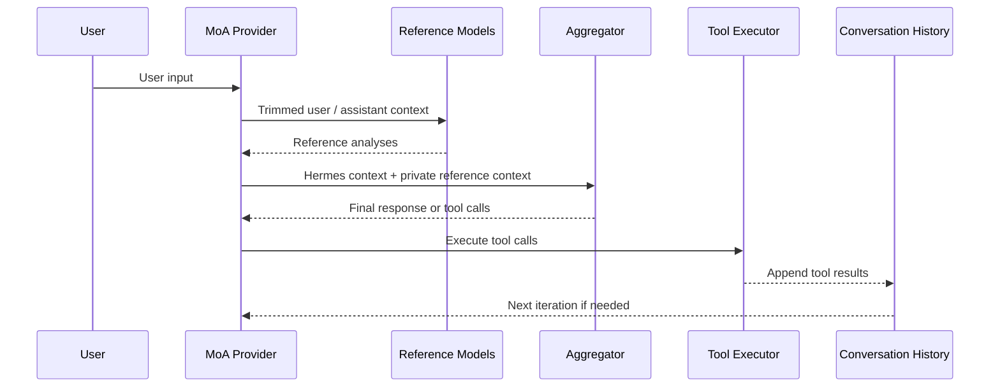

> 基于 Together AI 的 MoA 论文（[arXiv:2406.04692](https://arxiv.org/abs/2406.04692)）、Self-MoA 论文（[arXiv:2502.00674](https://arxiv.org/abs/2502.00674)）与 [Hermes Agent 官方文档](https://hermes-agent.nousresearch.com/docs/user-guide/features/mixture-of-agents)。文中 YAML 配置的型号 ID 仅为示意；伪代码描述的是 MoA 在 agent loop 中的执行流程，集成时以 Hermes 官方文档为准。

## 单模型的盲区

假设你让一个 coding agent 排查一次数据库迁移失败。

一个模型可能很快指出 SQL 兼容性问题；另一个模型可能更关注回滚路径；还有一个模型会提醒你测试环境和生产环境的 schema 版本不一致。它们给出的答案不一定谁绝对正确，但每个模型可能抓住不同角度。

最直接的办法，是把同一个问题分别问 GPT、Claude、DeepSeek、Gemini，再人工对比、筛选、整合。这个办法当然有效，但它有一个明显问题：它发生在当前 agent 工作流之外。

一旦你离开正在运行的 agent 会话，工具调用记录、文件修改状态、任务计划、错误日志、上下文缓存和会话历史都会被切开。你得到的是几份孤立建议，而不是一个仍然留在原工作流里的行动者。

Mixture of Agents（MoA）要处理的，就是这个问题：能不能让多个模型参与判断，但对外仍然表现得像一个普通模型？

Hermes MoA 真正解决的不是“怎么让多个模型一起回答”，而是“怎么让多个模型参与判断，同时让 agent 系统里仍然只有一个清晰的执行边界”。

换句话说，MoA 的关键不只是“多问几个模型”，而是“让多个模型一起想完之后，系统里仍然只有一个模型在行动”。

---

## 从 MoA 研究到 Hermes 实现

在看 Hermes 的 MoA 实现之前，需要先说明一点：Mixture of Agents 并不是某个 agent 产品里的临时技巧，而是已经有研究论文讨论过的一类多模型聚合方法。

Together AI 团队在 2024 年的论文《Mixture-of-Agents Enhances Large Language Model Capabilities》[^moa]中提出了一种分层架构：每一层包含多个模型，每个模型都会读取上一层所有模型的输出，然后生成自己的回答。经过多层传递之后，再由最后的模型或聚合步骤产出最终结果。

这篇论文给出的结果很醒目：只使用开源模型搭建的 MoA 系统，在 AlpacaEval 2.0 上取得 65.1% 的 length-controlled win rate（长度受控胜率），高于论文中对比的 GPT-4 Omni 的 57.5%。这个结果说明，在开放式回答评价这类任务上，经过设计的多模型集成有机会超过单个强模型。

但这个结论需要放回 benchmark 语境里看。

MoA 不等于“几个普通模型一定胜过一个强模型”。2025 年的 Self-MoA 研究[^selfmoa]就提出了反例：不混合不同模型，只让一个强模型多次采样，再聚合这些输出，在不少场景下反而超过标准 MoA。它提醒我们，MoA 的收益可能不只来自“模型之间互补”，也来自“多次采样 + 聚合”本身。

所以，更稳妥的理解是：MoA 是一种把额外推理预算花在“多份候选答案与聚合”上的方法。它可能带来质量提升，但收益取决于任务类型、模型组合、采样策略、聚合模型质量，以及最终评估标准。

如果任务本身很简单，MoA 很可能只是昂贵的重复劳动。如果任务存在多种可行路径、多个约束条件、较高错误成本，MoA 才更可能发挥价值。

在这个背景下再看 Hermes，重点就不是“它提出了 MoA 这个概念”，而是“它如何把 MoA 接进一个真实 agent 系统里”。

原论文里的 MoA 是分层、多轮、多模型的研究架构。Hermes Agent 里的 MoA 更像一个工程化版本：reference models 先给出分析，aggregator 再读取这些分析，并作为唯一真正面向 agent loop 的 acting model。

研究层面的 MoA 关注的是：多模型输出如何提升回答质量。

Hermes 的 MoA 关注的是：如何把多模型聚合接入一个真实 agent，而不破坏原有的工具、记忆、会话、缓存和用户操作路径。

后者才是这套实现最值得看的地方。

---

## Hermes MoA 的基本链路

Hermes MoA 可以先粗略理解成下面这条链路：

1. 用户输入一个困难任务。
2. 几个 reference models 先读取问题和对话文本，生成各自的分析。
3. Hermes 把这些分析作为 aggregator 的私有上下文。
4. aggregator 生成最终回复，并且只有它可以发起工具调用。
5. 对 Hermes 的工具系统、会话历史和用户界面来说，这仍然只是一轮普通模型调用。

用图表示，大概是这样：



这个图里最关键的是：reference models 不直接面对 tools，也不直接写入 conversation history。它们只是给 aggregator 提供分析。

真正对外表现为“这个 agent 在行动”的，是 aggregator。

这就是 Hermes MoA 的基本边界：多个模型参与判断，一个模型拥有执行权。

---

## 第一层：MoA 是虚拟模型提供方，不是工具

Hermes 把 MoA 做成一个 virtual model provider。每个 MoA preset 都会作为 `moa` provider 下的一个可选模型出现。用户选择它的方式，和选择普通模型一样（preset 名在前，provider 在后；具体命令以 `hermes moa list` 与官方文档为准）：

```text
/model default moa
/model review moa
```

这个设计很关键。

MoA 没有被做成一个额外工具，也不是让主模型在运行时再去调用“多模型分析工具”。它直接挂在模型选择层：当 provider 是 `moa` 时，Hermes 在内部展开 reference 调用和 aggregator 调用；在外部，它仍然像一个普通模型。

这带来一个清晰边界：MoA 属于“模型供应层”的增强，而不是“工具系统”的扩展。

如果把 MoA 做成工具，会出现一堆额外问题：主模型什么时候调用这个工具？工具返回的多模型意见是否进入正式对话历史？如果 reference model 建议调用另一个工具，谁来执行？如果多个模型意见冲突，谁说了算？

Hermes 选择绕开这些问题：MoA 不进入工具层，而是伪装成一个普通 provider。工具调度、会话记录、目标管理、TUI / Desktop / Gateway 等表层入口，都不需要为 MoA 改一套流程。

它们只知道当前模型是某个 `moa` preset，不需要知道背后有几个 reference model 参与过判断。

这就是它最重要的工程抽象：多个模型可以参与判断，但 agent loop 仍然只面对一个模型接口。

---

## 第二层：preset 把模型组合固定下来

Hermes 用 preset 描述一组 MoA 配置。一个示意配置大致如下（其中的型号 ID 仅为示意，请以你实际可用的模型替换）：

```yaml
moa:
  default_preset: default
  presets:
    default:
      reference_models:
        - provider: openai-codex
          model: gpt-5.5
        - provider: openrouter
          model: deepseek/deepseek-v4-pro
      aggregator:
        provider: openrouter
        model: anthropic/claude-opus-4.8
      reference_temperature: 0.6
      aggregator_temperature: 0.4
      max_tokens: 4096
      enabled: true
```

`reference_models` 是咨询模型列表。它们可以来自不同 provider，也可以来自同一个 provider。它们的职责不是行动，而是提供额外视角。

`aggregator` 只有一个。它是 acting model：最终回复由它生成，工具调用也只能由它发出。

（`max_tokens` 这个字段配置层仍然接受，但新版 Hermes 在运行时已不再用它截断 aggregator 输出——reference 和 aggregator 都按模型自身上限走，以免长综合被砍断。把它理解为历史遗留字段即可。）

preset 的价值在于可复用。你可以为不同任务配置不同组合：代码审查用一个 preset，复杂排障用一个 preset，长文写作用一个 preset，架构决策再用另一个 preset。切换时仍然走普通模型选择路径，而不是临时拼一段提示词。

这也避免了另一类混乱：不要把 MoA 当成“每次手工指定几个模型”的临时技巧。真正进入 agent 系统之后，MoA 应该是一组可命名、可复用、可关闭、可观测的模型策略。

---

## 第三层：每一轮模型迭代里发生了什么

当当前模型是 `moa` provider 下的某个 preset 时，Hermes 在每一次主模型调用中执行以下流程：

1. 按名称解析当前 preset。
2. 运行配置中的 reference models。
3. reference models 不接收工具 schema，只看到经过裁剪的 user / assistant 文本。
4. Hermes system prompt 和工具调用 transcript 不会交给 reference models。
5. Hermes 把 reference outputs 追加为 aggregator 的 private context。
6. aggregator 携带正常 Hermes tool schema 被调用。
7. aggregator 的输出被当作这一轮真实模型回复。
8. 如果 aggregator 调用了工具，Hermes 正常执行工具。
9. 如果工具结果回来后还需要下一轮模型迭代，MoA 流程会基于更新后的对话再次运行。

用伪代码表示，大概是这样：

```text
for each agent_iteration:
    preset = resolve_moa_preset(current_model)

    reference_outputs = parallel_call(
        models = preset.reference_models,
        input  = trimmed_user_assistant_conversation
    )

    aggregator_input =
        normal_hermes_context
        + private_reference_context(reference_outputs)

    response = call_aggregator(
        model = preset.aggregator,
        input = aggregator_input,
        tools = hermes_tool_schema
    )

    if response.has_tool_calls:
        execute_tools(response.tool_calls)
        continue

    return response
```

reference models 和 aggregator 的差异，可以用一张表说清楚：

| 角色                | 能看到什么                                 | 不能看到什么                                             | 能做什么                       |
| ----------------- | ------------------------------------- | -------------------------------------------------- | -------------------------- |
| reference models  | 裁剪后的 user / assistant 文本              | tool schema、完整工具调用 transcript、Hermes system prompt | 给出分析建议                     |
| aggregator        | 正常 Hermes context + reference outputs | 不直接暴露给用户的内部实现细节                                    | 回复用户、调用工具、推进下一轮 agent loop |
| Hermes agent loop | aggregator 的输出、工具调用结果                 | reference models 的内部讨论                             | 执行工具、维护状态、记录会话历史           |

这个表里最重要的是第一行和第二行的差别。

reference models 不是“另几个也能行动的 agent”。它们只是咨询模型。它们不会拿到完整工具权限，也不会直接决定下一步行动。

aggregator 才是真正进入 agent loop 的模型。它看完 reference outputs 之后，决定最终如何回复、是否调用工具、是否继续下一轮推理。

这也是 Hermes MoA 和“多个 agent 一起乱跑”的区别：它不是多执行者系统，而是多咨询者、单执行者系统。

---

## 成本：MoA 不是一次性开销

这个流程里有一个容易低估的成本点：reference models 不是在任务开始时只咨询一次。

只要任务需要多轮工具调用，每当任务**状态推进**（来了新的用户消息，或回来一个新的工具结果），这一轮就会重新跑 reference + aggregator。Hermes 这里有一层 turn 内缓存：如果 agent loop 在同一状态下重复发起调用（advisory 视图没变），reference 不会重跑，直接复用上一次的输出。所以真正触发重跑的是状态变化，而不是单纯的迭代计数。

假设一个 preset 有 2 个 reference models 和 1 个 aggregator，那么每次状态推进就是 3 次模型调用。如果一个任务推进了 4 次（4 轮工具迭代），总调用次数就可能接近 12 次。

它的调用成本可以粗略理解为（这是上界——命中缓存的重复调用不计入）：

```text
total_model_calls ≲ agent_iterations × (reference_model_count + 1)
```

Hermes 的 reference 是并行 fan-out 的，单轮延迟大致接近：

```text
latency_per_iteration ≈ max(reference_latencies) + aggregator_latency + tool_latency
```

如果换一套实现把 reference 改成串行调用，单轮延迟则会退化成：

```text
latency_per_iteration ≈ sum(reference_latencies) + aggregator_latency + tool_latency
```

所以 MoA 的成本不是固定的一次性开销，而是随 reference 数量和 agent 迭代轮数线性增加。

这也是为什么 MoA 不适合默认开着。它更像一个“高推理预算模式”，应该用在错误成本高、上下文复杂、需要多视角判断的任务上。

对于简单问答、日常改写、轻量工具调用，MoA 的收益往往抵不过成本。对于代码审查、架构决策、复杂排障、长文推理这类任务，它才更可能发挥价值。

---

## 第四层：三个工程不变量

Hermes MoA 真正值得看的，不是它“调了多个模型”，而是它在多模型协作时维持了三个不变量。

第一个是执行权唯一不变量。

reference models 只提供咨询意见，不能直接回复用户，也不能调用工具，更不能修改外部状态。真正拥有执行权的，只有 aggregator。

这里的“执行权”包括三件事：它决定最终怎么回复用户；它决定是否调用工具；它的输出会进入下一轮 agent loop。

这解决了一个很现实的问题：如果多个模型都能行动，系统就必须处理一堆冲突。

比如，两个模型都想调用工具，谁的调用有效？一个模型建议改文件，另一个模型建议回滚，系统听谁的？多个模型都生成最终回复，哪一个进入会话历史？

Hermes 通过唯一 aggregator 把这个问题压掉了。reference models 可以参与判断，但不能行动；aggregator 可以读取它们的建议，并且承担最终行动责任。

所以，MoA 在这里不是“多个模型一起控制 agent”，而是“多个模型提供意见，一个模型负责执行”。

第二个是会话历史不变量。

reference outputs 不会被写入正式历史，也不会改写之前的对话。它们只是 aggregator 的 private context。对用户界面和会话存储来说，这一轮仍然是一轮普通模型调用。

这点很重要。因为一旦 reference outputs 进入正式 transcript，后续每一轮都会携带大量模型间讨论，历史会迅速膨胀，用户也会被迫看到很多本不该暴露的中间意见。

Hermes 把 reference outputs 留在 private context 里，相当于把“内部咨询意见”和“正式会话历史”分开。用户看到的是最终行动者的回复，而不是所有咨询过程。

第三个是缓存前缀不变量。

Hermes system prompt、历史消息、工具 schema 等稳定内容不会因为 MoA 被重排。reference outputs 被放在 aggregator 输入的尾部 private context，而不是插入到系统提示词或历史消息中间。

这意味着，原本稳定的 prompt prefix 仍然保持稳定。MoA 增加的是尾部的额外分析，而不是打乱整个上下文结构。

这三个不变量构成了 Hermes MoA 的工程核心：

执行权唯一，解决的是“谁能行动”。

会话历史不变，解决的是“什么进入正式记录”。

缓存前缀不变，解决的是“什么保持可复用”。

多模型参与判断，但行动边界、历史边界和缓存边界都不被破坏。

---

## private context 在代码里怎么落地

上面三个不变量听起来像设计理念，但它们在 Hermes 代码里其实是几个很具体的手法。把 reference 分析喂给 aggregator 这一步，处理方式值得单独看。它不是简单地“把几段文本拼起来发出去”，而是在拷贝、注入位置、角色提示三个地方都做了刻意的选择。

**第一，改的是一份消息副本，不是真实历史。**

注入 reference context 之前，Hermes 先对消息列表做一次浅拷贝（`agg_messages = [dict(m) for m in messages]`），之后所有改动都发生在这份副本上。agent loop 持有的原始 conversation history 一个字都没动。

这就是“会话历史不变量”在代码层的落点：reference outputs 只活在这一次 aggregator 调用的入参里，调用返回后就丢，从不写回 transcript。下一轮要再加 reference，是基于更新后的真实历史重新拷一份、重新拼，而不是在一份越滚越大的历史上反复追加。

**第二，注入位置是“最后一条 user 消息的尾部”，而不是新插一条消息。**

一个容易想当然的实现是：把 reference 分析包成一条新消息 append 到末尾。Hermes 没有这么做。它从后往前找到最近的那条 user 消息，把 reference guidance **接在它的 content 后面**（以下伪代码对应 `moa_loop.py` 的 `MoAChatCompletions.create()`）：

```text
for msg in reversed(agg_messages):
    if msg.role == "user" and isinstance(msg.content, str):
        msg.content = msg.content + "\n\n" + reference_guidance
        break
else:
    # 整个对话里没有任何 user 消息时才兜底新插一条
    agg_messages.append(user_message(reference_guidance))
```

这个位置选择同时解决了两个问题。一是缓存：system prompt、历史消息、tool schema 全在前面、原封不动，新增内容只贴在**最末一条 user turn 的尾巴**，稳定前缀因此仍可命中 prompt cache。二是协议合法性：Anthropic 这类 provider 会把结尾的 assistant turn 当成 prefill，no-prefill 模型（如 Claude Opus 4.8）会直接报 `must end with a user message`。把 guidance 并进最后一条 user 消息，既塞进了 context，又保证整个请求以 user turn 结尾。

**第三，aggregator 和 reference 拿到的是两套截然不同的输入。**

同一段 reference 分析，喂给 aggregator 时附带的角色提示，和 reference 自己收到的提示正好相反：

| | reference 收到的 | aggregator 收到的 |
| --- | --- | --- |
| 角色提示 | “你不是 acting agent，不能调用工具、不能执行任何动作” | “你就是 aggregator 和 acting model，可以直接回复用户或调用工具” |
| 注入形式 | 独立的 system 消息 | 并入最后一条 user 消息的尾部 |
| 看到的 transcript | 裁剪后的 advisory 视图（无 system prompt、工具调用压成文本） | 完整 transcript |
| 调用时是否带 tools | 否 | 是 |

最后一行是关键：reference 那次模型调用根本不传 `tools` 参数，aggregator 那次才传。“只有 aggregator 能调工具”不是靠 prompt 让模型自觉遵守，而是在调用入参层面就分流了——reference 的请求里压根没有工具可调。三个不变量里最硬的那条“执行权唯一”，最终落在这一行入参差异上。

---

## 缓存：为什么这件事没有把 agent loop 拖垮

MoA 在生产系统里最容易踩坑的地方，不是“能不能多调几个模型”，而是“多出来的上下文会不会破坏 prompt cache”。

前面那段注入逻辑——reference outputs 只贴在最后一条 user turn 的尾部，不改写历史、不替换 system prompt——直接决定了 MoA 的长期成本结构。它带来两个直接效果。

第一，aggregator 仍然可以命中稳定前缀的 prompt cache。新增成本主要来自尾部 reference 分析，而不是因为上下文结构变化导致整个缓存前缀失效。

第二，reference models 看到的是经过裁剪、相对确定的 user / assistant 对话视图。只要历史前缀稳定，并且对应 provider / model 支持相关缓存机制，它们自己的调用也可以正常利用缓存。

需要注意的是，缓存命中不等于“完全不计费”。以 Anthropic prompt caching[^cache] 为例，cache read tokens 仍然会计费，只是价格低于普通 input tokens。Hermes 这里真正避免的是：为了加入 reference 分析而打乱长期稳定的上下文前缀，导致本来能复用的缓存失效。

换句话说，MoA 的主要额外成本应该来自“多了几次 reference 调用”，而不是“把原本稳定的上下文缓存打穿”。

这也是“把 reference outputs 放到尾部”这个看似随意的拼接位置，实际是一个影响成本的工程决定。

---

## 几个实现取舍

除了前面讲过的两条（reference 不带工具、aggregator 是唯一 acting model——它们已经体现在“reference 调用不传 tools 参数”这个入参差异上），Hermes 还有几个值得单独点出的取舍。

失败不阻断整轮任务。

如果某个 reference model 因为凭证、限流或服务问题失败，Hermes 会把失败信息放入 reference context，并继续使用其他成功返回的模型。MoA 不应该因为一个咨询模型失败就让整个 agent 停下来。

禁止递归 MoA。

一个 preset 的 aggregator 不能再指向另一个 MoA preset。否则用户很容易配出递归展开的调用树，成本和行为都不可控。Hermes 在配置层、reference fan-out 层、aggregator 调用层三处都设了守卫，让递归 preset 既存不下来、也跑不起来。

preset 可以单独关闭。

`enabled: false` 会让这个 preset 停止 reference fan-out，只保留 aggregator 单独工作。临时关闭 MoA 时，不需要删除整套配置。

这些取舍共同指向同一个目标：让 MoA 增加判断能力，但不要增加执行混乱。

---

## 生产环境里真正要小心的事

MoA 的 happy path 很容易理解：多个 reference models 给建议，aggregator 做最终判断。但真正进生产系统以后，更麻烦的是 failure modes。

第一是 reference hallucination。

reference models 不带工具 schema，也看不到完整工具调用 transcript。它们看到的是裁剪后的对话视图。因此，它们可能给出看似合理、但基于不完整上下文的建议。

aggregator 必须把 reference outputs 当成 advisory signal，而不是事实来源。它应该有能力判断哪些建议可靠，哪些只是噪声。

这不是 MoA 的附带小问题，而是这套架构的内生问题：reference models 被刻意限制了视野，所以它们的建议天然不该拥有执行权。

第二是 latency tail。

多个 reference models 如果并行调用，单轮延迟通常由最慢的 reference model 决定。一个 provider 抖动，整个 MoA 调用就可能被拖慢。

因此，真实系统里最好有 timeout、partial aggregation、失败降级策略。否则 MoA 很容易把 agent 从“更聪明”变成“更慢”。

第三是 cross-provider privacy。

MoA 很可能把同一段用户上下文发送给多个模型供应商。个人使用时这可能只是成本问题，企业环境里就是数据边界问题。

哪些任务允许跨 provider？哪些上下文不能发给外部 reference model？reference models 是否允许来自不可信 provider？这些都应该成为 preset 策略的一部分，而不是临时决定。

第四是 observability。

reference outputs 是 private context，不直接出现在最终对话里。这个设计对用户界面很干净，但对调试不友好。

如果最终答案质量不好，到底是 reference model 给了坏建议，还是 aggregator 聚合失败，还是某个 provider 超时了？没有 trace，就很难定位。

所以 MoA 系统需要能在 debug 模式下查看 reference 输出、失败原因、token 成本、延迟分布和 aggregator private context 的构造方式。

这里的难点来自 Hermes 的设计选择本身：reference outputs 不进入正式 transcript，所以正式会话更干净；但也正因为它们不进入 transcript，系统必须在 trace 层提供额外可观测性。

第五是 aggregation bias。

aggregator 不是中立裁判。它本身也是一个模型，也有偏好、盲区和风格倾向。MoA 的最终质量很大程度上取决于 aggregator 能不能识别 reference outputs 的质量差异，而不是简单平均或机械综合。

这也是为什么 aggregator 通常应该选择能力更强、更稳、更擅长综合判断的模型。reference models 可以多样化，但 aggregator 必须可靠。

MoA 的上限，很多时候不取决于 reference models 数量，而取决于 aggregator 能不能判断谁说得更对。

---

## 接入前的检查清单

如果你打算把 MoA 接进自己的 agent 系统，下面这份清单可以在动手前逐项过一遍。它把上面五类 failure modes 压成可勾选的决策项：

- [ ] **任务是否值得**：这是高错误成本、多约束、多路径的任务吗？简单问答和轻量改写不该开 MoA。
- [ ] **成本预算是否算清**：用 `agent_iterations × (reference_count + 1)` 估过最坏情况的调用次数和费用了吗？
- [ ] **数据边界是否合规**：用户上下文会被发给哪些 provider？企业环境里，哪些上下文明确禁止发给外部 reference model？reference 是否只允许来自可信 provider？
- [ ] **降级策略是否就位**：reference 调用配了 timeout 吗？某个 reference 失败时是 partial aggregation 还是整轮降级？aggregator 单独工作时行为可接受吗？
- [ ] **可观测性是否够用**：debug 模式下能看到每个 reference 的输出、失败原因、token 成本、延迟分布，以及 aggregator 的 private context 是怎么拼出来的吗？
- [ ] **aggregator 是否够强**：选的是能力更强、更稳、更擅长综合判断的模型吗？记住 MoA 的上限由 aggregator 决定，而不是 reference 数量。
- [ ] **递归是否已禁止**：aggregator 不会指向另一个 MoA preset 吗？
- [ ] **缓存前缀是否稳定**：reference outputs 是注入到尾部 private context，而不是插入 system prompt 或历史中间吗？

---

## Hermes MoA 的工程本质

如果只看表面，Hermes MoA 像是“多个模型先回答，一个模型再总结”。

但从 agent 工程角度看，它真正做的是一件更克制的事：把多模型协作封装成一个 provider 抽象，并且不让这种复杂性泄漏到 agent loop 的其他部分。

这背后有一条很重要的边界：

reference models 可以参与思考，但不能行动。

aggregator 可以读取建议，也必须承担最终行动责任。

Hermes 的工具系统、会话历史、缓存策略和用户界面，只面对 aggregator 这个 acting model。

这使得 MoA 不会变成一个到处扩散的系统复杂度。它不是在工具层加一个“多模型咨询工具”，也不是把多个模型的输出全部写进会话历史，而是在模型 provider 层完成 fan-out、聚合和降级。

这个设计的好处是：上层系统几乎不需要为 MoA 改造。你选择普通模型，agent loop 正常工作；你选择 `moa` provider，agent loop 仍然正常工作，只是模型调用层内部多了一组 reference consultation。

所以 Hermes MoA 的产品化价值，不在于“用了几个模型”，而在于它把多模型协作压缩进了一个普通 provider 抽象里。

用户看到的是一个模型。

工具系统面对的是一个模型。

会话历史记录的是一个模型。

缓存策略也尽量围绕稳定前缀继续工作。

复杂性被留在模型调用层内部，而不是扩散到整个 agent 系统。

---

## 结语

MoA 产品化之后，真正难的不是让多个模型都说话，而是让它们说完之后，系统仍然只有一个清晰的执行边界。

研究论文证明了 MoA 在某些 benchmark 上有质量提升空间；Self-MoA 又提醒我们，提升可能来自采样、聚合和模型质量之间的共同作用，而不一定来自“不同模型天然互补”。

Hermes 做的事更工程化：reference models 负责扩展判断空间，aggregator 负责承担行动责任；多模型协作被压缩进 provider 抽象，agent loop 的外部契约保持不变。

这也是 MoA 从论文走向产品时最实际的问题：不是能不能让多个模型一起想，而是能不能让它们一起想完之后，仍然像一个可靠的模型在工作。

[^moa]: Together AI（Junlin Wang, Jue Wang, Ben Athiwaratkun, Ce Zhang, James Zou）, *Mixture-of-Agents Enhances Large Language Model Capabilities*, 2024: https://arxiv.org/abs/2406.04692
[^selfmoa]: Wenzhe Li, Yong Lin, Mengzhou Xia, Chi Jin, *Rethinking Mixture-of-Agents: Is Mixing Different Large Language Models Beneficial?*, 2025: https://arxiv.org/abs/2502.00674
[^cache]: Anthropic Docs, *Prompt caching*: https://platform.claude.com/docs/en/build-with-claude/prompt-caching
