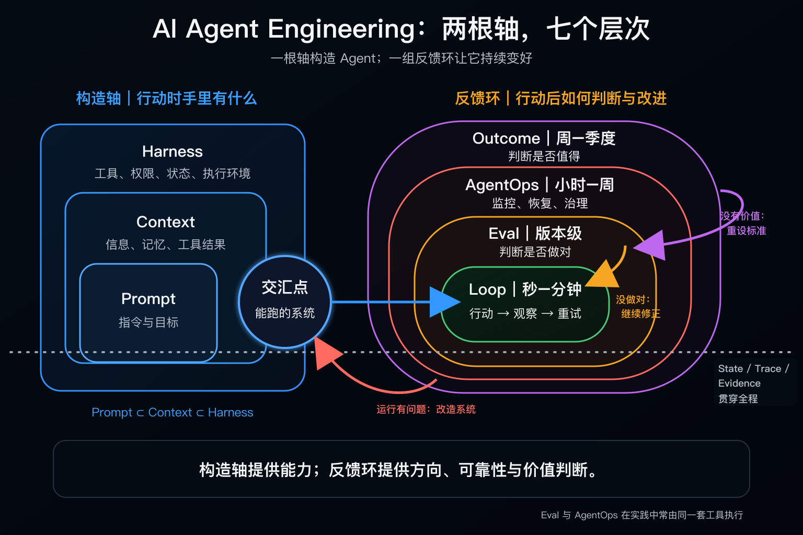
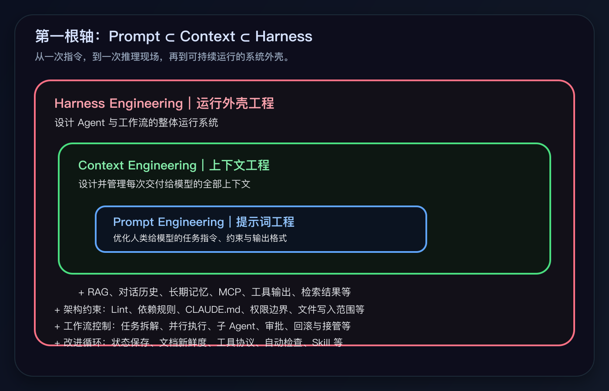
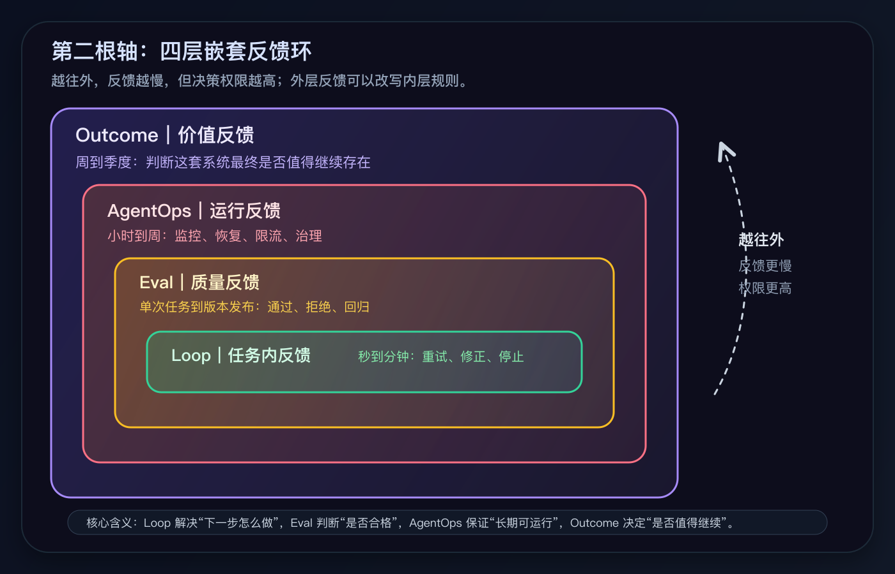
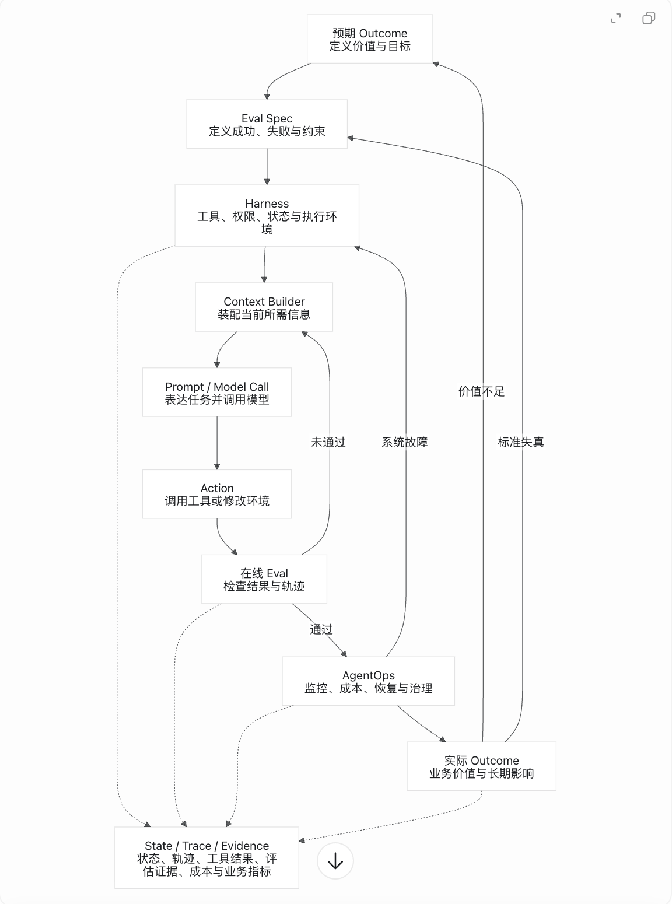

## TL;DR

AI Agent 工程正在从“怎样构建一个 Agent”，走向“怎样让一个 Agent 在真实环境中持续运行、被评估、被纠偏，并最终产生价值”。

本文把这件事拆成两根轴：

- **构造轴**：Prompt → Context → Harness，回答“Agent 行动那一刻，手里有什么”。
- **反馈环轴**：Loop → Eval → AgentOps → Outcome，回答“Agent 行动以后，谁来判断、维持和改进它”。

其中，Loop Engineering 是近期讨论的触发点；Eval、AgentOps 和 Outcome 是本文沿着 Loop Engineering 向外推演出的运行反馈框架。

可以把它看作一张理解 Agent Engineering 的地图：Prompt、Context、Harness 提供能力；Loop、Eval、AgentOps、Outcome 提供方向、可靠性和价值判断。它还没有成为统一的行业标准，更接近一套用于分析和实践的框架。

---

AI Agent 工程正在从一个相对熟悉的问题，走向一个更难的问题。

熟悉的问题是：怎样构建一个 Agent？

所以我们谈 Prompt Engineering，研究怎样把任务说清楚；谈 Context Engineering，研究模型行动时应该看到什么、记得什么；谈 Harness Engineering，研究模型周围的工具、权限、状态和执行环境。

更难的问题是：Agent 跑起来之后，怎样持续执行、被评估、被纠偏，并最终产生价值？

最近被集中讨论的 Loop Engineering，正好把问题推到了这里。它提醒我们，Agent 的工作单元不再只是一次 Prompt 或一次对话，而可能是一个持续运行的循环：行动、观察、修正、再行动，直到达到某个可验证的停止条件。

沿着这个方向继续向外看，会出现三个自然的问题：

- 谁来判断循环是否做对？
- 谁来维持系统长期运行？
- 谁来判断技术上的成功是否真的创造价值？

本文把它们分别概括为 Eval、AgentOps 和 Outcome。

如果只为了便于记忆，可以把这七个词排成一条线：

```text
Prompt → Context → Harness → Loop → Eval → AgentOps → Outcome
```

但更有用的理解方式，是把 AI Agent Engineering 看成两根轴：

- **构造轴**：Agent 行动时手里有什么？
- **反馈环轴**：Agent 行动以后，谁来判断、维持和改进它？

构造轴决定 Agent 是否具备完成任务的能力；反馈环决定这些能力能否长期、可靠地转化为真实价值。本文就是基于这两根轴，尝试对 Agent Engineering 做一次地图式整理。



需要先说明一点：除了这两根轴，还有一条 State / Trace / Evidence 脊柱横切贯穿所有层次——它不属于任何单独一层，而是同时为两根轴提供状态、轨迹和证据。为了先把两根轴讲清楚，这条脊柱留到后文单独展开。

## 第一根轴：构造 Agent

构造轴由 Prompt、Context 和 Harness 组成。

它们不是三个相互平行的概念，而是一组层层嵌套的关系：

```text
Prompt ⊂ Context ⊂ Harness
```

从左向右，系统所包含的信息和能力越来越多，也越来越稳定、可复用。



### Prompt Engineering：怎样表达当前任务

Prompt 是模型在当前时刻收到的指令。

它通常定义：

- 要完成什么任务；
- 为什么要完成；
- 有哪些约束；
- 输出应该采用什么格式；
- 什么情况可以被视为完成。

例如：

> 修复认证模块中导致登录测试失败的问题。不要改变公开 API。完成后运行认证测试、lint 和类型检查。

Prompt Engineering 关心的是如何把目标表达清楚，使模型减少歧义和错误假设。

但 Prompt 只是模型输入中的一部分。

即使任务描述得非常准确，如果模型不知道代码库结构、看不到测试日志、不理解项目约定，也无法稳定地完成任务。

这就进入了 Context Engineering。

### Context Engineering：模型行动时知道什么

Context 不只是对话历史，而是模型在某次推理发生时可以看到的全部信息。

它可能包括：

- 当前 Prompt；
- 相关代码和文档；
- 检索结果；
- 对话历史；
- 项目规范；
- 长期记忆；
- 工具返回值；
- 之前的失败记录；
- 其他 Agent 传回的结果。

如果 Prompt 回答的是“现在应该做什么”，Context 回答的就是：

> Agent 在决定下一步行动时，究竟知道什么、看到什么、记得什么？

Context Engineering 的关键并不是不断向模型塞入更多内容，而是选择此刻真正有用的信息。

过少的 Context 会让模型凭空猜测；过多的 Context 则会引入噪声、过时信息和相互冲突的指令。

因此，Context Engineering 需要处理：

- 信息检索；
- 记忆选择；
- 上下文压缩；
- 大型输出卸载；
- 信息的新鲜度；
- 子 Agent 之间的可见性边界；
- 不同指令的优先级。

不过，即使拥有理想的 Context，系统仍然需要回答另一个问题：

> 谁负责持续收集这些信息，并让模型能够真正采取行动？

答案是 Harness。

### Harness Engineering：构建模型运行的外壳

Harness 是包围模型的程序化运行环境。

它负责为每一次模型调用装配 Context，并提供完成任务所需的能力，例如：

- 注册和调用工具；
- 读写文件；
- 执行终端命令；
- 管理权限与审批；
- 隔离运行环境；
- 保存任务状态；
- 处理错误和重试；
- 限制成本和运行时间；
- 记录执行轨迹；
- 调度子 Agent。

可以把模型理解为一个推理计算器，把 Harness 理解为连接这个计算器与真实世界的软件系统。

Prompt 是一次任务表达；Context 是一次推理现场；Harness 则是能够持续生产这些推理现场的结构性外壳。

每当 Agent 犯下具有重复性的错误，工程师不应只在下一次 Prompt 中临时提醒它，而应考虑把修复写进 Harness：

- 如果它总是忘记运行测试，就把测试加入停止检查；
- 如果它总是修改越界文件，就限制可写目录；
- 如果它会重复创建记录，就为写操作增加幂等键；
- 如果错误信息无法指导下一步，就修改工具返回协议；
- 如果它在失败后丢失进度，就把状态保存到外部存储。

这类改进不会随着一次对话结束而消失，而会永久改变系统之后的每次运行。

### Harness 是两根轴的交汇点

Prompt、Context 和 Harness 共同造出了一个“能跑的系统”。

但能跑并不等于能可靠地完成任务。

模型可能：

- 过早宣布完成；
- 反复执行相同操作；
- 在错误方向上持续优化；
- 通过测试却没有解决用户问题；
- 长期运行后成本失控；
- 在模型或环境变化后发生行为漂移。

因此，在 Harness 之上，还需要一组不同时间尺度的反馈环。

它们不负责为 Agent 增加更多“材料”，而是负责在 Agent 开始行动后持续回答：

- 下一步应该做什么？
- 当前结果是否正确？
- 整个系统是否健康？
- 这件事最终是否值得？

## 第二根轴：让 Agent 持续改进

本文提出的反馈环轴包含 Loop、Eval、AgentOps 和 Outcome。

它们不是四个简单串联的步骤，而是四个逐渐向外扩张的反馈环。越靠外，观察的时间越长，权限越大，也越有能力修改内层系统的规则。

其中，Loop Engineering 是近期形成的讨论焦点；Agent Evals 和 AgentOps 已经分别存在于质量评估与生产运维实践中；将它们与 Outcome 组织为四层嵌套反馈环，则是本文基于 Loop Engineering 所做的进一步推演，而不是对现成行业标准的复述。

为什么要这样划分？

因为 Agent 一旦开始运行，真正重要的问题不再只是“它有没有能力”，而是“谁在什么时间尺度上给它反馈，以及这种反馈有多大的修改权限”。

这就是第二根轴的划分依据：反馈发生的时间尺度和决策权限。

| 层级 | 它问的问题 | 时间尺度 | 它的权力 |
|---|---|---|---|
| Loop | 这一步之后该怎么继续？ | 秒到分钟 | 重试、修正、停止 |
| Eval | 这次输出或这个版本算不算合格？ | 单次任务到版本发布 | 通过、拒绝、回归 |
| AgentOps | 这个 Agent 系统能不能长期稳定运行？ | 小时到周 | 监控、恢复、限流、治理 |
| Outcome | 这套系统最终有没有创造价值？ | 周到季度 | 重设目标、重设 Eval，甚至取消系统 |



所以，Loop、Eval、AgentOps 和 Outcome 的边界，不在于它们是否由四套工具分别完成，也不在于团队里是否一定要有四个岗位。

它们的区别在于反馈权力不同：

- Loop 决定下一步怎么做；
- Eval 决定做得是否合格；
- AgentOps 决定系统能否长期运行；
- Outcome 决定这套系统是否值得继续存在。

工具可以重叠，团队可以合并，但反馈权力不能混为一谈。

### Loop Engineering：当前任务如何持续推进

Loop 是最内层、运行速度最快的反馈环。

它通常发生在秒到分钟的时间尺度内：

```text
行动 → 观察 → 判断 → 重试或退出
```

例如，一个编码 Agent 可能执行：

1. 运行测试；
2. 读取失败信息；
3. 定位最可能的原因；
4. 修改代码；
5. 再次运行测试；
6. 如果仍然失败，继续修正；
7. 满足退出条件后停止。

Loop Engineering 的重点不是写一个 `while` 循环，而是设计循环能够可靠推进的条件：

- 每次迭代应该获得什么反馈？
- 如何判断是否取得进展？
- 什么情况下应该重试？
- 什么情况下必须停止？
- 如何防止无限消耗 Token？
- 如何从中断的位置继续运行？

一个可靠的 Loop 至少需要两类退出条件：

```text
成功退出：所有测试通过，lint 和类型检查无错误
失败退出：达到最大迭代数、预算或时间上限
```

智能体不再调用工具，只表示当前轮次结束，不代表任务真正完成。

“完成”不能由执行者的自信决定，而必须由外部标准证明。

这个标准来自 Eval。

### Agent Evals：怎样证明 Agent 做对了

本文中的 Eval，主要指 Agent Evals：它不是只给最终回答打分，而是围绕 Agent 的输出、行动轨迹、工具调用、环境变化和多次运行稳定性建立评估标准。

它既存在于 Loop 内部，也存在于不同版本之间。

#### 执行前，Eval 定义成功

在任务开始之前，系统需要明确：

- 什么结果算成功？
- 哪些约束不能违反？
- 什么错误必须拒绝？
- 哪些证据足以证明任务完成？

如果没有预先定义的标准，Agent 就只能根据自己的感觉决定何时停止。

#### 执行中，Eval 充当在线检查

Loop 每完成一次行动，就需要获得反馈：

- 测试是否通过？
- 输出结构是否合法？
- 数据库状态是否正确？
- 工具调用是否越权？
- 是否出现了重复操作？

Eval 未通过，结果便返回 Loop，成为下一轮修正的依据。

#### 执行后，Eval 负责回归评估

当模型、Prompt、Context 或 Harness 改变后，还需要判断：

- 新版本是否整体优于旧版本？
- 是否修复了当前问题，却破坏了其他能力？
- 成本和延迟是否显著上升？
- 成功率是否稳定，而不是偶然通过？

因此，Eval 不只是在最终输出上打一个分数。对于 Agent 系统，它还需要评估：

- 最终结果；
- 工具调用轨迹；
- 外部环境的真实变化；
- 安全与权限；
- 成本和延迟；
- 多次运行的稳定性。

最可靠的原则是：

> 能用确定性规则判断的，优先使用测试、Schema、编译器和静态检查；只有无法被确定性规则覆盖的部分，才使用模型裁判或人工评审。

Eval 回答“这次做对了吗”，但它无法独自回答“这个长期运行的系统是否健康”。

这属于 AgentOps。

### AgentOps：让系统在生产环境中持续活着

AgentOps 观察的不是某一次输出，而是作为长期运行系统的 Agent。

它关注小时到周的时间尺度：

- 服务是否可用；
- 成功率是否下降；
- Token 和工具成本是否异常；
- 延迟是否变长；
- 是否频繁陷入重试；
- 是否需要人工介入；
- 权限使用是否合规；
- 故障后能否恢复；
- 模型升级是否造成行为漂移。

Eval 和 AgentOps 的区别，可以用两个问题区分：

```text
Eval：这一次或这个版本做对了吗？
AgentOps：这套系统长期运行得健康吗？
```

如果 AgentOps 发现系统性问题，修复对象通常不是当前输出，而是 Harness：

- 调整权限；
- 更换工具；
- 修改超时策略；
- 增加缓存；
- 保存检查点；
- 改变模型路由；
- 优化 Context 装配；
- 增加降级和人工接管机制。

这就形成了一条重要反馈路径：

```text
AgentOps → Harness
```

在现实团队中，Eval 和 AgentOps 往往由同一套可观测平台、数据管道和工程团队实现。但它们承担的认知功能仍然不同：Eval 定义和判断质量，AgentOps 维持系统运行。

即使 Loop 顺利结束、Eval 全部通过、AgentOps 仪表盘也保持绿色，仍然存在最后一个问题：

> 这个系统完成的事情，真的创造了价值吗？

### Outcome：判断这一切是否值得

Outcome 是最外层、时间尺度最长的反馈环。

它观察数周到数季度后的真实结果：

- 用户问题是否得到解决；
- 工作效率是否提高；
- 收入是否增长；
- 风险是否降低；
- 人工负担是否减少；
- 自动化收益是否超过成本；
- 用户是否愿意持续使用。

软件测试通过，只能证明实现符合某个规格；它不能证明规格本身是正确的。

例如，一个自动修复 CI 的 Agent 可能表现得非常“成功”：

- 95% 的运行没有报错；
- 所有自动化测试都通过；
- 平均十分钟创建一个 PR；
- AgentOps 仪表盘没有异常。

但如果工程师拒绝了大多数 PR，或者审查这些 PR 花费的时间比人工修复还长，那么这个系统并没有创造预期价值。

Outcome 可以推翻内层所有绿色指标。

当 Outcome 不理想时，不应只是要求 Loop 再努力一点，而应该重新审视：

- 目标是否选错了？
- Eval 是否测量了错误的东西？
- 成功标准是否过于局部？
- 这个任务是否根本不适合自动化？

因此，最外层的重要反馈路径是：

```text
Outcome → Eval
```

如果最终没有价值，就应当重新定义系统所追求的标准。

这也是 Outcome 与 Eval 的区别：

```text
Eval 判断系统是否满足标准。
Outcome 判断这些标准是否值得满足。
```

### 四条反馈路径形成闭环

将两根轴放在一起，可以得到四条关键关系。

#### Harness → Loop：提供执行能力

Harness 向 Loop 提供工具、权限、状态和运行环境。没有 Harness，Loop 只能停留在文本推理中。

#### Eval → Loop：提供修正方向

Eval 判断当前结果是否满足标准。未通过的检查会成为 Loop 下一轮行动的依据。

#### AgentOps → Harness：修复系统性问题

当运行中出现持续性故障、成本异常或权限风险时，AgentOps 推动对 Harness 的结构性改造。

#### Outcome → Eval：重新定义成功

当系统技术指标全部正常，却没有创造价值时，Outcome 迫使团队重新设计目标和评估标准。

于是，Agent Engineering 不再是一条从 Prompt 走向 Outcome 后便结束的流水线，而是一组可以反向修改自身的嵌套反馈环。

## State、Trace 与 Evidence：贯穿所有时间尺度

两根轴之间还需要一条共同的证据脊柱：

```text
State / Trace / Evidence
```

### State 保存系统走到了哪里

它记录：

- 已经完成什么；
- 尝试过什么；
- 哪些方法失败；
- 下一步应该做什么；
- 当前预算还剩多少。

没有持久状态，跨会话运行的 Agent 每次都会从零开始。

### Trace 记录系统是怎样行动的

它包括：

- 模型调用；
- 工具调用；
- 参数和返回结果；
- Agent 之间的交接；
- 重试与错误；
- 时间、Token 和成本。

没有 Trace，团队只能看到最终输出，无法解释 Agent 为什么成功或失败。

### Evidence 支撑系统的判断

测试结果、数据库状态、人工反馈和业务指标，都会成为 Eval、AgentOps 与 Outcome 的证据。

没有 Evidence：

- Loop 不知道是否应该停止；
- Eval 只能依靠感觉打分；
- AgentOps 无法定位问题；
- Outcome 无法判断真实价值。

状态让系统能够延续，轨迹让系统能够被观察，证据让系统能够被判断。

## 一个贯穿七层的例子：自动修复 CI

假设团队想构建一个自动修复 CI 失败的 Agent。

### Prompt

当前任务可能是：

> 找出本次提交造成的测试失败，进行最小范围修复，不改变公开接口，并在所有检查通过后创建草稿 PR。

### Context

Agent 需要看到：

- 失败的 CI 日志；
- 最近提交的 diff；
- 相关代码；
- 测试文件；
- 架构约定；
- 历史相似故障；
- 允许修改的目录。

### Harness

系统需要提供：

- Git 和独立 Worktree；
- 代码读写工具；
- 测试、lint 和类型检查命令；
- 文件写入范围限制；
- 最大迭代次数；
- Token 和时间预算；
- 状态与 Trace 存储；
- 创建草稿 PR 的连接器。

### Loop

Agent 执行：

```text
读取失败 → 定位原因 → 修改代码 → 运行检查 → 根据结果重试
```

### Eval

系统验证：

- 所有测试是否通过；
- lint 和类型检查是否干净；
- 是否只修改允许的文件；
- 是否产生回归；
- PR 是否符合项目规范。

### AgentOps

团队持续观察：

- 修复成功率；
- 平均运行时间；
- 每次有效修复的成本；
- 循环卡死率；
- 人工介入率；
- 模型升级后的行为变化；
- 工具和权限事故。

### Outcome

最后衡量：

- 工程师处理 CI 的时间是否真正减少；
- 自动 PR 的接受率是多少；
- 审查时间是否下降；
- 回滚和缺陷率是否增加；
- 整体收益是否超过运行成本。

只有到这一层，团队才能判断这个 Agent 是否值得继续投入。

## 这套地图的三个边界

这张地图有三个使用边界。

第一，它是一套分析框架，不是行业标准。Prompt、Context、Harness、Loop、Eval 和 AgentOps 都有不同程度的实践基础，但把它们与 Outcome 组织成两根轴，是本文对 Agent Engineering 下一阶段的整理和推演。

第二，它不要求团队按七层拆组织。在小型团队中，一个人可能同时负责 Harness、Loop、Eval 和运维；同一套平台也可能同时提供 Tracing、Eval 和 AgentOps。

第三，它不意味着所有工作都该 Agent 化。

如果一个任务：

- 很少重复；
- 无法客观验证；
- Agent 不能端到端完成；
- 错误成本很高；
- 人工流程已经足够简单；

那么，一个清晰的 Prompt 或普通自动化脚本可能更加合适。

这张地图的价值，在于帮助团队识别问题究竟发生在哪一层：是 Prompt 没说清，Context 不完整，Harness 缺能力，Loop 没有可靠退出，Eval 测错了目标，AgentOps 没有看见运行风险，还是 Outcome 本身不成立。

## 把两根轴合成一个运行闭环

前面两张图分别解释了构造轴和反馈环轴。放到一个真实 Agent 系统里，它们会形成一个端到端闭环。

设计从预期 Outcome 和 Eval Spec 开始；执行发生在 Harness、Context、Prompt、Action 和在线 Eval 之间；上线后，AgentOps 和实际 Outcome 再把运行证据反馈回目标、标准和系统外壳。



## 从哪里开始：先反向定义，再正向自动化

刚开始构建 Agent 时，最容易犯的错误，是一上来就做 Loop 和无人值守自动化。

更稳的路径，是先从 Outcome 往回定义标准，再从一次可靠执行开始逐步自动化。

| 阶段 | 要回答的问题 | 产出 |
|---|---|---|
| 1. 定义 Outcome | 为什么值得做？什么变化证明它有价值？ | 业务目标、用户价值指标、停止投入条件 |
| 2. 设计 Eval | 什么算成功？什么必须拒绝？ | 成功标准、失败标准、回归用例 |
| 3. 建立单次执行 | 人工触发时，Agent 能否可靠完成一次任务？ | Prompt、最小 Context、必要工具 |
| 4. 固化 Harness | 哪些重复提醒应该变成系统规则？ | 权限、工具协议、状态、自动检查 |
| 5. 加入 Loop | 失败后能否安全重试，成功后能否可靠停止？ | 迭代策略、退出条件、预算上限 |
| 6. 接入 AgentOps | 上线后如何持续观察和恢复？ | Trace、监控、告警、降级、人工接管 |
| 7. 回到 Outcome | 系统真的创造价值了吗？ | 价值复盘、Eval 调整、范围收缩或扩大 |

这个顺序有点反直觉：设计上先从最外层的 Outcome 开始，工程落地时却要从最小可控的单次执行开始。

这样做的好处是，团队不会太早把一个尚未验证价值、也没有明确停止条件的 Agent，推向长时间自动运行。

## 名词来源与本文定位

需要再次说明：本文不是声称这七个词已经形成统一的行业标准。

Prompt Engineering 已经是大模型应用开发中的基础实践；Context Engineering、Harness Engineering、Loop Engineering、Agent Evals 和 AgentOps 也都已经有不同程度的公开讨论与工程实践。但它们的成熟度并不相同，概念边界也仍在变化。

尤其是 Outcome Engineering，目前还不是一个已经确立的行业学科名称。本文使用 Outcome，不是为了制造一个新术语，而是为了标记 Agent 工程中最外层、也最容易被忽略的一类反馈：系统最终是否真的创造了用户、业务或组织价值。

换句话说，本文的定位是：

> Prompt、Context、Harness 是已有工程实践的归纳；Loop 是近期被集中命名的执行范式；Eval、AgentOps、Outcome 则是本文沿着 Loop Engineering 继续向外推演出的运行反馈框架。

几个相关来源包括：

- Context Engineering：Anthropic 的 [Effective context engineering for AI agents](https://www.anthropic.com/engineering/effective-context-engineering-for-ai-agents)、LangChain 的 [Context Engineering for Agents](https://www.langchain.com/blog/context-engineering-for-agents)。
- Harness Engineering：Mitchell Hashimoto 在 [My AI Adoption Journey](https://mitchellh.com/writing/my-ai-adoption-journey) 中提到 harness engineering；Birgitta Böckeler 发表于 Martin Fowler 网站「Exploring Gen AI」系列的 [Harness Engineering - first thoughts](https://martinfowler.com/articles/exploring-gen-ai/harness-engineering-memo.html) 也讨论了同一主题。
- Loop Engineering：Addy Osmani 的 [Loop Engineering](https://addyosmani.com/blog/loop-engineering/) 和 LangChain 的 [The Art of Loop Engineering](https://www.langchain.com/blog/the-art-of-loop-engineering)。
- Agent Evals：Anthropic 的 [Demystifying evals for AI agents](https://www.anthropic.com/engineering/demystifying-evals-for-ai-agents)。
- AgentOps：IBM 的 [What is AgentOps?](https://www.ibm.com/think/topics/agentops)。

## 结语

AI Agent Engineering 的核心，不是不断为模型提供更多自主权。

它包含两个同样重要的任务：

1. 构造一个拥有足够信息、工具和权限的 Agent；
2. 建立一套能够判断、限制、恢复并重新定义它的反馈系统。

Prompt、Context 和 Harness 决定 Agent 手里有什么。

Loop、Eval、AgentOps 和 Outcome 决定 Agent 如何行动、是否正确、能否长期运行，以及这一切最终是否值得。

真正成熟的 Agent 系统，不只是能够自主完成任务。

它还必须能够留下证据、接受否决、从故障中恢复，并在技术指标与真实价值发生偏离时，重新定义自己追求的目标。

一句话概括：

> 构造轴提供能力；反馈环提供方向、可靠性与价值判断。
