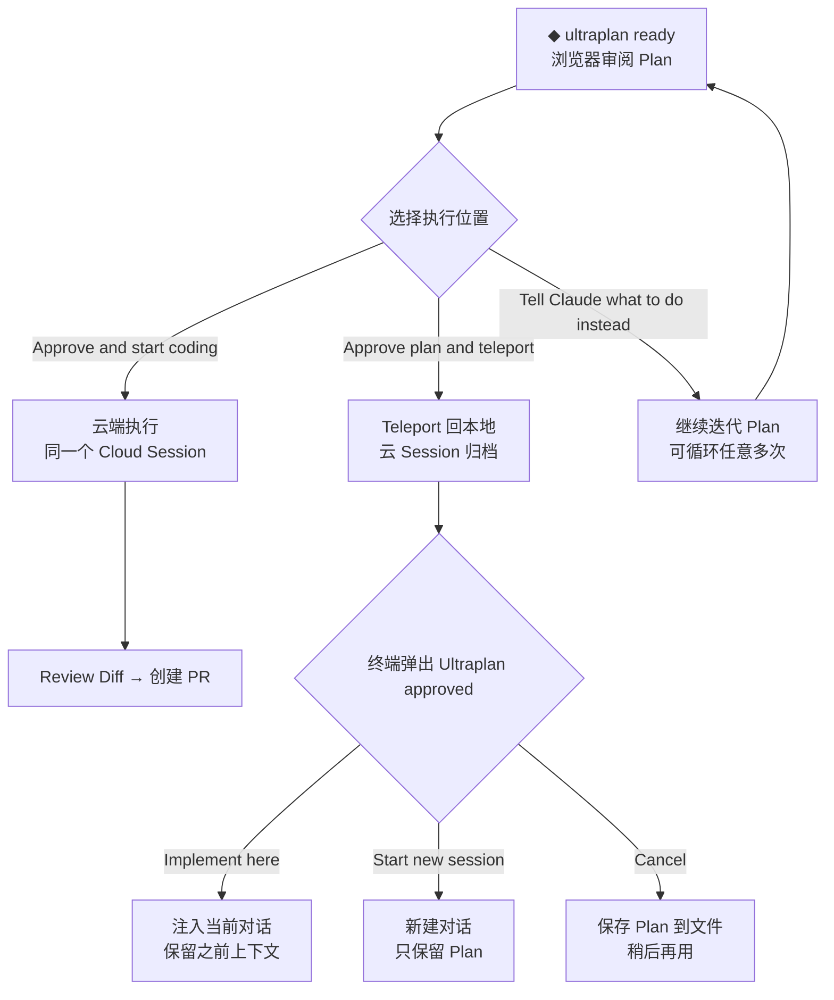
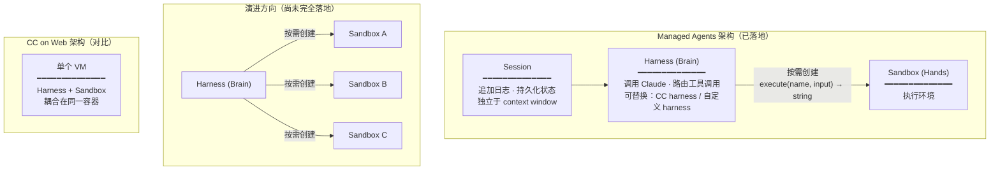

> 本文首发于 CuiLiang.ai（微信公众号 + 小红书），作者亮叔。AI Agent 方向，practitioner 视角，real problems。

---

## 一、开场：一条命令串联的四个能力模块

在本地终端输入 `/ultraplan migrate the auth service from sessions to JWTs`，看起来就是一条命令。但它触发的事情远比看到的多：本地 CLI 发起请求，Anthropic 云端 VM 启动并 clone 你的仓库，浏览器弹出一个带章节导航和 inline comment 的 plan review 界面，审阅通过后你可以选择在云端执行还是 teleport 回本地实现。

CC on Web 云 session、Remote Control、Teleport、plan mode，四个能力被串联成一个工作流。Ultraplan 不是新基础设施，而是已有能力的编排层。

为什么 Anthropic 要把一件事拆得这么碎？

官方文档给出的回答很直接：终端的 review 体验不够好。Ultraplan 提供三个终端做不到的东西：**针对性反馈**（对 plan 的特定章节做评论，而不是对整体回复）、**免打扰起草**（plan 在云端生成，终端空出来继续干别的）、**灵活执行**（审阅后选择在云端执行并创建 PR，或者送回终端本地实现）。

这三点回答了"为什么做 Ultraplan"，但没有回答一个更底层的问题：**为什么 plan 和 execution 可以、甚至应该在不同的环境里完成？** 这背后是一个 agent 架构的设计判断。Ultraplan 是这个判断在用户层面的具体体现。本文从这个切入点出发，拆解 Claude Code 的云端/本地交互设计。

## 二、先交代背景：Claude Code 的执行环境

Claude Code 有多种运行方式，但核心区别只有一个：**代码在哪里执行。**

| | CC on Web（云 session） | Remote Control | 本地终端 CLI |
|--|------------------------|----------------|-------------|
| 代码跑在 | Anthropic 云 VM | 你的机器 | 你的机器 |
| 你从哪操作 | claude.ai 或手机 app | claude.ai 或手机 app | 终端 |
| 使用本地配置 | 否，只有仓库内容 | 是 | 是 |
| 需要 GitHub | 是（或 bundle 上传） | 否 | 否 |
| 断开后继续运行 | 是 | 终端开着就行 | 否 |

同一个 claude.ai/code 界面，背后可能是 Anthropic 的云 VM 在跑你的代码，也可能是你桌上那台电脑在跑。

CC on Web 是「把代码搬上云」：仓库从 GitHub clone 到 Anthropic 管理的 VM，git 操作通过专用代理服务转发，push 被限制为只能推送到当前工作分支。Remote Control 是「把遥控器带在身上」：代码和文件从不离开你的机器，只有聊天消息和工具结果通过加密通道传输。

## 三、Ultraplan 的设计解剖：plan-execution 分离

### 3.1 四个阶段，四种环境

Ultraplan 把一个完整的任务拆成四个阶段，每个阶段的执行环境不同：

| 阶段 | 在哪执行 | 为什么选这里 |
|------|---------|------------|
| 发起 | 本地终端 | 需要感知当前仓库状态和分支 |
| Plan 生成 | 云端 VM | 解放本地终端，plan 过程不需要本地环境 |
| Review | 浏览器 | 终端的 review 体验太差，浏览器支持 inline comment、emoji reaction、章节导航 |
| Execution | 云端或本地（你选） | 这是最关键的设计决策 |

发起方式有三种：`/ultraplan` + prompt；在普通 prompt 里包含 `ultraplan` 关键词；或者在本地 plan mode 完成后选择「No, refine with Ultraplan on Claude Code on the web」。

### 3.2 本地不执行，但保持感知

云 session 启动后，本地终端并不是「发起后完全不管」。CLI 的 prompt 输入区会显示一个轻量的状态指示器：

- `◇ ultraplan` ：Claude 正在研究代码库和起草计划
- `◇ ultraplan needs your input` ：Claude 有澄清问题，需要你打开 session 链接回应
- `◆ ultraplan ready` ：计划就绪，可以在浏览器中审阅

这是一个有意思的交互设计选择：本地终端在 plan 生成期间完全可用（你可以继续写其他代码），但保持了对云端进度的感知。不是完全阻塞（那就没必要分离了），也不是完全断开（那你不知道什么时候该去看）。

**轻量感知，优于阻塞，也优于断开。** 做过 agent 交互设计的人应该都踩过这个坑。

### 3.3 执行位置的选择权

Plan 审阅通过后，在浏览器里有三条路径。下面这张流程图画出了完整的流转过程：

三条路径分别对应不同的场景：

**路径一：云端执行。** 选择「Approve Claude's plan and start coding」，Claude 在同一个云 session 里直接实现，完成后你 review diff 并创建 PR。适合环境无关的任务，代码改动不依赖本地特定配置、数据库或工具链。

> 实测标注：截至本文写作时（2026 年 4 月），笔者在自己的项目上尚未走通这条路径。Ultraplan 创建的云 session 持续报「This repository does not have a Git remote」，按钮灰色不可用，即使同一仓库的普通云 session（通过 `--remote` 创建）工作正常、push 成功。GitHub issue [#44914](https://github.com/anthropics/claude-code/issues/44914)、[#44984](https://github.com/anthropics/claude-code/issues/44984) 有多位用户报告了相同问题。Research preview 阶段的已知 bug，预期会逐步修复。

**路径二：Teleport 回本地。** 选择「Approve plan and teleport back to terminal」，云 session 被归档（避免并行执行），plan 注入你本地的终端。终端会弹出「Ultraplan approved」对话框，给出三个子选项：

- Implement here ：把 plan 注入当前对话，继续你之前的上下文
- Start new session ：清空当前对话，只保留 plan 作为上下文
- Cancel ：保存 plan 到文件，不执行。Claude 会打印文件路径

这三个选项的设计体现了一个思路：**plan 是一个可持久化的中间产物**，不是「审阅通过就必须立即执行」的东西。你可以存起来，换个时间、换个 session 再用。

**路径三：继续迭代。** 选择「Tell Claude what to do instead」，继续修改 plan。可以迭代任意多次。

### 3.4 背后的判断

为什么要拆成 plan 和 execution 两个阶段？因为两者的性质不同：plan 对执行环境依赖弱但对交互体验要求高，execution 反过来。plan 往交互体验好的地方走（浏览器），execution 往环境匹配的地方走（云端或本地，你选）。这就是 Ultraplan 的架构形态。后面第五部分会展开这个逻辑在基础设施层面的映射。

## 四、踩坑实录：云端和本地之间的摩擦

以下是我在实际使用中遇到的问题。记录这些不是为了吐槽，而是因为踩坑的位置恰好暴露了云端和本地之间的摩擦所在。

### 4.1 执行环境错位：以为在操作本地，实际在云端

第一次打开 CC on Web 的 session 时，我在里面输了 `pwd`，返回 `/home/user/项目名`。一开始以为是在操作我本地的机器。直到 `git pull` 报错说当前分支 `claude/pwd-command-TwMmm` 没有 upstream tracking，我才意识到，这是一个 Anthropic 的云 VM，不是我的电脑。

进一步验证：`git remote -v` 显示的不是 `github.com`，而是 `http://local_proxy@127.0.0.1:xxxxx/git/你的用户名/你的仓库`。这是云 VM 里的 GitHub 代理层，代理验证 scoped credential，附上你的实际 GitHub token，再转发到 GitHub。

同一个 claude.ai/code 界面承载了两种完全不同性质的 session（Cloud 和 Remote Control），没有足够显眼的视觉区分。session 列表的筛选器里确实有 Local / Cloud / Remote Control 三个选项，但你得主动去筛才能看到区别。

### 4.2 权限校验断层：Plan 阶段能过，Execution 阶段 403

在 Ultraplan 里，plan 在云端正常生成，审阅也没问题。但选择云端执行时，`git push` 返回 403。排查发现：代理注入的 token 能读不能写。根因是我只做了 OAuth 授权（Authorized GitHub Apps），没有安装 GitHub App（Installed GitHub Apps），OAuth token 的 scope 不包含 write 权限。

**plan 只需要 read，execution 需要 write，但 Ultraplan 在发起时不做权限预检。** 你可能花了 20 分钟起草和审阅一个 plan，最后在执行阶段才发现 push 不了。

这个「不预检」未必完全是粗糙的边缘。我的推断是（Anthropic 没有公开说明），背后可能隐含了**最小权限原则**：Plan 阶段只给读权限，防止 prompt injection 或 agent 幻觉在「只是看看」的阶段修改代码。问题不在于分阶段授权本身，而在于缺少前置提示，发起时应该检查权限是否足够，不够的话提前告知。

实操建议：一定要安装 GitHub App（Installed），不要只做 OAuth 授权（Authorized）。前者有明确的仓库级读写权限配置，后者的 scope 不透明。

### 4.3 代码托管边界：非 GitHub 项目无法走通云端闭环

对于不在 GitHub 上的项目：`claude --remote` 会自动打包本地仓库上传到云 VM（bundle fallback），但通过 bundle 创建的 session 不能 push 回远程。云端执行路径走不通，只能 teleport 回本地。

CC on Web 的云端执行路径目前强依赖 GitHub。GitLab、Bitbucket 等只能走 bundle，不能推送。

### 4.4 连接模式互斥：Ultraplan 与 Remote Control 无法并行

Ultraplan 启动时会断开 Remote Control，两者共用 claude.ai/code 界面，同一时间只能连接一个。如果你正在用 Remote Control 监控一个长时间运行的本地任务，发起 Ultraplan 会中断它。

这不是 bug，是当前架构的约束。一个界面承载了多种 session 类型，还没有做到并行。

## 五、往上看一层：brain-hands 解耦

上面遇到的各种边界摩擦（权限校验的阶段错位、本地环境的剥离、session 类型的互斥），表面看是工程实现的不完善。但往底层看，这些摩擦的共同根源是同一件事：Anthropic 正在把原本耦合在一起的 agent 组件逐步拆开。拆的过程必然有接缝，接缝处就是我们踩坑的地方。

### 5.1 从用户层到基础设施层

Ultraplan 的 plan-execution 分离是用户能直接感知到的。但 Anthropic 在基础设施层做了同样的事情，走得更远。

2026 年 4 月 8 日发布的 [Managed Agents](https://www.anthropic.com/engineering/managed-agents)，在工程博客里提出了一个架构演进：把 agent 的 brain（推理/harness）和 hands（执行/sandbox）从同一个容器里拆出来。

CC on Web 目前还是 harness 和 sandbox 在同一个 VM 里。Managed Agents 已经解耦了，brain 通过工具调用按需创建 sandbox 容器，不需要执行环境的 session 就不等容器启动。

效果很直接：p50 TTFT（Time To First Token）降低约 60%，p95 降低超过 90%。原因是大部分请求的第一个 token 是 Claude 的思考或文字回复，不是工具执行结果。把容器启动从关键路径上移走，推理可以立即开始。

### 5.2 Ultraplan 是同一思路的用户层映射

把 brain-hands 解耦和 Ultraplan 的 plan-execution 分离放在一起看，底层逻辑是一致的：**不是所有阶段都需要同样的环境，按阶段的实际需求分配资源和界面。**

Plan 阶段对执行环境的依赖弱，起草一个迁移计划，不需要跑代码、不需要连数据库、不需要本地的 MCP 服务器。但它对交互体验的要求高，你需要逐章审阅、对特定段落做评论、反复迭代。终端做不好这件事。Execution 阶段反过来，对交互体验的要求弱（Claude 自动执行就好），但对执行环境的依赖强。

在基础设施层，同样的逻辑表现为：推理阶段不需要沙箱（不跑代码），执行阶段才需要。把沙箱从推理的关键路径上移走，推理可以立即开始。

| | Ultraplan（用户层） | Managed Agents（基础设施层） |
|--|-------------------|---------------------------|
| 拆的是什么 | plan vs execution | brain（推理）vs hands（执行） |
| 拆的依据 | 对环境和交互的需求不同 | 对计算资源的需求不同 |
| 好处 | plan 往浏览器走，execution 往合适的环境走 | 推理不等沙箱冷启动，按需创建容器 |
| 演进方向 | 用户自主选择执行位置 | 一个 brain 连接多个 hands |

### 5.3 session-harness-sandbox 三层抽象

Managed Agents 的工程博客提出了三个核心抽象，下面这张图展示了它们的解耦关系：

注意：一个 brain 连接多个 hands 是 Anthropic 工程博客提出的演进方向，当前 Managed Agents（public beta）已实现 brain-hands 的物理解耦和按需创建，但多 sandbox 并行编排仍在迭代中。

三层的具体职责：

- **Session**：追加日志，记录所有发生的事情。独立于 context window 存在，是持久化状态
- **Harness**：调用 Claude 并路由工具调用的循环。不同任务可以用不同的 harness
- **Sandbox**：执行环境。按需创建，独立于 harness

CC on Web 用的 harness 是 Claude Code 本身，CLI、桌面 app、Web、IDE 扩展都共享同一个底层引擎（Agent SDK）。Managed Agents 则是 meta-harness，不绑定具体的 harness 实现，提供通用接口来容纳不同的 harness。

这套抽象的一个重要特性是：**每一层的实现可以独立替换。** Anthropic 在博客里提到一个例子：Sonnet 4.5 有「context anxiety」（感知到上下文快满时会提前结束任务），harness 里加了 context reset 来补偿。到了 Opus 4.5，这个行为消失了，context reset 变成了无用代码。harness 编码的假设会随模型能力提升而过时。

## 六、怎么选执行环境

回到实操。问自己三个问题：

**第一，这个任务依赖我本地环境吗？** 本地数据库、私有 MCP 服务器、定制工具链、SSH key、AWS SSO，这些都不会出现在云 VM 里。云 session 每次 fresh clone，只有仓库里 commit 过的内容可用。

**第二，这个任务需要访问外部网络吗？** 云 VM 的出站网络默认受限（Trusted 模式只放行包管理器和 GitHub 等白名单域名）。如果你的任务需要调用内部 API、访问私有服务或下载非白名单资源，要么配置 Custom 网络规则放行对应域名，要么用本地 CC。

**第三，我需要在执行过程中持续介入吗？** 云 session 的权限模式只有 Auto accept edits 和 Plan 两种，没有 Ask。云端执行默认信任 agent，减少交互阻断。

| | 不依赖本地环境 | 依赖本地环境 |
|--|--------------|------------|
| 不需要持续介入 | CC on Web 云 session | 本地 CC + Remote Control |
| 需要先规划后执行 | Ultraplan | 本地 CC（plan mode） |
| 定时重复任务 | Schedule tasks（Cloud） | Schedule tasks（Desktop） |

## 七、结尾

Ultraplan 的设计揭示了一个 agent 架构的基本问题：**agent 的思考和行动是否应该在同一个环境里完成？**

Anthropic 的答案是不一定，取决于每个阶段对环境和交互的不同需求。Plan 阶段对环境依赖弱但对交互要求高，往浏览器走。Execution 阶段对环境依赖强但对交互要求弱，往合适的环境走。同样的逻辑在基础设施层体现为 brain-hands 解耦。

这个思路不局限于编码场景。任何需要「先规划后执行」的 agent 工作流，无论是自动化运维、数据管道编排还是文档生成，都会遇到同样的设计选择。

我个人的判断是：**plan 和 execution 的分离不是一个产品特性，而是 to B agent 大规模服务的必然选择。** 当 agent 从个人工具走向企业级服务，推理层需要快速响应、弹性调度，执行层需要稳定、安全、可隔离的沙箱环境，两者对基础设施的要求完全不同，耦合在一起迟早会成为瓶颈。我目前在做的 Agent Sandbox Infra，解决的就是执行侧的问题：为 agent 提供稳定、安全、高效的执行环境，让推理层不用操心沙箱的生命周期管理、权限隔离和资源调度。Anthropic 的 Managed Agents 走的是同一个方向，只是它选择了自己托管整条链路。

值得关注的不是 Ultraplan 这个功能本身，而是它背后 session-harness-sandbox 的三层抽象，以及 Anthropic 从 CC on Web → Ultraplan → Managed Agents 这条路径上，逐步把 plan 和 execution 解耦的演进逻辑。这条路径的方向已经比较清晰了，具体实现还在打磨，GitHub 权限预检、非 GitHub 仓库支持、多 session 并行，都是当前的粗糙边缘。

留一个开放性的问题：Anthropic 把 session-harness-sandbox 作为自己的托管服务推出（Managed Agents），这是一个平台化的选择。但开源社区会怎么跟进？以 LangGraph 的 checkpointer（状态持久化）和 subgraph（编排层）、AutoGen 的 runtime 与 agent container 分离为例（具体特性请以各框架最新版本为准），这些框架已经在各自的抽象层面触及了类似的问题，但据我观察，在默认的本地开发形态下，目前都还没有走到完全的 brain-hands 物理解耦，推理和执行仍然在同一个进程里（生产环境中通过 API/MCP 将 Tool Node 独立成微服务可以部分实现，但这更多是部署层面的工程选择，而非框架层面的原生抽象）。当开源生态开始在框架层面认真对待这个分层，agent 基础设施的竞争格局可能会发生有意思的变化。
